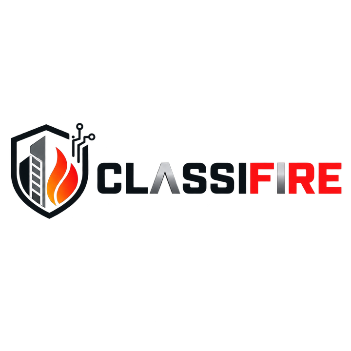

# CLASSIFIRE




**Passive-fire estimating and technical decision-support system**

CLASSIFIRE is an estimating system produced and developed by Ceasefire PFP.

> **Release status:** pre-production integration build. This repository contains the working application foundation, editable pricing and technical-library services, deterministic calculation and rule engines, branded output renderers, and Mission Control integration scaffolding. It must not be represented as production-authorised until the published release gates and source-parity tests pass.

## What is included

- FastAPI application and server-rendered estimator/admin UI
- Decimal-safe calculation service
- Versioned estimating-rule engine
- Editable product, material, labour and pricing records
- Package 14 pricing importer
- Package 15 technical-variant importer
- Technical-document preservation and draft extraction foundations
- Estimate snapshots and audit records
- Branded PDF and Excel output renderers
- Mission Control integration client and bootstrap command
- Proprietary CLASSIFIRE branding assets

## Local installation

### Windows PowerShell

```powershell
Set-ExecutionPolicy -Scope Process Bypass
.\install.ps1
```

### macOS or Linux

```bash
chmod +x install.sh
./install.sh
```

The installer creates a virtual environment, installs CLASSIFIRE, copies `.env.example` to `.env` when required, and initialises the local database.

Start the application:

```powershell
# Windows
.\.venv\Scripts\Activate.ps1
classifire start
```

```bash
# macOS/Linux
source .venv/bin/activate
classifire start
```

Open `http://127.0.0.1:8787`.

Create an administrator account before operational use:

```bash
classifire create-admin
```

## Developer checks

Confirm the installed command and run non-destructive environment checks:

```powershell
.\.venv\Scripts\classifire.exe version
.\.venv\Scripts\classifire.exe doctor
```

Run the relevant test file or test group before changing behaviour. On Windows,
use a fresh temporary test directory and disable pytest's repository cache so
test output is not mixed with retained local evidence:

```powershell
$testRoot = Join-Path $env:TEMP ("classifire-pytest-" + [guid]::NewGuid())
.\.venv\Scripts\python.exe -m pytest -q -p no:cacheprovider --basetemp $testRoot tests/test_physical_model_lock.py
```

## Repository guide

- `src/classifire/` — application, domain services, API, UI, and CLI.
- `tests/` — regression and boundary tests.
- `migrations/` — database lineage; do not edit or remove migrations as ordinary cleanup.
- `docs/` — architecture, roadmap, operating guidance, and retained reports. See [the architecture baseline](docs/CLASSIFIRE_ARCHITECTURE.md).
- `knowledge/` — controlled source-release and technical-library material; source corpora are intentionally excluded from Git.
- `data/` — local runtime databases, backups, UAT material, and evidence. Treat it as operational state, not disposable workspace output.
- `openclaw/` — controlled integration configuration. CLASSIFIRE remains the canonical home for domain logic and canonical state.

## Safety and governance

- Keep inference, review, and canonical writes separate. Do not let transient inference overwrite approved state.
- Do not treat a defect as a quantity. Model distinct services, openings, substrate planes, and repair components explicitly.
- Keep technical compatibility evidence-based. Unresolved evidence must remain unresolved rather than being inferred as approval.
- Do not commit `.env`, local databases, customer data, supplier pricing, UAT evidence, or generated runtime material.

## Source-library import

Confidential Package 14, Package 15 and calculator source files are not required to be published with the application repository. Place authorised sources in a controlled local path and import them with:

```bash
classifire import-pricing /path/to/QUANTIFIRE_14_Pricing_Library_v2.13.csv --version 2.13
classifire import-technical /path/to/QUANTIFIRE_17_Technical_System_Variants_v2.13.jsonl --version 2.13
```

Run a readiness check:

```bash
classifire doctor
```

## Mission Control

Mission Control is the architecture and operations control plane. CLASSIFIRE remains the canonical system for evidence, estimates, pricing, technical records, calculations, snapshots and outputs.

After configuring `CLASSIFIRE_MISSION_CONTROL_URL` and `CLASSIFIRE_MISSION_CONTROL_API_KEY`:

```bash
classifire mission-control-bootstrap --repo-url https://github.com/Slayde91/classifire
```

The adapter must be contract-tested against the exact installed Mission Control version before production use.

## Security

- Keep the repository private.
- Do not commit `.env`, API keys, database credentials, customer data, supplier prices, proprietary technical reports or production evidence.
- Use PostgreSQL, TLS, secure secrets management, malware scanning and tested backups for production.
- Technical records extracted by AI remain draft until authorised review and approval.
- A cost allowance is not technical approval.

## Branding

The only approved product logo is `assets/brand/classifire-logo-master.png`. Do not redraw, recolour, distort or replace it through ordinary content-management functions.

## Licence

Proprietary. See [PROPRIETARY.md](PROPRIETARY.md). No open-source licence is granted.
