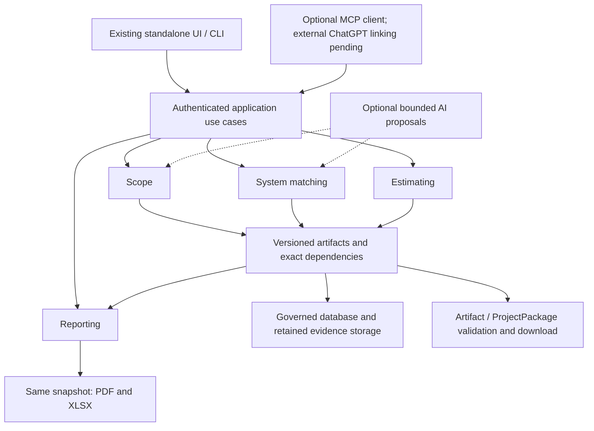
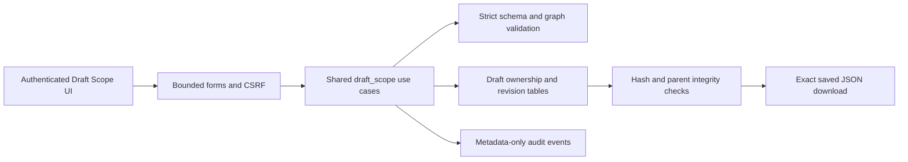
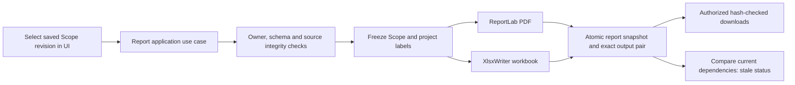
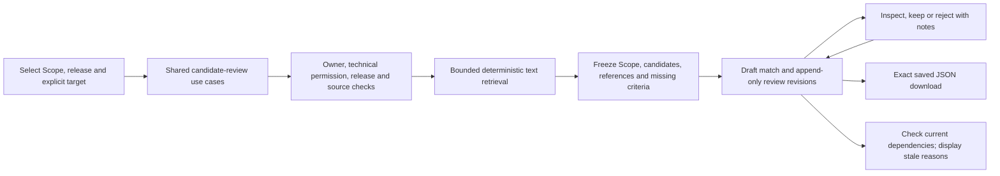
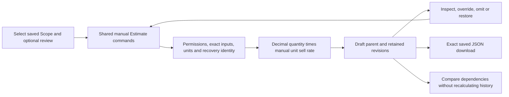
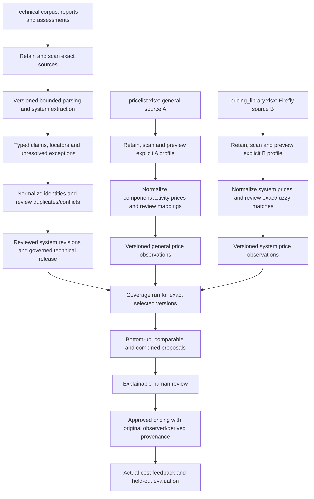
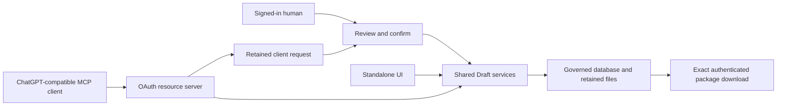

# CLASSIFIRE Architecture

**Document status:** Current pre-production architecture

**Architecture version:** 5.42 - governed quantities, merged MCP T9/roster parity and candidate recipe-link parity.

**Verified shared baseline:** `324f66a2e73330589e43b2ca17529eaf8de61bfe` on
`origin/main`. Shared main includes deterministic read-only T9 coverage,
bounded T13 roster-history client access, the governed T6/v4 recipe-review increment,
the bounded T10 preview and the immutable Scope-bound quantity journal. Exact PR #235
run 34329434461 passed the full repository workflow before merge; post-merge run
34336769556 passed the same repository gates on the merge commit. [PROJECT_STATE.md](./PROJECT_STATE.md)
owns measured validation and publication state.

No AI or OpenClaw path is used by this increment. Evaluation execution, commercial
activation, broader estimation, real ChatGPT linking and production readiness remain
open. Direct-main PR #236 reuses the same boundary for bounded T6 recipe-link history
and exact integrity-checked reads. It preserves legacy UI ordering and adds no write or
authority. Exact code-head run 34333784853 passed every repository gate; its
documentation reconciliation still requires final CI before merge. Earlier milestone
descriptions are historical checkpoints; do not infer phase completion from source
presence.
**Accepted target architecture:** Hybrid deterministic core with bounded,
optional AI adapters; see
[Architecture Decision 0001](./ARCHITECTURE_DECISION_0001_HYBRID_ORCHESTRATION.md),
refined by approved [Decision 0002](./ARCHITECTURE_DECISION_0002_INDEPENDENT_CAPABILITIES.md).

This document separates the architecture that is implemented now from the
adopted target architecture and known gaps. Read it with [PROJECT_STATE.md](./PROJECT_STATE.md)
and [CLASSIFIRE_ROADMAP.md](./CLASSIFIRE_ROADMAP.md). Source, tests, migrations,
Git state, and retained runtime receipts determine factual implementation state.
[Technical corpus and dual-pricing design](./TECHNICAL_CORPUS_AND_DUAL_PRICING_DESIGN.md)
contains the detailed component contracts, estimation methods, validation and phased
acceptance criteria. Its proposed records and workflows extend ADRs 0001/0002; they
are not claims about existing tables, imported datasets or measured accuracy.

**Current bounded implemented change (PR #227):** add a forward v4 technical-release recipe snapshot
and one governed T6 component/activity review link from a frozen requirement to current
reviewed Dataset A evidence. **Reason:** T9 cannot honestly claim bottom-up support from
mutable technical fields or name similarity. **Consequences:** preview is no-write; save
is append-only and binds exact release, target, recipe, source, profile, decision,
observation and row hashes. T9 grants bottom-up A support only when every frozen
requirement has a current confirmed complete link. Missing, provisional, unresolved,
stale or corrupt inputs fail closed, and ambiguous/stale B evidence still requires
review. All price, library, Estimate, technical, evaluation and release effects remain
false. **Migration:** additive `0045_draft_pricing_recipe_links`; v3 releases remain
readable but cannot claim a recipe that they never froze.

**Current bounded implemented change (PR #229):** add a computed, non-persisted bottom-up preview over
the exact T9/T6 dependency graph. **Reason:** users need a visible amount calculation
before broader corpus and model work, but descriptive recipe notes are not safe numeric
inputs. **Consequences:** an authorised reviewer supplies explicit per-requirement
quantities; the service accepts only current confirmed complete links, exactly one
reviewed observation per requirement and an explicit `sell_price`, then exposes each
quantity x rate calculation and a hash-bound exact JSON download. Any incomplete or
incompatible line withholds the whole total. No Estimate, approval, activation,
technical, evaluation or release state changes. **Migration:** none; the preview is
recomputed and read-only.

**Current T10 browser hardening (PR #231):** keep the PR #229 service and contract
unchanged, allow the browser to submit a blank quantity so the deterministic backend can
render its fail-closed reason, and show the dependency hashes already present in the proposal.
**Reason:** actual Chrome UAT found that native HTML validation hid the governed withheld
result and the page omitted useful audit detail. **Consequences:** no domain, schema,
migration, pricing or authority change. Real Chrome 152, exact download, permission and
server-restart checks now prove the bounded presentation lifecycle with synthetic data.

**Current bounded implemented change (PR #233):** add an append-only project-quantity record between saved
Scope and the T10 proposal. **Reason:** a typed preview number cannot be reopened or
defended as a project fact. **Consequences:** an authorised reviewer selects a service
from the current immutable Scope revision for one exact frozen recipe requirement;
preview is no-write and save binds Scope/service, release/target/recipe/link/requirement,
quantity/unit/state, reviewer, time, reason and hashes. T10's normal path accepts only the
newest current compatible record and withholds when dependencies change. The old manual
input remains an explicitly named comparison/test mode and is unavailable in the browser.
No Estimate, technical, library, evaluation or release authority is added.
**Migration:** additive forward-only `0046_draft_pricing_quantity_bases`, now the
shared-main deployment head; it refuses destructive downgrade.

**Prior bounded change (PR #222):** an append-only T13 evaluation roster freezes exact
eligible/excluded B inventory and target-blind connected-group splits before later model
or feature work. Migration 0044 creates `draft_pricing_evaluation_rosters`.

**Prior bounded change (PR #220):** append-only human-reviewed Dataset B
system/configuration mappings bind exact commercial rows to eligible source-bound
technical variants or retain ambiguous/unmatched outcomes. Price cannot establish
identity. Migration 0043 adds `draft_pricing_system_mappings`.

**Prior bounded change (PR #214):** the merged A/B profile lifecycle has an append-only
`approve`, `reject` or `request_revision` decision bound to the exact profile JSON
hash. Decisions retain actor/time/reason/hash history and become stale after a newer
profile. Migration 0041 adds one terminal decision per exact profile and refuses
destructive downgrade. A profile decision grants no row, library, system, Estimate,
technical or release authority.

**Prior bounded change (PR #210):** merged PDF page/entity review and the manual graph editor
now extend to explicitly mapped worksheet rows and chosen picture occurrences. The
same deterministic validation, no-write preview and atomic revision services remain.
Scope v5 extends the evidence-reference union; migration 0038 adds a purpose-specific
source binding beside PDF/pricing sources. **Reason:** worksheet cells and image anchors
need their own provenance without importing pricing authority or inventing PDF pages.
**Consequences:** compatible v1-v5 readers, conditional report versions and current
source/scan/actor checks are required; original history and raw-source export boundaries
remain intact. No AI dependency, canonical admission or pricing execution is added.

## Implemented execution boundary and planned package boundary

PR #185 is merged at `73c428e`; optional journal lifecycle hooks now span both
visual and report transports. Capture begins before inference dispatch;
completion is durably reloaded and validated before proposal acceptance.
Duplicate begin, abort and conflicting verifier configuration fail closed.
The journal is a bounded foundation, not a complete workflow scheduler or proof
of remote capture. Managed factories remain unwired pending producer assurance.
[Exact main CI](https://github.com/Slayde91/classifire/actions/runs/33941884582)
passed 974 tests. No OpenClaw retirement or operational migration occurred.

A local, untracked Draft ProjectPackage schema/archive candidate exists in
`.tmp/project-package-draft-20260905`; 22 synthetic tests passed on review.
It is not shared-main architecture. It accepts an explicit snapshot/inventory
and authorization callback, validates the declared graph and hashes, and writes
or validates deterministic archives. A supplied inventory cannot prove database
completeness, and a callback interface cannot establish an export policy.
That candidate remains unshipped. The current Draft-specific implementation below
adds selected artifact projection, rights, immutable persistence and download; full
project coverage and source-body export remain unfinished; the import amendment
below implements selected-workspace exchange.

Do not reuse `services/snapshot.py:build_estimate_snapshot` as a read-only package
extractor: it calls `recalculate_estimate`. Future projection must preserve a
consistent authorized revision and reuse exact clean-byte evidence reads without
recalculating, changing records or bypassing canonical output gates.

## Approved capability composition and first prototype

**Accepted target; manual Scope/Estimate, candidate review and independent Draft reports have browser evidence:** one modular CLASSIFIRE application exposes
Scope, System Matching, Estimating and Reporting through independent use cases.
Each accepts explicit validated saved/manual inputs, produces a versioned artifact
and stops unless the user requests another capability. Stable IDs, evidence,
validation, storage and permissions are shared across clients.



The arrows show available data paths, not automatic execution. Reporting reads
selected available artifacts; it does not call the other three capabilities.
Technical suitability and pricing remain separate, and source/library eligibility
still applies. Model output is proposed evidence, never authority.

| Component | Implemented starting point | Accepted prototype/target work |
| --- | --- | --- |
| Interfaces/API | FastAPI/Jinja independent routes; PDF/Excel source review, optional PDF suggestions, A/B pricing profiles, exact-profile review, Dataset A observations, Dataset B mappings, T13 roster lifecycle, T9 coverage/JSON and T6 recipe preview/save/history/download are on shared main. PR #235 adds merged MCP T9/roster parity; direct-main PR #236 adds candidate bounded recipe-link history. | Add client parity for reviewed row records. Preserve manual fallback; evidence-graph and pricing-profile client commands plus real ChatGPT linking remain planned. |
| Optional external client | draft_client.py, draft_client_auth.py, draft_client_requests and shared Draft services; PR #235 adds merged read-only T9 coverage plus bounded T13 roster history, and direct-main PR #236 adds candidate bounded T6 recipe-link list/exact read | OAuth resource server only; client proposals require a separate same-user browser confirmation. Independent Match/Estimate/report commands are merged in PR #205, measured review in PR #206 and workbook pricing in PR #207. Pricing evidence reads require read/estimate/technical scopes plus current local pricing-review rights. External linking remains unproven. |
| Orchestration | Deterministic controllers, no-write PDF/Excel graph previews and explicit atomic saves; bounded inference journal; generic worker has no registered handlers | Keep visible source interactions bounded. Extend existing BackgroundJob for necessary corpus stages, leases/retries and immutable outcomes after the visible prototype; no new fleet or scheduler database. |
| Domain services | Physical/evidence guards, technical governance, calculations, snapshot/renderers and deterministic pricing coverage. PR #227 adds frozen recipe snapshots and immutable recipe-link review. | Reuse independently callable contracts across UI/client. Planned corpus extraction/resolution and pricing estimation use the same governed application; they do not bypass independent capability prerequisites. |
| Technical corpus | Individual TechnicalDocument intake, limited PDF metadata, JSONL Draft variants, manual source-bound materialisation/review | Planned batch inventory, versioned extraction/claims, stable system identity, deduplication and exception review for hundreds to thousands of documents. Existing source/review/publication gates remain. |
| General pricing source A | Explicit `general_pricelist` identity, stable source versions, append-only profiles/decisions and exact reviewed product/material/labour/service row observations over retained cells. PR #227 links those observations to frozen recipe requirements. | Commercial activation, representative recipe breadth and real-source validation remain planned. |
| Firefly pricing source B | Separate `firefly_system_prices` identity/profile/decision lifecycle plus append-only exact-row mappings to an eligible active-release variant or explicit unmatched/ambiguous outcome | Add representative-source breadth, candidate/alias resolution and package/client coverage while keeping observed prices separate from technical applicability and derived proposals. |
| Pricing evaluation | Pure T13 contract plus persisted 0044 roster revisions over current mapped B records; target-blind connected-group assignment, explicit exclusions/insufficient evidence, scoped access, cutoff/freshness, exact dependencies, canonical bytes/hash, history and download are implemented | Validate v1 lineage/split policy with authorised representative data, then add access-separated target opening, untouched evaluation, metrics and approved calibrated limits. |
| Pricing coverage and proposals | Manual Draft rates, source selection, original values and override history plus bounded T9 coverage over all active-release targets, T6 recipe review, PR #229's read-only sell-price preview and PR #233's immutable Scope-bound quantities, with line evidence, deterministic rounding, withholding and exact JSON. | Validate representative quantity meaning; add governed yield/productivity/recovery inputs and multi-observation recipes, then comparable/combined proposals, calibrated review and append-only approval/actual-cost feedback. Observed and derived prices remain distinct after approval. |
| Draft persistence | Scope/report/candidate/Estimate records, PDF/Excel/pricing source bindings, retained PDF suggestions, 0040 A/B profile history, 0041 decisions, 0042 Dataset A observations, 0043 Dataset B mappings, 0044 T13 rosters, 0045 recipe links and 0046 Scope-bound quantities. T9 coverage remains computed. | Preserve owner/admin checks, exact dependencies, hashes, conditional saves and import lineage. Pricing evidence package membership, source-inclusive portability and operating retention limits remain unfinished. |
| Canonical physical writes | Existing opening/service UI writes guarded canonical rows | Keep these routes and admission/lock protections intact. Draft Scope saving cannot promote data into them. |
| Packages | Scope v1-v6 exchange is merged; v6 carries original suggestion claims in the same evidence_refs union and exact package inventory | Preserve earlier readers/bytes and mark imported claims unverified. A/B profile/source membership and whole-project/source-body coverage remain planned. |
| Reporting | Four independent retained Draft PDF/XLSX profiles; merged v6 uses conditional render versions 7/8/8/9, preserving earlier profile versions | Render explicit saved Scope/Match/Estimate snapshots, including cell/image claims. Current source checks remain separate from saved status; do not recalculate or rerender retained downloads. Canonical export keeps its locks. |
| Security | Session/CSRF, active human permissions, Draft owner/admin access, bounded forms/JSON and safe download names | Preserve these checks on import. Existing shared project metadata means full tenant/project privacy is still unproven. |

### Implemented manual Draft Scope slice (P0)

The existing UI now creates a new project and owner-scoped manual Draft, edits
separate defects/openings/services/observations, validates, saves successive
revisions and downloads exact saved JSON. The browser demonstration included shared
links, a blank opening and unknown quantity; data and bytes survived a server restart.
See [the contract](./DRAFT_SCOPE_V1_CONTRACT.md) and [demo](./DRAFT_SCOPE_DEMO.md).



`draft_scope_ui.py` adapts browser requests; `services/draft_scope.py` owns the
independently callable validation, ownership, save/read and export rules. No new
framework, agent, database or scheduler is required. Each save uses the expected
revision and a conditional update so simultaneous writers cannot silently overwrite.
The service flushes in a caller-owned transaction; failed requests roll back.

Migration `0027_draft_scope_revisions` adds two tables. Revision envelopes preserve
stable IDs, server-assigned author/time, Draft/manual/unreviewed status, parent and
content hashes. Historical bytes remain stable. Read/download validates retained
bindings; checksums are integrity checks, not signatures or approval. Downgrade
refuses destruction of retained revisions. The standalone synthetic launcher uses
separate local SQLite storage; it does not establish production migration readiness.

Draft content requires an active human with the relevant project permission and
ownership or administrator status. Existing project names/references remain visible
through shared `/projects` behavior; this is not tenant isolation. Bounded input,
CSRF, escaped rendering, safe download names and metadata-only audit, excluding scope text, preserve the exposed
boundary. Import preview/confirmation is implemented as described below. Saving or validating creates no
canonical Defect/Opening/Service, technical match, estimate, lock or release and
invokes no AI provider. Manual Confirmed is still an unreviewed assertion.

**Remaining Scope gaps:** report/source intake, verified evidence locators, richer
plane/service-instance/treatment and contradiction models, verified evidence provenance
and cross-capability dependency tracking. These are subsequent visible increments;
P0 does not claim the complete Scope Package contract or full Scope Analysis.

### Implemented Draft Scope exchange (P1a)

`preview_import` and `apply_import` extend the existing shared Draft service. The
browser uploads exact bytes as bounded base64 form data; the server validates the
version, strict envelope fields, UUID/time/hash claims, graph, normalized values and
checksum before displaying a no-write preview. Duplicate JSON keys, nonfinite
values, malformed UTF-8 and unsupported authority fields fail closed. The artifact
limit is 288 KiB and the separate encoded form limit is 1.2 MB.

Confirmation requires an explicit replacement choice plus a purpose-specific,
15-minute signed preview binding the actor, session, destination, saved revision/
hash and exact file hash. Current ownership/permissions and target integrity are
rechecked, then the existing conditional revision update arbitrates concurrent
writers. Replay or stale confirmation cannot silently create another revision.
Preview emits no audit/persistence changes; successful apply records metadata only.

Existing v1 manual revision bytes remain unchanged. Imported revisions use
`CLASSIFIRE-DRAFT-SCOPE-v2`, `provenance: imported` and up to 16 source metadata
records. Later manual edits retain that history with `provenance: manual_edit`;
reimport retains declared ancestry and appends the newly observed source identity
and file hash. All foreign identities/history remain unverified claims. Local
revision/actor/time/ownership come from the current application; status remains
Draft/unreviewed. No approval, canonical model, estimate or provider is invoked.

This evolution uses existing revision JSON storage and needs no database migration
or new dependency. Reaching the supported lineage limit is an explicit refusal,
not silent truncation. Raw source attachments and complete foreign revision history
are not stored by this narrow import; the complete ProjectPackage/evidence-retention
boundary remains separate. See the [v1/v2 contract](./DRAFT_SCOPE_V1_CONTRACT.md).

**Implemented for Draft artifacts, reports and selected packages:** pin input/release
revisions and hashes. Broader canonical package coverage remains planned.
Upstream edits mark affected downstream relationships stale without changing the
old artifact's content or approval history. The user chooses to compare or rerun.
A report snapshot captures selected revisions and freshness so PDF and XLSX agree.

**Scope of independence:** saved/manual input can replace a prior session's
execution, but cannot replace required evidence or approval. Partial Draft
artifacts/reports may be valid with explicit missing information. Structural
validity, completeness, technical authority and Human Release are separate facts.


### Implemented independent Draft Scope reporting (P4a)

`services/draft_scope_reports.py` exposes create/list/read/download/freshness use
cases independently of an Estimate, canonical physical model or provider.
`draft_scope_ui.py` provides saved-revision selection, full content preview,
explicit creation and retained PDF/XLSX links. No upstream capability runs.
See the [report contract](./DRAFT_SCOPE_REPORT_V1_CONTRACT.md).

The frozen `CLASSIFIRE-DRAFT-SCOPE-REPORT-v1` snapshot includes the entire verified
Scope v1/v2 envelope, project identity/name/reference, local actor/time, report ID,
Draft/unreviewed status, profile/render version and canonical JSON checksum.
Both renderers consume detached copies of that snapshot. One new report row retains
both output byte strings, separate byte hashes and the source revision binding.
A renderer failure saves neither report nor create audit; a later download never
regenerates the files. Each output is limited to 8 MiB in service and database.



Forward migration `0028_draft_scope_reports` adds the report table and a composite
foreign key to the retained Draft/Scope revision. Existing migration history is
unchanged. Deployment-lineage/current-head checks advance explicitly. Generated
outputs are held within the existing database transaction; they are not uploaded
source documents and acquire no fabricated clean-scan attestation. Downgrade refuses
to destroy retained reports. Append-only service behavior and checksums do not make
the database tamper-proof; operational database administrators remain trusted.

Creation requires an active human with project write permission and Draft ownership
or administrator access. Reads require the corresponding read permission and the
same ownership boundary. Browser mutations require CSRF. Reads verify snapshot,
source and both output hashes; stale-but-valid files remain downloadable. Metadata-only
audit excludes Scope text. Later Scope revisions or project label changes flag the
report as stale without modifying its snapshot or downloads.

PDF includes complete flowing content and provenance. XLSX has typed known quantities,
explicit unknowns, stable IDs, separate many-to-many links, filters and frozen headers.
Imported claims remain unverified; missing technical/pricing sections remain unavailable.
Escaped PDF text and literal Excel strings prevent markup/formula/URL interpretation.
Unsupported PDF glyphs and unsafe control characters are visibly represented as code
points; exact original text remains in the saved Scope artifact. No new dependency.

**Bounded prototype trade-offs:** synchronous rendering, maximum 8 MiB per format,
and a newest-20 report list. Older report IDs remain valid; pagination and moving
large outputs to object storage can follow measured need. The dedicated PDF is the
print layout; wide Excel sheets are intended for filtering and horizontal navigation.
Only this Scope profile is implemented, not complete reporting or ProjectPackage export.

### Implemented saved technical-candidate review (P2a)

`draft_system_match_ui.py` is a thin FastAPI/Jinja adapter over independently callable
`services/draft_system_matches.py`. Users explicitly select a saved Scope revision,
a technical release and one opening, service or valid linked pair. Retrieval does
not create canonical Openings or an Estimate and does not invoke AI. The full saved
Scope remains context; `coverage: selected_target_only` identifies unassessed items.
An opening-only review does not imply every linked service has been assessed.

The existing `technical.search_variants` supplies text retrieval with stable ordering.
It does not test complete applicability. Missing material, size, FRL, insulation and
installation criteria remain visible; plane is not substituted for orientation.
The UI exposes captured constraints/references, not an Applicable control. Keeping
or rejecting a candidate is an unapproved preference, not library approval.



The [v1 candidate contract](./DRAFT_SYSTEM_MATCH_V1_CONTRACT.md) stores the complete
Scope envelope, release ID/hash, explicit target, allowlisted technical fields,
source locators/bindings, retrieval findings and decisions. It omits raw source JSON,
storage paths, source bytes and arbitrary metadata. New retrieval validates release
membership, published fields, dates and source integrity. Legacy unbound records
remain unresolved. Source verification means retained-byte integrity, not a malware
scan or technical applicability decision.

Forward migration `0029_draft_system_matches` adds a parent and revision table after
0028. Review saves use expected-revision comparison and append rather than overwrite;
only decisions, author/time and revision lineage change. Downgrade refuses retained
data loss. All operations require an active persisted human, Draft owner/admin access
and technical read permission; writes additionally require project write and browser
CSRF. Metadata-only audit excludes source/Scope text and review notes.

Reads validate retained envelope/hash/chain and its local Scope binding separately
from live source eligibility. Changed Scope, library, candidate or source dependencies
produce stale reasons while preserving earlier unapproved metadata downloads. Users
may annotate an old basis; this neither refreshes it nor removes staleness. A newer
review revision blocks a stale save. Rerunning retrieval creates a separate artifact.

Bounded synchronous limits: 20 candidates, 1 MiB artifact, 64 MiB aggregate deduplicated
source reads and newest 20 saved reviews. PostgreSQL uses existing locked clean-byte
reads; SQLite supports the isolated demonstration without proving quarantine
serialization. Technical source links open current metadata, not a source-file viewer.
Complete applicability (P2b), full System Match import/export and general source intake
remain unfinished. No new framework, provider, database or scheduling dependency.

### Implemented: independent manual Draft Estimate (P3a)

This slice implements the separate estimating capability under ADR 0002. It uses
an exact saved Scope v1/v2 revision and optionally the complete saved candidate
review envelope for that same Scope. Matching and pricing-library publication are
not prerequisites. An attachment remains unapproved context; it never selects a
technical system or rate. Browser/restart and local verification passed; PR #192 is merged with successful main CI.

`draft_estimate_ui.py` adapts shared `services/draft_estimates.py` commands. Its
picker creates empty revision 1; users select one target, add a work line, change
quantity/rate with a reason, omit or restore a retained line, view history and
download exact JSON. The UI contains no parallel arithmetic or persistence logic.
The [v1 contract](./DRAFT_ESTIMATE_V1_CONTRACT.md) defines strict commands and the
`CLASSIFIRE-DRAFT-ESTIMATE-v1` envelope in `draft_estimate_contract.py`.



**Bounded arithmetic and work:** rates are explicit user-defined unit sell prices
in AUD. Tax is excluded and not calculated. Quantities and rates accept bounded
nonnegative decimal strings with at most six decimal places; `each` quantities
must be whole numbers. Service units are fixed to the Scope (`each`, `m`, `mm`).
A blank opening accepts manual `each` or `m2` with a quantity reason. No conversion,
geometry-derived quantity, default rate, markup, waste or labour inference runs.
Each quantity times rate is rounded half up to cents using the existing `money`
helper; those rounded line amounts are summed. Thus 3 x 0.333333 produces 1.00,
and 1000 mm x 0.001234 produces 1.23. Missing quantity/rate yields no line amount;
explicit zero remains zero. Summary always declares a partial, unapproved subtotal.

A server-derived recovery key permits one service-specific line across all that
service's opening links, excluding shared-opening work, or one blank-opening
closure line. A duplicate target is refused even if its line is omitted; restoration
returns the same line. Nonblank-opening work, unrepresented targets, unpriced lines
and omitted work remain visible. This is not the complete recovery ledger.
Original Scope quantity, first entered rate, fixed target/unit/work basis and
original description/source note remain retained. Later changes add local actor,
UTC time, before/after values and a reason; they do not overwrite earlier events.

**Persistence and authority:** forward migration `0030_draft_estimates` adds
`DraftEstimate` and `DraftEstimateRevision` tables, unique revision identities and
foreign keys to exact Scope and optional review revisions. It preserves previous
migrations and refuses destructive downgrade. The shared Draft atomic wrapper,
expected-revision/hash comparison and metadata-only audit support caller-owned
transactions. All reads verify retained content, recomputed amounts, parent chain
and dependencies; download returns canonical retained bytes with a safe ID-based
name, `no-store` and `nosniff`. Current Scope/review/source changes flag staleness
without recalculating prior totals or replacing attachments.

Every operation requires an active persisted human, `project:read`, `estimate:read`
and Draft owner/admin access. Mutations additionally require `project:write` and
`estimate:write`; downloads require `estimate:export`. An attached review requires
`technical:read` on reads, edits and downloads, including history. Lists exclude
attached artifacts when that permission is absent. Browser mutations require CSRF;
services independently enforce object and role checks and recheck authority around
writes and attached-source freshness checks.

**Consequences and limits:** 100 retained lines, 100 events per line, 2 MiB JSON,
64 KiB form bodies and newest 20 accessible estimates keep this synchronous slice
bounded. No new dependency or infrastructure was added. `D(None)` and canonical
`calculate_line` are not used for this contract because they respectively collapse
unknowns and round unit rates before multiplication. Existing canonical Estimate
creation, locked line writers, recalculation, snapshots and human-release gates
are unchanged. P3b default/inferred methods and broader source coverage, full recovery, taxes,
Historical checkpoint: Estimate import and the additional PDF/XLSX profiles were
planned here; the later reporting and imported-origin amendments supersede this status.

The supplied original UI PNG is served at `static/brand/classifire-logo.png`
(SHA-256 `fa738653f44b4bd148de81c6190b7aed572c036e8589f18540b9cdaf02fdb46a`).
Shared UI CSS frames its original pixels on white; the report master/logo remains
unchanged. Sign-in, sidebar and Estimate browser screenshots were inspected with
this exact logo during the successful local P3a workflow.

## 1. Governing reasoning chain

CLASSIFIRE preserves this order:

```text
Project Evidence
-> Defects
-> Services and Assets
-> Openings
-> Substrate Planes
-> Physical Model
-> Repair Components
-> Technical System Search
-> Compatibility Validation
-> Commercial Applicability
-> Quantity and Labour
-> Reconciliation
-> Estimate, Scope, and Close-out
-> Human Release
```

This chain governs defensibility and authority; it does not require every user
to run every capability in one session. Validated saved/manual inputs may enter
at a capability boundary, with unresolved facts and approvals explicit.

Physical reality comes before technical selection or pricing. A report label,
Defect, photograph, Opening, Service, Opening-Service link, repair component,
and commercial line are different records. One Defect does not imply one
Opening, one Service, or quantity one.

An assumption-led desk quote is a deliberately parallel proposal-only
commercial scenario. It may support early budgeting from bounded evidence and
assumptions, but it does not enter or bypass the canonical chain above.

## 2. Authority and sources of truth

The governed CLASSIFIRE database and content-addressed retained-file storage are
live canonical project state for an application instance. The planned versioned
`ProjectPackage` schema is the canonical interoperability contract; each valid
export is an immutable, hash-bound snapshot of one governed project version,
with independent Scope/System Match/Estimate artifacts and explicit partial
project exports supported in the target. Every import remains untrusted until quarantine, integrity, schema,
lineage, conflict, permission, and authority checks pass. The existing
`ProposalReviewPackage` is a narrower proposal-only review artifact, not that
complete portable project contract. OpenClaw sessions, Mission Control tasks,
prompts, model outputs, chat history, desk quotes, and temporary receipts remain
evidence or proposals, not live canonical truth.

Authority remains separate for:

1. evidence retention and review;
2. proposal-only inference;
3. human evidence adjudication;
4. canonical Physical Model submission;
5. Physical Model Lock creation;
6. technical-source and TechnicalVariant approval;
7. technical-release publication;
8. commercial approval;
9. deployment; and
10. Human Release.

Approval for one operation never grants a later authority.

For the library workflow, `pricelist.xlsx` and `pricing_library.xlsx` have different
semantic purposes and are not automatically authorized commercial or technical truth.
The current Draft slice implements explicit source kind, stable dataset ID and source
version on `DraftPricingSource`; a filename or similar description cannot silently choose
a profile. Planned reviewed ingestion will treat the general source as component/activity
price evidence and the Firefly source as complete-system observations/comparables.
`legacy_package14` remains separately identified during migration.

Original source bytes, extracted claims, normalized identities, mapping decisions,
calculated proposals and approval decisions are separate records with exact lineage.
A reviewed estimated price remains derived; approval never turns it into an observed
source price. Library approval does not prove suitability for a project configuration,
complete quantities/recovery or Human Release. Dataset/corpus access and export rights
must be enforced in shared services; existing staff permissions and project ownership
are foundations, not evidence of production tenant isolation or redistribution rights.

### Repository tiers

| Tier | Meaning |
| --- | --- |
| **Shared main** | Reviewed source on the current GitHub `main` lineage. |
| **Isolated branch/worktree** | Candidate work based on current main; not shared implementation until reviewed and merged. |
| **Quarantined legacy root** | Historical and unfinished evidence in the conflicted `C:\CLASSIFIRE` checkout; never a bulk publication or deployment source. |
| **Local runtime evidence** | Receipts and disposable artifacts proving a particular bounded operation; never canonical state or source publication. |

## 3. Implemented application composition

| Layer | Current implementation | Main boundary |
| --- | --- | --- |
| Application | FastAPI, CLI, development HTML UI, worker shell, and audit services | Pre-production; not every merged service has an operator/UI flow |
| Persistence | SQLAlchemy with packaged Alembic migrations | A/B profiles use 0040, profile review uses 0041, Dataset A observations use 0042, Dataset B mappings use 0043 and T13 rosters use 0044. Recipe links use 0045; the merged Scope-bound quantity journal advances the single head to 0046. |
| Evidence storage | Content-addressed `StoredFile`, Project/Estimate ownership, immutable metadata, verified reads, quarantine | Exact production use requires PostgreSQL transaction semantics |
| Physical model | Defect, EvidenceSource, Opening, Service, `ServiceOpeningLink`, locks, admissions, submission receipts, governed reopen/amendment execution, and atomic signed replacement-lock execution | Historical UAT records report no accepted replacement lock; live state was not rechecked; code capability does not authorise operation on real project data |
| Proposal-only inference | Blind inventory, Physical proposal, Validator, bounded correction, receipts | No canonical-write or lock capability |
| Report assessment | Shared components, expected-label admission, an approval-bound proposal-review controller, proposal-only single/family runners, retained single-report/family package lifecycle, and administrator-only immutable human-review annotations | The family runner validates every exact family member's approved source and V2 scope before it creates any injected no-tool port, then preserves separate member packages; no CLI, API, or UI invokes either runner and no real-provider run exists |
| Technical governance | Document review, clean source-byte checks, source-bound Draft materialisation/variants/revisions, predecessor lineage, locators, independent activation, pinned active releases and atomic publication | Corpus extraction, per-fact multi-document claims, entity resolution and production technical authority remain planned; see sections 4, 5 and 8 |
| Commercial source intake | Bounded retained XLSX preview/selection, explicit A/B source versions, unapproved profile revisions, immutable exact-profile decisions, governed Dataset A observations, Dataset B mapped/unmatched/ambiguous identity records, T13 rosters, read-only T9 coverage, governed T6 recipe links, Scope-bound quantities and legacy Package 14 CSV/Product imports. | Commercial activation, representative recipe/quantity breadth and broader pricing estimation remain planned; reviewed evidence is not an activated library |
| Estimating/output | Canonical calculation/outputs/desk quotes plus local independent manual Draft Estimate contract, history, partial totals and JSON | All four independent Draft report profiles exist; full pricing, technical-to-component recovery and production release remain incomplete |
| Orchestration | OpenClaw boundary and Mission Control client/bootstrap | Transitional current implementation. The accepted target is a small CLASSIFIRE-owned deterministic job/run coordinator with bounded optional AI adapters; journal/lifecycle foundations are implemented, but full migration remains incomplete and OpenClaw stays until parity gates pass. Neither control plane owns canonical estimate state. |

Production startup validates configuration before storage work, never runs
`create_all()` or seeds a default administrator in production, and requires the
configured database to match the packaged migration head. Development retains
convenient schema creation/seeding. This is narrow hardening, not deployment
proof.

### Verified execution boundary and worker debt

Controllers determine stage order and correction bounds through injected
inference ports. Separate Physical/Validator contexts do not prove a deployed
autonomous fleet. OpenClaw transport lives under services; that placement does
not make it a provider-neutral domain layer.

BackgroundJob and worker.run_once() are existing extension points. The worker
claims a queued job with a row lock, marks it running, then fails it because no
handlers are registered. Its selector does not honour run_after. Durable stages,
lease expiry, cancellation and crash recovery remain gaps. Record them now;
PR #184's journal reuses this table in distinct non-queued states;
the generic worker still has no registered handlers. The execution journal seals
bound completion evidence and refuses redispatch of old attempts; it is not a
resumable corpus queue. Planned corpus jobs must use separate versioned job types,
explicit new attempts, idempotent stage outputs, bounded concurrency, lease expiry,
retry/backoff and terminal exception states. Preserve journal semantics and enforce
source/permission checks at dispatch and consumption, including after a worker restart.
Job progress may be durable without granting any document/variant approval power.

The controlled-write plugin defaults to phase8-admission-only. Broader catalog
entries and Mission Control bootstrap code do not prove working API routes,
deployed tools or an operational fleet. Inventory callers/profiles/tests before
deciding what the replacement must preserve.

## 4. Domain model

The current physical graph is:

```text
Project
  -> Estimate
       -> Defect
            -> EvidenceSource
            -> one or more Openings
                 -> zero Services for an explicit blank opening/core hole
                 -> one or more Services through ServiceOpeningLink records
```

An Opening is the aperture or bounded penetration condition. A Service is a
physical item passing through it. Placeholder Services are prohibited.

### Technical and pricing records: implemented versus planned

Current `models.py` has TechnicalDocument and TechnicalVariant. A variant carries
an indexed textual `system_id`, globally unique `variant_id`, one optional document
binding, page/table/figure locators, configuration fields, component/labour JSON and
revision lineage. There is no separate TechnicalSystem entity, normalized claim graph
or cross-document identity-resolution service. Existing Product, PricingLibraryRecord,
LibraryRelease and Draft Estimate records remain reuse points, not proof of the new
pricing semantics.

The target below describes **logical contracts, not a requirement for one SQL table
per row**. Extend existing records/services with forward migrations where coherent;
retain PostgreSQL and content-addressed storage as the initial persistence stack.

| Planned logical record | Identity, content and relationship |
| --- | --- |
| SourceDataset / DatasetVersion / SourceRecord | Dataset kind (`technical_corpus`, `general_pricelist`, `firefly_system_prices`, `legacy_package14`), access/export policy, immutable version/source hash, parser/profile version, and document or worksheet/row/cell provenance. Replacements create versions; source records are not approved prices. |
| CorpusBatch / ExtractionRun | Exact batch members and source/version bindings, per-document bounded stage status, parser/schema/model versions, immutable outputs, failure/retry lineage and resource/cost receipts. Reprocessing creates a new run; it never overwrites accepted claims. |
| TechnicalSystem / SystemRevision | Stable namespaced system identity with retained external aliases; immutable configuration/revision references existing TechnicalVariant lineage, source claims, limitations and technical-review state. A system family is not an interchangeable tested variant. |
| Claim / ClaimEvidence / ResolutionDecision | Typed asserted value, unit, uncertainty/confidence reasons, extraction run/version and multiple exact document/page/section/table/figure/cell locators; record support/conflict and human mapping/merge/split decisions without deleting original assertions. |
| ComponentRecipe / ActivityRecipe | Versioned material/component requirements, quantity expressions and installation/labour activities with units, applicability, evidence and exclusions. Unknown yield, productivity or dimensions stay unknown. Freeze selected recipe versions before costing. |
| PriceObservation / ComponentMapping / SystemPriceMapping | Exact source kind/version/row and raw/normalized values; price/unit/currency/tax/effective-date basis and inclusions/exclusions; distinguish cost, sell and unknown basis. Link source A to components/activities and source B to exact system revisions with method/confidence/reviewer. |
| CoverageRun / EstimateProposal | Immutable inventory and coverage classification for a selected technical release and both dataset versions; method-specific amounts/ranges, component/cost-driver inputs, comparables, adjustments, assumptions, source/recipe/mapping versions, exclusions and reasoned confidence. No available evidence means withheld pricing. |
| ReviewDecision / ApprovedSystemPrice / ActualCostFeedback / EvaluationRun | Append-only decision and corrected/approved amount alongside original proposal; permitted use and approval scope, observed actual cost with basis/date, and reproducible holdout membership/results. Neither approval nor feedback erases source kind or estimated provenance. |

All relationships bind exact revisions rather than mutable names or latest records.
Normalize units/identifiers with versioned mappings; preserve original text and retain
ambiguity. Migrations must preserve historical global variant IDs, legacy release and
row hashes, source locators and saved artifact bytes; existing imports do not gain
local approval by being associated with a new TechnicalSystem.

### Pre-technical physical amendments

**Current architecture:** an active Physical Model Lock blocks evidence and
physical mutations. **Change:** the generic API now allows an `estimate:write`
human to reopen an active *unsigned* pre-technical lock with a nonblank reason.
**Reason:** a human-reviewed physical correction needs a governed way to proceed
without discarding retained evidence or topology. **Consequences:** reopening
invalidates the old lock, records the actor, reason, prior lock hashes, current
physical hash, and row counts in the existing audit record, then preserves every
Defect, EvidenceSource, Opening, Service, and link for amendment. It fails closed
when technical selection, estimate lines, rule evaluations, snapshots, approval,
or any signed lock is present. **Migration impact:** none; it uses the existing
lock invalidation and audit fields.

### Signed-lock amendment eligibility

**Current architecture:** a no-write P-256 verifier and transaction-ready
preflight bind an active signed lock, its current physical hash, a prospective
canonical payload, and an exact semantically approved visual-validation receipt.
**Change:** a separately additive immutable admission journal now records a
fresh verified manifest, canonical prospective payload, preflight receipt, and
attributed human-governance audit event. **Reason:** retain exact approval
lineage without letting a generic API, a receipt, or the journal itself become
lock-execution authority. **Consequences:** registration refuses unsigned,
stale, altered, expired, mismatched, visually withheld, conflicting-replay, or
corrupt retained candidates. Exact replays recheck every stored binding before
returning the existing admission. A separate no-write registered-admission preflight reloads the exact journal
record and reruns the locked signed preflight. The permission-gated execution
service consumes only that exact registered payload in the same caller-owned
transaction. It reconciles Openings, Services, and ServiceOpeningLinks, preserves
or records their logical row identities, invalidates only the signed target lock,
and retains exact canonical before/after payloads, hashes, an identity map, an
execution receipt, and an attributed audit event. Exact completed replays return
the intact retained outcome; corrupt outcomes fail closed. Any write or audit
failure rolls back the topology, invalidation, outcome, and audit together. A
disposable PostgreSQL two-session race test holds the first execution
uncommitted, proves the second session blocks, and then requires both callers to
resolve to the same single outcome and audit event.
Execution rejects a no-op and rechecks later technical, commercial, rule,
snapshot, or release dependencies. It creates no replacement lock and grants no
technical, commercial, snapshot, release, or other downstream authority. Lock
decimals remain semantically normalised before hashing so an unchanged model is
not made stale by database display scale. **Migration impact:** forward-only
migration `0022_signed_physical_model_lock_amendment_admissions` adds the journal;
`0023_signed_physical_model_lock_amendment_outcomes` adds the immutable execution
outcome. Neither alters the initial-submission admission table.

A separate signed replacement-lock contract now binds one short-lived P-256
approval to the exact immutable amendment outcome, invalidated signed-lock hash,
approved visual receipt, and unchanged amended physical-model hash. Its
transaction-ready preflight locks the Estimate and every current physical row,
rechecks scope-aware physical completeness, editable lifecycle state, and the absence of technical, commercial,
rule, snapshot, or release dependencies, then returns only a deterministic
no-write receipt. A separate human-attributed registration transaction reruns
that preflight and immutably journals the exact canonical signed envelope and
receipt. Exact replays are idempotent; conflicting or corrupted records fail
closed. A fresh separately signed approval can be registered if an earlier
short-lived approval expires unused; every record keeps a distinct exact identity.
Registration creates no Physical Model Lock and grants no downstream authority.
A separate active-human `estimate:write` transaction may consume one exact
registered admission only after rerunning its locked fresh preflight. It creates
the exact replacement Physical Model Lock over the unchanged approved snapshot,
retains the complete canonical signed envelope on that lock, and writes one
immutable outcome plus attributed audit event in the same transaction. Exact
completed replay returns the same intact outcome. Active-lock races, state drift,
corrupt replay, or a failed outcome/audit write fail closed or roll back together.
The writer performs no technical selection, pricing, deployment, or release and
grants no downstream authority. **Migration impact:** forward-only migration
`0024_signed_physical_model_lock_replacement_admissions` adds the journal;
`0025_signed_physical_model_lock_replacement_outcomes` adds the immutable
execution outcome.

The read-only lock-content snapshot API exposes the exact canonical JSON preimage
of the existing v1 lock hash. That payload includes the row identities and bound
fields for Defects, evidence, Openings, Services, and ServiceOpeningLinks. The
ordinary lock summary and persisted content hash are built through the same
snapshot path, preventing the inspection payload from silently diverging from
the lock identity. It performs no write and grants no amendment authority.

Barrier/substrate, plane, orientation, opening type and dimensions, FRL or
governed assumption, service identity/material/quantity, link provenance, and
limitations remain independently represented. Unknown or occluded facts must
not be invented to make a proposal complete.

Shared main also implements immutable admission registration and one-shot
initial physical submission. Registration is authority evidence, not a write.
Initial submission does not create a lock. A separate reviewed and signed lock
admission is required before a replacement active Physical Model Lock.

## 5. Evidence and storage architecture

### 5.1 Retained evidence

`StoredFile` retains immutable file metadata and content identity.
`ProjectEvidence` gives each binding exactly one direct owner: either a Project
or an Estimate, never both. Every Estimate is itself owned by a Project.
`EvidenceSource` binds a supported claim or observation to the estimate and
retained source.

For security-sensitive consumption, the PostgreSQL path locks every row sharing
the same SHA-256, requires every shared row to remain clean, opens the exact
retained path without following unsafe substitutions, verifies size and hash,
and holds the transaction through consumption. A malware verdict uses the same
row set and quarantines all matching-byte rows. Binding mismatches cannot roll
back confirmed shared-byte quarantine.

Metadata-only checks are not equivalent to this atomic clean-byte contract.

### 5.2 Report normalisation

The merged report adapter supports bounded PDF, XLSX, and DOCX normalisation:

- report/page metadata hashes;
- text blocks;
- strict explicitly numbered caption text blocks, with a fixed categorical caption
  kind and no raw caption text in the locator;
- tables;
- annotations;
- drawing locators/hashes;
- embedded-image locators/hashes;
- visible XLSX worksheet shape locators with no worksheet names;
- non-empty XLSX cell position/category/hash locators with no cell values;
- structural DOCX document locators, visible body paragraph locators, and simple body table locators, all with no document text or table values; and
- stable report/page/item identities and ordered Defect scopes.

Text, table, annotation, strict caption, selected XLSX cell, and selected DOCX paragraph/table items can provide
transient documentary content. Drawing, embedded-image, and XLSX worksheet items are
locator/hash evidence without raw documentary content. XLSX formula text is never
executed. The XLSX boundary rejects hidden sheets, macros, external links,
drawings/media/charts, comments, pivots, embedded objects, validation rules, and unsafe
archive or worksheet shapes. The DOCX boundary rejects encrypted or unsafe archives, macros, external relationships, embedded or hidden content, tracked changes, fields, hyperlinks, drawings, and unsupported body structures. Actual visual inference bytes come from a separately
governed retained visual packet. A caption is only an exact retained text block with an
explicit numbered category; it is not automatically associated with an image and cannot
establish a physical fact. General report formats remain planned. Explicit human-approved family admission, deterministic proposal-review aggregation, and service-only family execution are available. The family runner preflights every ordered member's exact retained source and V2 approved scope before it creates any no-tool port, then preserves separate inputs and packages; family records retain their approved member identities through the existing controlled-UAT reviewer lifecycle.

On shared main, cardinality is deterministic for the report scopes that already exist in the
database. An approved expected-label manifest record is source-bound to the
report bytes and estimate for runner completeness. New report scopes are admitted
only as one complete, exact label set matching that approval record, and every new
scope retains its approval-record ID. Bound packets emit V2 approval details.
Historical unbound scope packets remain verifiable as V1, but both the proposal
runner and the database-backed proposal-review controller reject them rather than
treating them as approved coverage or using them to assemble a new package.

### 5.3 Planned corpus and two-library intake pipelines

**Current limits:** technical upload calls `technical.extract_pdf_candidate_metadata`
for limited PDF text/regex hints, not system extraction; individual retained documents
can be manually materialised as source-bound Draft variants. The JSONL importer accepts
prestructured rows, not reports. Existing report locators and Draft PDF/XLSX workers
are reusable bounded primitives, not corpus parsing or OCR. Draft PDF limits are
10 MiB, 50 pages, 20 sources per Draft, 2 MiB normalized metadata and a 30-second
subprocess timeout. Technical upload's general 100 MB setting is not a safe parser
capacity claim. Corpus limits and deployment isolation need their own measured policy.

**Planned data flow; none of the new corpus/semantic-library stages is implemented:**



A corpus batch records exact members, declared source types/rights, duplicate hashes,
per-document status and safe failure reasons before processing. Parse text/tables and
page structure with bounded workers; use OCR or no-tool AI interpretation only where
a representative source and measured benefit justify them. Extract individual tested
configurations separately, with installation details, performance and limitations
linked to retained locators. Normalize typed values before deterministic validation;
ambiguous identities, conflicting reports and unsupported layouts enter human review.
A confidence score is diagnostic, not an eligibility decision or permission to approve.

An extraction run binds source bytes, schema, parser/rules and optional model/prompt
versions. Reprocessing writes new immutable outputs and a reviewable difference from
the previous run; it does not overwrite accepted claims. Source/approval changes make
dependent system, mapping and pricing views visibly stale. Retain source bytes and
review history even when a later configuration is rejected or superseded.

Both workbook pipelines reuse `draft_source_intake`, the bounded XLSX worker, explicit
sheet/header/column mappings and row/cell hashes. A profile must be explicitly declared:
A normalizes product/material/labour/service identity, category, units, rates and dates;
B normalizes individual Firefly system identity/configuration and system-level prices.
Retain raw values, unknown basis, source errors and formula cells without execution.
Use exact namespaced identifiers and reviewed aliases first; fuzzy matches are ranked
proposals with method/features/confidence and an abstention path, never automatic
technical approval. Many rows may refer to one system or price basis: preserve them,
then resolve duplicate recovery and version precedence explicitly.

**Historical sequencing note:** the first retained A/B deliverable was a visible
source-profile preview using small synthetic workbooks; PDF/Excel Draft graph review was
then delivered first. Profiles, decisions and the first Dataset A row observation now
exist. Durable batch stages and large-corpus performance still follow these visible
interactions; T1-T14 requirements are unchanged. No customer
source structure, supplied workbook contents or 1,000-row successful import was verified
by the design amendment. Source inspection and authorized sample selection remain
prerequisites to each real-source adapter.

### 5.4 Linked originals and visual evidence

Linked-original retrieval is limited by approved host/address/TLS/redirect,
path/query, MIME, byte, pixel, and runtime policies. A higher-resolution image
is retained only after binding to the report-provided parent. Lower-resolution
page context, annotations, crops, and alternate views remain relevant when they
contain different evidence.

Photograph count never becomes Opening, Service, or quantity count.

## 6. Proposal-only assessment architecture

The visual controller executes:

```text
Blind Validator inventory
-> Physical proposal
-> Conditioned Validator review
-> Optional bounded correction
-> Approved, Blocked, or Failed receipt
```

The blind inventory cannot see a Physical proposal or human answer. The Physical
role cannot see the blind inventory. Human-reference material is validation-only
and remains hidden from inference.

Schemas enforce separate Openings and Services, links, blank-opening semantics,
unique candidate IDs, uncertainty, evidence references, issue codes, and blind
reconciliation. Correction authority is field-specific. A quantity issue cannot
authorise an unrelated topology, substrate, material, or relationship change.

The report-specific services add:

```text
Owned clean report bytes
-> stable report locators and Defect scopes
-> transient documentary context + governed visual packet
-> v2 property assessment
-> proposal/Validator receipt
-> deterministic JSON + inert Markdown review
-> completion receipt over preceding artifacts
```

`execute_phase8_report_assessment_runner()` composes this sequence as a
proposal-only application service. It is not an operator surface: callers must
provide the transaction and no-tool port. The shared proposal-review lifecycle provides a scoped internal reviewer UI for registered package metadata, with explicit reader grants and administrator-only immutable review annotations. It does not wire that UI, an API, or a CLI to execute the runner. No real-provider run is implemented or authorised.

### Latest documented operational evidence

The following is retained historical evidence; the receipt and UAT database
were not reopened during the 2026-09-05 documentation reconciliation.

The authorised 2026-09-01 proposal-only attempt started inference and failed at
the first blind-inventory call. It safely returned
`VISUAL_PROPOSAL_FAILED`, did not compare a human reference, remained rollback-
only, exposed no write/lock capability, and performed no database write,
canonical submission, or lock creation.

`Phase8OpenResponsesTransportError` owns a stable code intended to exclude
secrets and response content. Historical receipts recorded only the exception
class under `INFERENCE_PORT_FAILED`, so they cannot identify the actual safe
transport reason. New proposal-only receipts retain only codes from the explicit
validated safe-code set; arbitrary exception text remains excluded.

## 7. Human review and canonicalisation

Human evidence review is a post-inference provenance record. It must bind exact
review/proposal lineage, account for every requested item, preserve unresolved
outcomes, and remain invisible to runtime inference. It is not a visual approval
receipt, canonical submission, lock, technical selection, price, or release.

The durable `VisualValidationReceipt` registry hash-binds the reviewed candidate,
controller receipt, evidence manifest, family/review records, policy versions,
and decision. Its verifier is a no-write eligibility check for a future lock
candidate. It neither writes a Physical Model nor creates lock authority.

Canonical submission, semantic acceptance, and Physical Model Lock remain
separate operations. The current estimate has no accepted replacement lock, so
downstream canonical technical and release phases remain blocked.

## 8. Technical authority

Technical selection must use authorised evidence and an immutable active
technical release; commercial pricing cannot prove compatibility.

Current shared-main safeguards include:

- independent technical-document submission and decision;
- clean, immutable, unchanged source-byte checks; an approved, unexpired source
  document with clean immutable `technical_evidence` metadata at bound-variant
  activation, search, snapshot, and pinned runtime use; and current
  technical-variant effective/expiry windows at
  activation, search, snapshot, and pinned runtime use;
- source-bound manual Draft materialisation and preserved exact document binding
  through revisions where the source remains the same; legacy/JSONL unbound candidates
  remain explicitly unresolved and cannot enter the governed review path without binding;
- a nonblank source locator before technical review, clean hash-verified bytes
  before candidate extraction and Draft-only metadata refresh, and content-safe
  extraction failure diagnostics;
- independent TechnicalVariant activation from `in_review`;
- Draft-only new technical-library imports regardless of source-declared state;
- a new Draft technical document may record a hash-bound historical predecessor only when that predecessor is independently approved and its retained source bytes remain clean and unchanged; this does not approve the Draft, retire the predecessor, activate a variant, or create a release;
- runtime use only through an active immutable pinned technical release;
- technical publication only by an active `technical:approve` human; it locks
  the current active candidates, rejects any ineligible or duplicate logical
  variant instead of silently omitting it, rechecks exact bound source bytes,
  and atomically supersedes the prior active release while creating the new
  immutable manifest and audit event. Migration
  `0026_single_active_technical_release` adds a technical-only partial unique
  index so concurrent publication cannot leave two active technical releases;
- each newly published technical manifest fixes a safe source state: bound
  document/file identity, digest, and locator, or an explicit legacy-unbound
  state; pinned runtime rejects a later source-hash or source-binding mismatch; and
- rejection when any manifest TechnicalVariant is missing, inactive, or no
  longer current because its bound source is missing/ineligible or its own date
  window has expired; and
- the same eligibility check before refreshing an editable estimate's pins; and
- read-only current-authority displays on TechnicalVariant and TechnicalDocument
  detail screens, structured immutable source-lineage rows on TechnicalRelease
  detail screens, and each TechnicalVariant revision's existing retained document
  plus cited document/page/table/figure locator. An eligible bound record safely
  links to the existing current read-only TechnicalDocument record without
  changing its published binding. Those displays reuse metadata or existing
  persisted locator values only: they do not read source bytes or grant approval,
  activation, publication, or release authority.

**Planned corpus extension:** preserve the independent source-review, variant-approval
and release-publication transitions while adding reviewed system identity and per-fact
source claims. A normalized identity or fuzzy match does not prove two tested
configurations are technically equivalent. Resolve duplicate identities separately
from conflicting claims, expired evidence and substantive system revisions; reviewers
must see original pages and the complete limitation/configuration context.

The current search performs bounded SQL prefiltering and text/token ranking, not
calibrated resolution or complete applicability. It considers only the first
`max(limit * 10, 100)` ordered variants; mixed-service lookup caps 50 and the management
page caps 500. Corpus retrieval needs pagination/indexed filters and coverage tests
that include eligible records beyond these caps. Begin with PostgreSQL indexes and
versioned search projections; add embeddings/vector infrastructure only if a measured
retrieval gap justifies it. Rebuild projections from exact released revisions; search
results never become a second technical source of truth.

**Implemented frozen costing boundary:** TechnicalVariant contains
`component_requirements` and `labour_requirements`, while v3 release records omit
both. PR #227 publishes new releases as v4 with a bounded recipe snapshot
and stable individually addressable component/activity requirements. It validates exact
source values and hashes and refuses invalid or oversized recipe shapes. Existing v3
manifests remain readable and byte-compatible but have no recipe-review path; no mutable
JSON is treated as historical approval. Representative recipe semantics, richer units,
package membership and production acceptance remain gaps.

Extraction-assisted and manufacturer-neutral source lineage, clean-machine recovery,
corpus scale and production technical authority are not complete. Unsupported
compatibility remains unresolved.

## 9. Quantity, commercial recovery, snapshots, and outputs

The target canonical path is:

```text
Locked Physical Model
-> supported technical strategy
-> required repair components
-> deterministic quantities and labour
-> one commercial recovery per component
-> independent validation
-> reproducible immutable snapshot
-> rendered output
-> Human Release
```

Shared main has basic calculation, releases, estimate lines, PDF/XLSX rendering,
and snapshots. The merged P3a slice adds independent manual unit-sell Draft arithmetic
and exact revision downloads, as described above, without invoking this canonical
chain. It does not yet implement the complete system-derived component,
productivity, and rate-inclusion/recovery ledger. Estimate snapshot V2 keeps
`generated_utc` for audit display but excludes it from `snapshot_hash`; a
separate `snapshot_document_hash` still binds every displayed field, including
that timestamp. The output boundary accepts legacy V1 full-payload hashes and
fails closed for invalid V1/V2 or unsupported packets. This establishes snapshot
integrity foundations only; it does not prove the independent Phase 12 inputs or
Human Release.

### Implemented coverage boundary and planned two-source estimation

The existing workbook feature applies an explicitly selected observed rate to one
Draft line. PR #224 additionally computes a read-only T9 inventory for every active
technical-release target. It reports current direct B support, ambiguous review, stale
input or insufficient evidence with exact release/target/mapping hashes. The isolated
PR #227 adds a review link between each frozen component/activity requirement and
current reviewed A observations. T9 reports bottom-up A support only when every frozen
requirement has a latest current confirmed link with no unresolved fields; otherwise it
abstains or requires review.

This coverage boundary neither activates a semantic library nor creates an approved
component/recovery ledger. PR #229 now derives one bounded read-only explicit-quantity
sell-price proposal from source A. The planned extension broadens source A for component/
material/labour/service evidence and source B for complete-system observations and
comparables, then broadens bottom-up and adds comparable and combined proposal states. Keep method,
coverage, evidence quality, staleness and approval as separate fields; one display label
must not hide conflicting prices or missing scope.

The deterministic T10 service accepts explicit technical/recipe versions, reviewed
mappings and a declared sell-price basis. The quantity journal supplies one
current Scope service quantity per frozen requirement; missing or stale records withhold
the result. It produces a proposal and stops. Broader bottom-up costing sums supported quantities times normalized rates
and evidenced labour/activity requirements, with separate material/labour/other amounts;
missing quantity, yield, productivity, unit or cost/sell basis withholds that component.
Comparable pricing first filters by admissible system/configuration and compatible unit,
date, currency, tax and inclusions, then weights multiple independent source B comparables
by declared technical/cost-driver similarities and evidence quality. Approved dimensional
or installation adjustments require provenance; a text match alone is not a cost model.

Where both estimates exist, retain each result, range and input decomposition. Compare
on the same basis and reconcile known scope/recovery differences first. A calibrated
combination may weight independent supported evidence; it must not blindly average
double-counted material/labour or reuse a complete-system price as component evidence.
Large unresolved disagreement lowers confidence and requires review; do not hide it in
a blended amount. Unknown basis or incomparable scope can prevent any combination.
No exact weighting, tolerance or accuracy claim is established by this document; the
[companion design](./TECHNICAL_CORPUS_AND_DUAL_PRICING_DESIGN.md) defines the explicit
method and holdout/calibration process for choosing supported policies.

Each proposal preserves source rows/cells, quantities, rates, comparables, adjustments,
assumptions, excluded/withheld work, method/version and confidence reasons. Human review
appends its decision/correction and approved price without altering the original result.
Observed/direct versus derived/estimated remains visible in queries, UI, reports and
packages after approval. Subsequent actual costs retain their own unit/date/scope and
are feedback, not replacements for the proposal or unquestioned truth about all jobs.

Holdout evaluation temporarily removes selected known Firefly prices from every allowed
comparable/mapping/calibration path and tests bottom-up, comparable and combined methods.
Split connected target-price/system lineage groups across aliases, near-duplicate
configurations and version copies within supported families; never put an entire
workbook into one mandatory group. Keep training/calibration/test membership separate,
and report unseen-family and forward-date stress tests independently. Report error by system type,
coverage/abstention, interval coverage and confidence calibration, not a single aggregate
accuracy claim. Establish use-specific thresholds with commercial reviewers from the
pilot; mandatory review persists outside measured support. Full production estimation
still requires the project-specific physical/technical prerequisites and recovery gates.

**Legacy migration hazard:** `importers/pricing.py` is a Package 14 CSV importer, not
an XLSX A/B adapter. It defaults the release to active, can honor row-declared active
status, derives active Product records, defaults units/basis, substitutes zero for missing rates,
and can reuse an existing version without checking a changed source hash. Do not route
new sources through those behaviors or silently reinterpret historical zero/active data.
Preserve original releases, source rows and hashes as `legacy_package14`; review unknown
or defaulted basis/prices and create governed replacement mappings/versions through a
forward migration. Source-derived product-name matching and maximum-price selection are
not a reviewed general price library. This documented debt is unchanged runtime behavior,
not evidence of a completed fix or permission to execute the legacy importer.

### Desk-quote exception boundary

PR #75 added strict assumption-led desk-quote payloads, active pricing-release
bindings, tamper-checked receipt rendering, client qualifications, PDF/XLSX
outputs, and audit events. A desk quote cannot claim an observed site condition,
technical system, canonical model, lock, approved estimate, or release.

The current implementation requires an explicit Project and Estimate reference,
accepts only ProjectEvidence-owned, immutable `project_evidence` with a `clean`
scan state, and reads every retained source through the atomic PostgreSQL
clean-byte reader. It rejects missing, changed, outside-root, link/reparse,
quarantined, wrong-purpose, and cross-estimate evidence. A caller locator must
match a persisted EvidenceSource page/region value or ReportEvidenceLocator.

Both new and cached exports are atomically read and hash-checked before their
bytes are returned. The audit binds the artifact hash and size. An evidence or
cache mismatch fails before an output or audit event; the proposal-only endpoint
still cannot create canonical state, a lock, a technical decision, or a release.
Synthetic SQLite and PostgreSQL race tests cover this boundary. PR #103 review
and CI passed; operational approval remains necessary before use.

Desk quotes also do not complete the canonical rate-inclusion/recovery ledger
and do not mark Phase 11 or Phase 13 complete.

## 10. Hybrid orchestration, OpenClaw, Mission Control, and human authority

[Architecture Decision 0001](./ARCHITECTURE_DECISION_0001_HYBRID_ORCHESTRATION.md)
accepts a hybrid target: deterministic CLASSIFIRE commands own durable workflow,
state, validation, packages, and authority-bearing transitions, while bounded
stateless AI calls are optional for evidence interpretation or independent
challenge where their benefit is measured. A persistent autonomous agent fleet
is not a required product foundation.

This is an accepted target with partial journal/lifecycle foundations, not a completed migration. OpenClaw remains the
current controlled execution adapter until CLASSIFIRE-owned replacements prove
equivalent no-tool isolation, context separation, input and version binding,
safe receipts, recovery, observability, and rollback. Removing or bypassing it
before those parity gates pass is not authorised by the decision.

OpenClaw provides controlled sessions, model routing, workspace/tool policy,
and audit evidence. Proposal roles must have empty effective tool inventories
and cannot submit canonical data, create a lock, approve technical/commercial
decisions, or release an estimate.

Mission Control is an operational task and visibility plane. It may mirror links
and summaries but must not become a second estimate database, technical library,
pricing authority, or release workflow.

The target ChatGPT integration and any standalone interface call the same
authenticated CLASSIFIRE application commands and queries. The governed
database and content-addressed storage remain live canonical state. A planned
`ProjectPackage` is a versioned interchange contract and immutable export; it
does not replace live canonical state or activate imported approvals, locks, or
release authority.

Competent humans own source approval, material evidence exceptions, technical
and commercial approvals where required, canonical/lock authorities, deployment,
and final Human Release. Decisions bind exact governed records, hashes, and
reasons.

## 11. Status vocabularies

Several bounded contracts intentionally use different vocabularies:

| Context | Terms |
| --- | --- |
| General governed evidence | Confirmed, Inferred, Provisional, Unresolved |
| Phase 8 v2 property assessment | Confirmed, Approximate, Inferred, Unknown |
| Desk-quote assumption | inferred, provisional, assumed, unresolved |

These terms are not interchangeable. No automatic translation may upgrade a
desk assumption or model estimate into a confirmed canonical fact.

## 12. Current architectural gaps and follow-up

### Accepted hybrid target (migration incomplete)

The hybrid decision merged in PR #175 at 9c0fc7d, with executable code
unchanged from the PR #174 baseline.
PR #177 completed the initial inventory and 13 synthetic contract cases.
PR #179 merged uncertain-creation refusal. Characterisation remains incomplete.
PR #180 merged deadline enforcement; PR #181 merged refusal of explicitly
incomplete/oversized audit pages. Stock pinned audit persistence is asynchronous
and can lose/disable new records without signaling this through audit.list.
A trusted completion/coverage evidence contract is therefore required before
claiming complete protection; legacy empty-list receipts remain observation-only.
This is a verified migration gap, not a new guarantee or permission to remove guards.
Complete remaining contract gates before production replacement wiring; extend the
existing journal/BackgroundJob boundary instead of inventing parallel run state.
Selected ProjectPackage exchange and the first optional MCP Draft adapter are
implemented as described in later amendments. Full project coverage, real ChatGPT
linking, production standalone packaging and OpenClaw retirement remain incomplete. No part
of this documentation decision grants canonical, technical, commercial, lock,
deployment, provider-run, or Human Release authority.

### Unresolved decisions, migrations and technical debt

**Implemented consumer (PR #183) and lifecycle integration (PR #185):** the completion-evidence boundary adds
a required application-injected verifier to both transports and binds validated
evidence into version-2 transport digests. Its context includes request/response
bytes, session, agent, audit and attestation receipts, and invocation times.
Missing evidence blocks inference dispatch; malformed, mismatched or incomplete
evidence blocks proposal acceptance. Independent no-tool checks remain.

**Reason and consequences:** shared-main audit pages cannot establish durable
completion. The consumer closes acceptance without pretending the missing
producer exists, but managed inference becomes unavailable until a trusted
producer/verifier is implemented and wired. Synthetic tests prove this availability
impact; no real provider was exercised. Typed callback data alone is not authentication.

**Migration and unresolved decisions:** verify historical version-1 receipts
separately from version-2 acceptance; never relabel old observations as complete
capture. The consumer adds no database migration or provider removal. Prove
producer identity, persistence ordering, capture health/loss detection, retention,
clock assumptions and crash/replay recovery before production wiring. The
[completion contract](./EXECUTION_COMPLETION_CONTRACT.md) records this boundary.

| Decision/gap | Constraint and next evidence |
| --- | --- |
| Durable execution | PR #184 journal is merged. PR #185 begin/complete/abort lifecycle integrates both transports without recursion; existing execute remains compatible. Generic coordination and real cancellation remain incomplete. No migration. |
| Inference replacement | Preserve ports, context isolation, evidence/version binding and receipts. Provider/endpoint, privacy, egress, retention/residency and secret policy need validation. |
| ProjectPackage v1 | Define project/estimate membership, rights/redaction, profiles, schema compatibility and signature trust. Database/storage remain live truth; imports never activate foreign authority. |
| Package integrity | Separate semantic and byte hashes; deterministic manifest entries, external final archive hash. Prove blank-instance import before existing-project conflict handling. |
| Interfaces/tenancy | MCP/standalone share application commands; prove identity mapping, tenant/project isolation and human review. Scoped reviewer grants are not full tenancy proof. |
| Offline use | Local backend/database and safe revision exchange need a separate decision. Do not assume SQLite reproduces PostgreSQL locking or permit automatic bidirectional merges. |
| Operations/cost | Clean-machine setup, backup/restore, safe traces, monitoring, rollback and accepted-result cost/latency remain unmeasured. Changing frameworks alone does not prove savings. |
| Scope evidence breadth | PDF/Excel graph review is merged in PRs #209/#210. Current optional PDF suggestions use a Draft-specific adapter and shared review, with scripted workflow proof and a manual fallback. Automatic extraction/OCR and real-evidence acceptance remain open. |
| Semantic source profiles | A/B identity/profile history and immutable decisions are merged through PR #214; PR #218 adds exact Dataset A observations, PR #220 adds Dataset B identity mappings, PR #222 adds persisted target-blind T13 rosters, PR #224 adds read-only T9 coverage, PR #227 adds T6 recipe linkage with guarded A coverage and PR #233 adds one Scope-bound project quantity per frozen requirement. Representative-source validation, commercial activation and package inclusion remain; no filename guessing, automatic activation or inferred prices. |
| Technical identity/claims | Extend existing Document/Variant identities with stable system revisions, typed multi-source claims and reviewed resolution; preserve global legacy IDs, original values and supersession lineage. |
| Recipe publication | Shared-main v3 releases omit component/labour JSON. PR #227 adds forward v4 recipe snapshots, strict validation and immutable review links while retaining v3 readers and bytes without fabricating historical approval. Representative semantics and production acceptance remain open. |
| Legacy pricing migration | Keep Package 14 CSV history separate. Replace active/default-zero/version-collision behavior for new ingestion through governed forward changes; do not feed A/B workbooks into the legacy importer. |
| Corpus operations | BackgroundJob has no handlers; add per-document durable stages, attempts/leases/recovery, bounded outputs and review pagination after the UI pilot. Reuse existing PostgreSQL/storage, not another agent framework or mandatory vector database. |
| Estimation evidence | The leakage-resistant roster mechanism exists, but representative source structures, commercial basis, lineage policy, unit/scope parity, target-opening separation, calibrated weights/thresholds and explicit abstention still need evidence. Hundreds/thousands scale, accuracy and operating cost remain unmeasured. |

**Planned corpus/pricing migration:** logical records in section 4 must be mapped to
existing tables and narrowly scoped additions, not implemented as a speculative schema
bundle. Use forward migrations after the required visible slice is defined. The active
shared-main head is 0046 for Scope-bound quantities, after 0045's T6 recipe-link
journal. Scope v5 still uses existing JSON
revision storage. Preserve prior technical release versions,
JSONL row/file hash meaning, source lineage, Package 14 records and all saved Draft/report/
package bytes. New dataset versions and approvals are explicit; imports or backfills
cannot manufacture source provenance, technical equivalence or commercial authority.

**Historical prototype migration impact:** P0 adds the Draft revision tables and minimal manual contract.
P1a adds explicit v2 import provenance in existing revision storage without reinterpreting v1 authority.
P4a adds a retained scope-only snapshot and exact PDF/XLSX pair in migration 0028.
P2a adds candidate-review revisions and explicit Scope/library dependencies in migration 0029.
P3a adds manual Draft Estimate parent/revisions and exact Scope/optional review foreign keys in migration 0030 (merged PR #192). P4b adds retained estimate-report snapshots and paired bytes in forward migration 0031; no historical migration is changed.
Capability/package/client increments follow the roadmap independently of the
replacement track. That track adds required run/adapter behavior and retires
OpenClaw only after Decision 0001 parity gates. Preserve historical migrations and receipt readers,
signed admissions and human authority. Do not create a general agent platform
or duplicate business rules in MCP/UI.

**Historical verification:** PR #175 was documentation-only; its 70 focused
contract/security tests and main CI 33899855871 describe that older baseline.
At that historical checkpoint, shared main was `24ee6e3`, including P3a through
PR #192, with main CI
33968038437 (1,286 tests, 141 warnings). P4b local verification includes 233 combined
regression passes, 17 report-HTTP/migration/readiness passes and 15 historical
migration/preflight checks. Browser creation, later edits and actual restart retained
identical PDF/XLSX bytes. See PROJECT_STATE.md for precise evidence and limitations.
None proves production or full recovery parity.

### Completed report-governance integration

PR #104 merged the expected-label manifest, atomic scope admission, V2 runner
preflight, migration-head readiness, and `main` push validation into
`b6409a5`. Pull-request validation passed on `0f6c252`, and the first observed
`main` validation passed on the merge commit (`33516292114`), including tests
and the one-head Alembic check. These are implementation and CI facts only: the
services remain proposal-only and no operator/UI surface or downstream authority
was added.

GitHub protection configuration is still unavailable to inspect on the current
private-repository plan. The standard merge and hosted validation were accepted;
that does not prove a configured required-review or required-check rule.

PRs #105-#118 then merged documentation reconciliation, semantic snapshot
identity, retained-source safeguards, source-bound Draft materialisation, and
contained type-safety hardening through `14ed594`. PR #119 reconciled the
preceding factual records; PR #120 moved PDF timestamps to an aware UTC clock;
PRs #121-#122 applied current CLASSIFIRE display branding; PR #123 reconciled
factual records; PR #124 added full hosted Mypy validation; PR #125 established
full hosted Ruff validation; and PR #126 added full hosted Bandit validation
and explicit Phase 8 fail-closed invariant errors. Their pull-request checks
and corresponding `main` validation runs passed; the latest post-merge run is
`33667477950` on `b33246a`. The technical changes require
retained source identity and locator, preserve exact Draft/revision source
binding, and derive candidate metadata only from clean hash-verified bytes with
content-safe extraction diagnostics. PR #113 makes admission rejection helpers explicitly
non-returning without altering their fail-closed safe-code behaviour. PR #114
makes rule and UI response types explicit, rejects non-text rule operators
deterministically, and proves existing library-page rendering. PR #116 preserves
release-administration guards while making their type boundaries explicit; PR
#117 clarifies XLSX row handling; and PR #118 rejects non-object task responses
from Mission Control. These safeguards do not approve a system, publish a
release, price work, create a lock, deploy, or release an estimate.

PRs #127-#142 then added verified-byte extraction, Draft refresh and
current-authority safeguards, reviewer visibility, immutable published source
lineage, factual reconciliations, and read-only source-document/locator
visibility for every TechnicalVariant revision. PR #142 validated successfully
on `cdf4236` (run `33695410954`) and after merge into `main` as `abe8bde`
(run `33695636744`). Those validations prove source/test/static/migration checks,
not technical, commercial, canonical, lock, deployment, or release authority.

### Proposal-review lifecycle and scoped-reader access on shared main

The adopted lifecycle policy names CLASSIFIRE as records owner and sets a five-year retention period from registration; an active legal hold prevents deletion beyond that period. PR #144 merged the narrow metadata and separate immutable-redaction records. PR #145 merged auditable active/revoked reader grants for one Project or one exact retained package. They retain only hash-bound identifiers, safe locators, safe outcome states, uncertainty, and receipt/source/approval bindings - never report bytes, image bytes, prompts, provider output, filesystem paths, signed URLs, credentials, or tokens.

Administrators can register a record, create a redaction, place or remove a legal hold, delete an expired non-held record, and manage reader grants. A non-administrator needs both the existing human read permission and an active matching grant before listing or reading a package. Every read verifies hashes and relational bindings; a mismatch is refused and produces a content-safe tamper audit event.

PR #145 passed pull-request run 33741309950 and post-merge main run 33741595397. The lifecycle does not execute the report runner or add canonical, technical, commercial, lock, deployment, or release authority.

### Approval-bound proposal-review assembly on shared main (PR #149)

The database-backed `assemble_phase8_report_review_package()` controller now
requires the exact human-approved expected-label manifest. Before it creates an
in-memory package, every selected packet must be V2 and retain the same manifest
ID, deterministic hash, and approval reference. Legacy/unbound packets and
packets tied to a different approval are refused before package assembly.
Historical V1 packet verification is retained without rewriting old records.

PR #149 passed pull-request validation run 33749820103 and post-merge main run
33750096567. The controller still cannot retrieve report bytes, invoke a
provider, materialise files, write canonical state, create a lock, or release
anything.

### Strict source-bound report captions on shared main (PR #151)

The PDF normaliser accepts only an explicit, bounded numbered caption prefix and
stores its category, position, size, sequence, and content hash—not its raw
wording. Before selected caption wording is exposed in transient documentary
context, the system normalises the exact verified PDF again and requires the
same locator and hash. Ambiguous prose, unknown categories, and locator fields
that attempt to persist raw caption wording fail closed. This is no image link,
no visual interpretation, and no physical, technical, commercial, canonical,
lock, deployment, or release authority. PR #151 pull-request run 33753130859
and post-merge main run 33753516838 passed.

### Source-bound XLSX report locators on shared main (PR #154)

PR #154 extends the existing exact-byte report boundary to retained `.xlsx` files.
It adds forward-only migration `0017_xlsx_report_evidence_locators`, accepts only
visible worksheet shape and non-empty cell position/category/hash locators, and
re-extracts a selected cell transiently only after exact-source verification. It stores
neither worksheet names nor cell values and never executes formulas. It adds no provider,
canonical, technical, commercial, lock, deployment, or release authority. Pull-request
run 33760112145 and post-merge main run 33760450512 passed.

### Source-bound DOCX report locators on shared main (PR #156)

PR #156 extends the existing exact-byte report boundary to retained `.docx` files.
It adds forward-only migration `0018_docx_report_evidence_locators`, accepts only
structural document, visible body paragraph, and simple body table locators, and
re-extracts a selected paragraph or table transiently only after exact-source
verification. It stores positions, counts, and hashes--never document text or table
values--and fails closed on encrypted or unsafe archives, macros, external
relationships, embedded or hidden content, tracked changes, fields, hyperlinks,
drawings, and unsupported body structures. It adds no provider, canonical, technical,
commercial, lock, deployment, or release authority. Pull-request run 33765731885 and
post-merge main run 33766069162 passed.

### Explicit human-approved report evidence families

Migration `0019_report_evidence_family_manifests` retains an immutable,
human-approved, ordered family of at least two already-retained reports for one Project
and Estimate. The approver supplies only each exact stored-file ID and source SHA; the
service rejects filenames, folders, timestamps, titles, and other inferred membership.
It rechecks the immutable clean source binding, ownership, source hash, and family hash
whenever the family is loaded, and rejects tampering or source drift.

Explicit family admission is now accompanied by a deterministic proposal-review
aggregate. It accepts exactly one already-valid single-report review package for each
approved member, in the approved order. Each inner package must retain a V2
human-approved expected-label manifest that is independently re-resolved against the
member's exact stored source and hash. The aggregate retains the separate scopes,
artifacts, and identical protected-state receipt binding; it rejects absent, extra,
swapped, legacy/unbound, drifted, or tampered components.

The proposal-review register now retains either a single-report package or an approved
report-family package. A family record binds the exact approved family-manifest ID,
hash, and human approval reference, then independently rechecks every member's exact
stored source, expected-label approval record, review-package manifest, and outcome
membership. It preserves member order and separate source identities; it never merges
reports or scopes. The same CLASSIFIRE-owned five-year retention, separate redaction,
legal hold, integrity refusal, and scoped internal reader grants apply. The internal `/proposal-reviews` pages identify a family and show each outcome's family
member and evidence identifier without exposing storage paths or creating an execution
route. Only an administrator may append an immutable, hash-bound human-review annotation
for the exact original or redacted view and a visible scope using an explicit finding state
and safe reason code. Other eligible readers can see annotations only in their exact view.
An annotation records an observation only; it is not a technical, commercial, lock, or
release approval.
This remains evidence admission and proposal-review assembly only. It does not change
PDF/XLSX/DOCX normalisation, merge or re-scope evidence/proposals, invoke the
single-report runner, call a provider, or grant canonical, technical, commercial, lock,
deployment, or release authority.

### Implemented and merged: estimate-only Draft reporting (first P4b increment)

`services/draft_estimate_reports.py` captures one explicitly selected saved Estimate
and its exact Scope/optional candidate-review envelope with project labels, author,
time and render version. `outputs/draft_estimate.py` renders that frozen snapshot
without calling upstream writers. Both outputs are retained atomically in
`DraftEstimateReport`, bound to the exact Estimate revision by migration 0031.
Read/download verifies the snapshot, saved input and both output hashes; it never
regenerates files. Separate scope-only contracts and older reports remain unchanged.
See [the report contract](./DRAFT_ESTIMATE_REPORT_V1_CONTRACT.md).

`draft_estimate_ui.py` and `draft_estimate_reports.html` provide selection, preview,
creation, saved-report listing and PDF/XLSX downloads. Active human owner/admin,
project/estimate read/write/export and optional technical permissions apply in the
shared service, with rechecks around rendering/byte work. CSRF protects creation.
Later Estimate, Scope, optional review/source or project changes show stale reasons
without rewriting historical files. Corruption and missing authority fail closed.

PDF and six-sheet XLSX show saved quantities, rates, partial AUD subtotal, originals,
change history, omissions, unknown/unassessed work and provenance. Exact decimal
text is authoritative; optional numeric line amounts appear only when safely
representable within 15 significant digits. No formulas, inferred URLs or tax
calculation. New outputs use the exact supplied PNG; existing outputs are untouched.

This is one estimate-only profile, not completion of P4b or production reporting.
Other technical/combined profiles, production retention limits and export projection
remain open. The first source-to-Scope interaction is merged in PR #194, described below.
P2b applicability, P3b governed pricing and full portability remain required work.

### Historical merged baseline: retained PDF observations (first P1b increment, PR #194)

Current architecture -> change: the shared upload service previously left files
pending/not_configured with no demonstrated Draft scanner consumer. A thin
`draft_pdf_ui.py` now calls CLASSIFIRE-owned `draft_pdf_intake.py` use cases for
upload, explicit scan, page viewing and explicit reviewed observations. No new
agent framework or orchestration server is introduced; OpenClaw is not called.

```mermaid
flowchart LR
    UI[Draft PDF upload and review UI] --> S[Authenticated shared intake commands]
    S --> B[Bounded immutable upload / StoredFile]
    B --> AV[Explicit exact-byte ClamD scan]
    AV --> G[PostgreSQL shared quarantine locks]
    G --> W[Disposable bounded PDF parser process]
    W --> N[Existing report normalizer / retained page metadata]
    N --> V[Authorized raster page and unreviewed text]
    V --> H[Human explicitly saves an observation]
    H --> D[New Draft Scope v3 revision with page references]
    D --> R[Independent downstream snapshots / stale checks]
```



Migration `0032_draft_pdf_sources` adds Draft ownership and an exact StoredFile
ID/hash/size foreign key, scanner metadata and normalized-document hash. It is
additive; older revisions and PDF/XLSX bytes remain intact. Downgrade refuses to
destroy retained evidence. Readiness advances to 0032 while preserving recognized
0029/0030/0031 upgrade lineages. SQLite manual workflows remain available; the new
PDF path requires PostgreSQL's existing serialized clean-byte boundary.

`malware_scan.py` streams bytes to configured ClamD using bounded INSTREAM, accepts
only explicit clean/infected verdicts and records engine/signature database/time.
Missing, stale, ambiguous, timed-out or changed-database responses never become clean.
A detected infection quarantines shared bytes, even if the scanning user's permission
was revoked during processing. The daemon endpoint is trusted infrastructure, not a
user-supplied URL; restrict its unauthenticated TCP service to trusted private access.

The parser uses the existing report evidence normalizer in a fixed child process,
with a 30-second timeout and no inherited application/provider/database credentials.
Source limits: 10 MiB, 50 pages, 20 sources per Draft; normalized metadata 2 MiB and
PNG preview 4 MiB. Encrypted/embedded-file/oversized PDFs fail closed. Extracted text
is unreviewed; image-only pages are available as raster previews without claiming OCR.
Linux adds CPU/address-space limits. Windows has process/timeout and data bounds,
not a complete OS sandbox. Hosted untrusted multi-user intake still needs deployment
isolation, concurrency/rate limits, scanner update monitoring and measured capacity.

Uploads use unique temporary files and atomic no-overwrite publication. Parent
links/reparse points are refused before child creation. Storage-root ACLs remain a
trusted operational boundary. A per-hash transaction lock prevents cross-Draft source
adoption; the supported policy binds each retained source to one Draft. There is no
source deletion UI or automatic garbage collection; quarantine retains bytes.
Global quotas, retention duration, orphan reconciliation, legal holds and complete
source export rights remain decisions before customer deployment, not implied by
this bounded synthetic prototype. Generic `worker.py` remains unwired; this explicit
synchronous scan command is a real working consumer, not a claim of a general queue.

Scope v3 pins observation content, source/hash/size, page locator/text hash, normalized
document hash, scan hash and reviewer/time. The full source hash binds page-image
context; a page text hash alone does not prove pixel identity. Manual edits keep the
old review hash and expose a stale-review warning; removal affects only the new
revision. Import always downgrades local source/review claims to imported_unverified,
without access to source bytes or local approval. Existing v1/v2 bytes stay unchanged.
The active v4 graph increment below extends this observation-only baseline.
See [the PDF evidence contract](./DRAFT_PDF_EVIDENCE_V1_CONTRACT.md).

New Scope/Estimate reports share `outputs/draft_branding.py` and the exact supplied
PNG; historical files and canonical/legacy output renderers remain unchanged.
Scope/Estimate reports retain page-reference claims; source/scan changes flag active
downstream dependencies as stale without rewriting saved artifacts or outputs.
Historical generated reports contain previously saved Draft claims, not embedded
raw PDFs; their downloads retain normal ownership/permission/integrity checks.
No canonical physical model, technical approval, price, lock or release is created.
Full applicability still needs explicit structured criteria: current retrieval uses
only service type/substrate and leaves size, material, orientation, FRL and installation
criteria missing. The former next priority, a bounded criteria/constraint review,
was delivered in PR #195 as described below; full applicability remains incomplete.
Never turn existing text similarity into an Applicable verdict.

### Merged partial measured-limit review (first P2b, PR #195)

The existing candidate review retrieves records through text comparison and captures
Scope, target, source and release. It is not a compatibility engine. The new
`draft_constraint_review.py` adds two deterministic checks: substrate thickness and
the measured minimum/maximum annular gap. The same FastAPI/Jinja screen explicitly
selects one retained candidate, records measurements and their evidence/method note,
saves, reopens and downloads the resulting unapproved review.

Current architecture -> change -> reason -> consequences -> migration:

- New technical publications use `CLASSIFIRE-TECHNICAL-LIBRARY-RELEASE-v3` and an
  explicit `technical_fields` snapshot shared with retrieval by
  `technical_field_snapshot.py`. Earlier manifests pin identity/version/source but
  do not freeze numeric limits; they cannot support a claim that limits were published.
- Existing publisher permissions, active-record/source checks and release transaction
  remain. No Draft activation or approval authority is added. New manifests hash the
  field snapshot; old releases are not rewritten or silently republished.
- Existing `DraftSystemMatch`/Revision rows store backward-compatible v1 and new v2
  envelopes. v2 adds `constraint_review`; the original immutable retrieval basis
  remains unchanged. `save_review` and `save_constraint_review` share the revision
  append/CAS path. No new table, database, orchestrator, agent or dependency is needed.
- Scope and release dependencies are locked for new measurement reviews, current
  ownership/permissions and source bytes are checked, and stale dependencies block
  new checks. Read/history still retain earlier results with current stale warnings.
- An explicit opening is required. Gap review additionally needs a selected linked
  service; no aggregate quantity or plane is repurposed as a measurement. Decimal
  range comparisons return within_limits/outside_limits/unresolved with reasons.
  Missing complete bounds cannot yield a within-limits result. Known violated bounds
  can yield outside_limits; inconsistent source ranges remain unresolved.
- v2 records manual measurement provenance, selected candidate, published field hash,
  results and a fixed unassessed-conditions list. Validation recomputes checks. These
  are unapproved input claims and partial checks, never a system applicability verdict.
  Existing keep/reject notes preserve the measured review. Attached Estimates retain
  their exact v2 bytes and become stale after later match revisions.

UI -> existing authenticated/CSRF route -> shared `save_constraint_review` -> locked
Scope/release/source checks -> pure numeric evaluation -> immutable revision/audit ->
read/download. No next capability runs. Future ChatGPT uses this same command through
an appropriately authenticated adapter; no business logic belongs in chat memory.

The synthetic P2B source explicitly states its fake numeric limits and is separately
versioned from the retained P2A fixture. Chrome demonstrated within/outside/unknown
outcomes and exact history after restart. See [contract/demo](./DRAFT_CONSTRAINT_REVIEW.md)
and PROJECT_STATE.md for actual checks. This does not complete P2b.

**Unresolved:** source-defined service-size meaning, material/FRL/insulation/seal depth,
configuration, spacing/support/fixings, exclusions, contradictions and authorized
technical review. Full System Match portability and complete applicability need
further contracts and evidence; no fallback to keyword matching is permitted.

### Current implemented increment: pricing workbook selection (first P3b)

Current architecture -> change -> reason -> consequences -> migration:
manual Draft rates/free-text notes and PDF-specific intake -> shared retained-source
intake plus bounded XLSX parsing and explicit rate selection -> make prices traceable
to actual workbook cells -> Estimate v2 freezes unapproved selection events while
v1 remains supported -> additive migration 0033; old source/report bytes unchanged.
No new framework, dependency, AI agent, canonical pricing writer or orchestration layer.

UI routes in `draft_pricing_ui.py` call `draft_pricing_intake.preview/apply_rate`.
`draft_source_intake.py` centralizes the prior PDF ownership, storage, ClamD and
shared quarantine protections; PDF wrappers retain existing behavior. A separately
bound DraftPricingSource and fixed disposable XLSX worker feed explicit sheet/header/
column mapping. Strict units/Decimal prices, row/document hashes and revision CAS
control application to one existing line. Prices never supply technical authority.

Estimate v2 links every source selection to its override event and retained workbook,
scan, parsed-document and row hashes. Exact cells preserve reference, description,
unit/rate, currency/tax, date, labour/materials and inclusions/exclusions. Existing
quantity, initial rate, stale-input and reasoned override rules remain. Formula rates,
missing prices and unsupported units stay unresolved. Workbook reads additionally
require library permission. Reports use the same frozen Estimate revision, with a
versioned PDF provenance section and XLSX Pricing sources sheet; no recomputation
on download. Shared commands can later serve ChatGPT without duplicated rules.

See [the contract](./DRAFT_PRICING_XLSX.md) for limits, security and revision details.
Windows parser limits are not a complete sandbox. Scanner operations, source download/
retention and full portability remain open. Recovery notes and workbook rows remain
unapproved human/source claims; this does not deliver all pricing methods or recovery.

### Implemented A/B profiles plus exact-profile review (T1/T5/T7/early T12)

Current architecture -> change -> reason -> consequences -> migration:
one generic DraftPricingSource plus direct row selection -> explicit A/B dataset identity,
stable source versions and append-only source-profile revisions -> prevent filenames or
legacy defaults from silently defining commercial meaning -> users can inspect and retain
an interpretation without giving it pricing authority -> additive migration 0040 keeps
historical rows null/unclassified and adds a separate profile table. The current change
adds an exact-profile human decision without row/library/Estimate authority -> additive
migration 0041 retains one immutable decision per profile.

`draft_pricing_ui.py` requires the user to declare `general_pricelist` or
`firefly_system_prices`. `draft_pricing_intake.retain_source` reuses the existing exact-byte,
ownership, ClamAV and shared-quarantine boundary. Identical bytes for the same kind are
idempotent; conflicting kind reuse fails; changed bytes increment a stable dataset's
source version. The filename is stored as provenance only.

`draft_pricing_contract.profile_definition` validates one bounded sheet/header/column
mapping and explicit price meaning, then records exact header cells, source/document
hashes, row diagnostics, missing mappings and current A/B semantic gaps. Preview writes
nothing. `save_profile` re-reads the clean source and compares source, preview and current
profile revisions before atomically appending a hash-chained unapproved envelope and audit
event. Reads and exact JSON downloads verify the stored hash and source/dataset binding.

The profile's effects declare library activation, Estimate change, system matching and
price inference false. `save_profile_decision` requires `pricing:approve`, serializes with
profile saves, revalidates the exact current profile and appends a separately hashed
decision envelope. Replays, stale/foreign/changed/corrupt inputs fail closed. A later
profile makes prior decision history stale without changing its bytes. Existing
`apply_rate` remains a different command. Neither profile nor decision creates Estimate,
LibraryRelease or TechnicalVariant records. Dataset A row observations and Dataset B
system mappings are described below. Commercial activation, package membership, client
parity, bulk capacity and price prediction remain unresolved.

The service permission is `pricing:approve`, but the current Draft page also requires
owned project/Estimate read access. In the demonstrated role model this makes the usable
reviewer an administrator; `pricing_manager` cannot open another user's Draft. A scoped
reviewer assignment/read model is unresolved production work. Do not solve it by granting
global Draft visibility.

### Implemented governed Dataset A row observation (T5/early T12, PR #218)

Current architecture -> change -> reason -> consequences -> migration: approved source
profiles had no governed normalized-row record -> add a no-write preview and explicit
append-only observation save for one exact `general_pricelist` row -> component and
activity evidence must exist before library activation or costing -> reviewers can
classify product/material/labour/service evidence while authority remains unchanged ->
additive migration 0042 creates `draft_pricing_row_observations`.

`draft_pricing_intake.preview_row_observation` reopens the exact clean retained workbook,
recomputes the row from the saved profile mapping and requires the latest source, latest
profile, a current approve decision and a declared non-unknown price meaning. Only usable
text/number/date/boolean mapped cells are accepted; formulas, errors and existing row
problems fail closed. The reviewer supplies a normalized reference, classification,
reason, evidence state and explicit unresolved mapped fields. Confirmed observations
cannot retain unresolved fields.

`save_row_observation` locks and rechecks the source/profile/decision/row hashes, rejects
changed previews and duplicate profile-row saves, then appends canonical JSON and a
metadata-only audit event. Reads revalidate the stored hash and every duplicated binding.
A newer source or profile preserves old bytes and reports the observation as stale. The
UI exposes preview, explicit save, reopen and exact JSON download. The effects contract
fixes all Product, material, labour, service, library, technical, system-match, price-
inference, Estimate and release effects to false.

This is evidence normalization, not commercial activation. The existing `apply_rate`
command remains separate.

### Implemented governed Dataset B system mapping (T7/T8/early T12, PR #220)

Current architecture -> change -> reason -> consequences -> migration: approved B
profiles had no governed relation to technical identity -> add no-write preview and an
explicit append-only mapped, ambiguous or unmatched decision for one exact usable
`firefly_system_prices` row -> system/configuration identity must be reviewed before
pricing evaluation can group observations safely -> current mapped records can feed a
future T13 roster while all authority remains unchanged -> additive migration 0043 creates
`draft_pricing_system_mappings` and refuses destructive downgrade.

`preview_system_mapping` reconstructs the row from the exact current source/profile/
decision and requires non-price identity evidence. A mapped decision requires exactly one
eligible variant from an active technical release. Ambiguous requires at least two exact
candidates; unmatched retains none. Both unresolved outcomes require explicit unresolved
fields. Price, currency and unit are never accepted as identity evidence.

Save locks and rechecks the source, profile, decision, row, release, selected variants and
technical source bytes. The immutable envelope retains dataset/source/profile/decision/
row hashes, the exact technical release record, current variant-field snapshot and verified
technical source binding. Stale, changed, replayed, foreign, corrupt, unusable, formula or
price-only inputs fail closed. Reads verify the stored hash and duplicated bindings; old
valid bytes remain downloadable and report staleness when a dependency changes.

The existing pricing UI provides preview, explicit confirmation, save, reopen and exact
JSON download. The service requires `pricing:approve` and `technical:read`; with
the present Draft ownership model the demonstrated reviewer remains an administrator.
Every effect flag for technical approval, library activation, applicability, System Match,
price inference, Estimate, holdout assignment, deployment and release is false. The path
adds no OpenClaw dependency, agent or model.

### Implemented target-blind pricing-evaluation roster (early T13, PRs #216/#222)

Current architecture -> change -> reason -> consequences -> migration: PR #216 supplied
only a pure caller-fed lineage contract -> PR #222 wires current governed B mappings into
a no-write preview and append-only roster journal -> benchmark membership must be frozen
before later model/feature choices can contaminate it -> exact eligible/excluded inventory,
target-blind connected splits and history are usable through the pricing UI without any
evaluation authority -> migration 0044 adds `draft_pricing_evaluation_rosters`.

The contract binds dataset/version, source/hash, profile/revision/hash, worksheet row/hash,
hashed target and availability. It computes transitive groups from system identity, alias
cluster, near-duplicate configuration cluster, source derivation and workbook-version
lineage. A group cannot cross training, validation and holdout. Feature declarations may
use technical facts, independently sourced A/labour data or training observations only,
and nothing available after the frozen cutoff. The canonical envelope preserves
actor/time, parent/hash lineage and explicit zero prediction, ingestion, library,
Estimate and release effects.

The roster service reads only current `mapped` Dataset B records as eligible members and
retains every mapping in its inventory. Stale, ambiguous and unmatched records receive
explicit exclusions. Assignment accepts only observation identities and lineage keys, so
the target rate cannot influence the split. Every connected group stays together, and
fewer than three independent groups cannot populate and save all required splits.

Save requires Draft visibility plus `pricing:approve` and `technical:read`, serializes
with B mapping saves on the Draft lock, rebuilds all locked dependencies and accepts only
the exact fresh preview. Revisions bind parent manifest, inventory, policy, cutoff,
actor/time, canonical JSON and hashes. Reopen verifies duplicated database bindings;
history marks only the latest unchanged inventory current; downloads return exact JSON.
Unchanged replay, foreign access, stale inputs and corruption fail closed.

This is implemented split governance, not evaluation execution. There is no model,
target-value store, target reveal, metric calculation, library activation, Estimate
change, technical approval, background job or release. Representative real data must
validate the grouping/split policy before the first access-separated evaluation run.
Until then there is no representative-data-validated roster, hidden-target separation,
evaluation run, metric, calibration or approved threshold.

Follow-up real-process Chrome 152 verification used the actual FastAPI/Jinja UI and a
fresh process/browser restart. It saved three mapped B rows and one unmatched row, derived
three direct-B coverage targets, saved one target-blind group in each split, reopened every
current record and reproduced all mapping, roster and coverage bytes exactly. Estimator
mapping/coverage/roster writes returned HTTP 403. No pricing-library activation, canonical
Estimate, prediction or evaluation occurred. This verifies the implemented interface and
persistence lifecycle with synthetic evidence; it does not validate representative B
semantics, split suitability, scale, malware scanning or model accuracy.

### Implemented T9 coverage, T6 recipe review and governed T10 quantities

Current architecture -> change -> reason -> consequences -> migration: governed A/B
records and technical releases existed without one target-wide support view -> add a
deterministic coverage service plus pricing-page and exact-JSON adapters -> show missing
commercial evidence before any pricing proposal -> every active-release target receives
an explicit direct, review, stale or insufficient status without downstream authority ->
no migration because the result is recomputed from existing exact records.

`services/draft_pricing_coverage.py` loads the current active technical release and
validates each current/stale Dataset B mapping envelope. A current direct mapping supports
its exact target; ambiguous candidate mappings retain review reasons; stale mappings
remain stale; absent evidence abstains. A direct target may still carry a review flag when
companion ambiguous or stale evidence exists. Ordering and canonical bytes are stable.

For v3 releases, reviewed Dataset A observations remain current or stale unlinked
evidence and intentionally support no target because those releases freeze no recipe.
PR #227 adds `CLASSIFIRE-TECHNICAL-RECIPE-SNAPSHOT-v1` inside new v4
release records, with exact source-value hashes and stable requirement IDs. It adds an
append-only recipe-link contract and table. An authorised user can preview without a
write, then explicitly save, reopen and download a linked or unresolved review outcome
that binds every technical and commercial dependency.

The UI remains a thin adapter over shared services. Reads and writes require existing
Draft/pricing/technical permissions; foreign, stale, changed, replayed and corrupt inputs
fail closed. T9 consumes a link only when every frozen requirement is current, confirmed,
complete and compatible. This increment adds no background job, agent, model, price
calculation, proposal, activation, Estimate change, technical approval, target reveal,
evaluation, deployment or release.

The PR #229 T10 service remains inside the same deterministic application boundary. It
rechecks T9 eligibility, loads every frozen recipe requirement, selects the latest link,
and reloads the exact retained Dataset A observation row. It never parses quantity,
yield, productivity or recovery prose into numbers. PR #229's explicit numeric input
remains a named manual comparison mode. PR #233's normal UI path instead
loads only the newest current `DraftPricingQuantityBasis` for each requirement. One
current confirmed observation with `sell_price`
and a matching unit produces a Decimal line amount rounded half-up to two places; a
missing link, quantity, compatible unit, current evidence or supported price meaning
produces an explicit withheld line and no total. The HTML adapter and hash-checked JSON
download call the same service.

`services/draft_pricing_quantities.py` is the shared deterministic boundary for
quantity preview/save/read. The strict v1 contract stores canonical JSON plus duplicate
relational bindings to the current saved Scope revision/service and exact
release/target/recipe-link/requirement. Database and service checks constrain quantity,
unit and size; all dependency hashes are rechecked on save and read. History is
append-only. Only the latest record for a requirement can be current, and any newer Scope
revision or recipe link makes prior history stale. The browser exposes compatible saved
Scope services, no-write preview, explicit save, history and exact download.

Migration `0046_draft_pricing_quantity_bases` adds the purpose-specific table and
deployment-readiness requirement. It does not alter historical migrations or Scope JSON.
This prototype adds no background job, agent or canonical Estimate write.
Multi-observation recipes and governed numeric yield/productivity,
waste/pack, recovery and margin rules remain proposed work.

Real Chrome 152 UAT now proves the UI can reach this service from pricing coverage,
display a withheld blank quantity, show exact dependency hashes, calculate
`2 each x $300 = $600.00`, deny a lower-privilege estimator, download canonical JSON
and reproduce byte-identical output after a server restart. The presentation hardening
removes only the browser-required flag and surfaces existing hashes; the service, schema
and permission boundary remain unchanged.

### Implemented current increment: independent scope-and-system reports (P4b)

Current architecture -> change -> reason: extend the existing `draft_scope_reports`
service/table and `outputs/draft_scope.py` renderers with a second snapshot profile,
rather than creating another report pipeline. Saved review revisions already contain
an exact Scope and source-bound candidate evidence; reporting that review should not
require a Draft Estimate. `draft_scope_ui.py` adds explicit preview/create routes
linked from candidate review. Shared presentation shows readable saved findings,
then complete captured source/decision/numeric detail, in UI/PDF/XLSX.

`CLASSIFIRE-DRAFT-SCOPE-REPORT-v2`, profile `scope-and-system`, renderer 2 adds the
complete validated saved `system_match` to the existing snapshot. Embedded Scopes
must be exactly equal. Exact retained review identity/hash/content is checked before
retention and on reads. Both outputs persist atomically in `DraftScopeReport`;
old scope-only schema-v1/renderer-1 downloads are never regenerated. No database
migration, dependency, agent or scheduler is added. This is an additive application
contract; all readers must retain both versions. Each output remains capped at 8 MiB.

Project ownership/read and active-human boundaries remain. Creation additionally
requires project write; all system-profile reads/exports require technical read,
matching the existing review JSON boundary. Estimate export is not required for a
non-estimate artifact. Users without technical access do not receive these report
entries in the recent-report list. CSRF, bounded forms, exact source binding,
metadata-only audit and escaped/literal output handling remain enforced.

Latest Scope/project/review changes and source/release/scan uncertainty mark a
retained report stale without rewriting it. Historical source claims stay historical;
no live source file or approval is silently embedded or granted. Reporting calls no
retrieval, calculation, provider or canonical writer. Full applicability, pricing and
human release remain unavailable in this profile. See [contract](./DRAFT_SYSTEM_REPORT_CONTRACT.md).

### Merged measured service sizes (P2b, PR #198)

Current architecture -> change -> reason: the same saved measured-review command
now supports a v3 match envelope with a measured service-size range and separate
measurement/source dimension meanings. Existing pinned min/max service-size fields
did not establish their meaning. Explicit unapproved human interpretation avoids
silently treating nominal size, bundle dimensions or rectangular widths as diameter.
No new library metadata or canonical physical dimension is asserted by this UI.

`draft_constraint_review.py` adds positive strict-decimal size inputs and one partial
range check. Both recorded meanings must be individual outside diameter, the target
must be an explicit nonblank opening/service, and the retained published fields must
be hash-bound. A known exceeded bound is outside; within requires a complete valid
range. Unknown/unsupported meanings and missing evidence remain unresolved. The
range covers recorded observations only; instance counts, complete coverage, material,
configuration and approved source interpretation remain unassessed.

`draft_system_match_contract.py` keeps v1/v2 readers and introduces v3 explicitly.
The v2 validator still rejects new inputs. `save_constraint_review(...,
service_size=True)` retains v3; an old-form write against v3 is refused rather than
silently losing size claims. Keep/reject copies the whole saved review. Existing
revision/hash/persistence, ownership/technical rights, CSRF, stale-source checks and
concurrency controls are reused. No database migration, dependency or agent is added.

The current measured-review template exposes the new inputs; shared presentation
propagates them into scope-and-system reports. Explicit Draft Estimate creation
retains the complete v3 match unchanged. Estimate-only rendering continues to show
a review reference; complete technical/commercial reporting remains a separate
profile. No report is rerendered on read. The separately versioned synthetic size
fixture preserves older demo source bytes and refuses unrelated fixture adoption.
See [the v3 contract and limits](./DRAFT_SERVICE_SIZE_REVIEW.md).

### Merged complete Draft reports (P4b, PR #199)

Current architecture -> change -> reason: the existing Estimate report command now
accepts an explicit complete profile because its retained Estimate already contains
the exact Scope and optional System Match. Reuse the same report table, persistence,
source binding, transaction and permissions. No new database, orchestration layer,
provider or domain calculation is needed. Original profiles and downloads remain intact.

Report schema v2/renderer 3 identifies complete composition; schema v1 preserves
estimate-only renderer 1/2. Mixed versions/profiles fail validation. Shared Scope
composition and technical review presentation join existing commercial lines/history
in one frozen PDF/XLSX pair. UI preview/create/history/download selects a saved Estimate
and profile; missing sections are unavailable and current staleness is visible.
Technical/library/export rights remain enforced. The profile grants no approval,
canonical write, lock or release. No migration or new dependency is required.
See [the contract](./DRAFT_COMPLETE_REPORT_CONTRACT.md).

### Merged selected Draft package (P5, PR #200)

Current architecture -> change -> reason: users can now collect coherent selected
Scope/review/Estimate revisions and existing reports in one portable ZIP. Shared
`draft_project_packages` reads existing validated services and report retention;
`draft_project_package_ui` adds configuration, no-write preview, explicit save,
history and download. No business logic is duplicated or upstream capability run.

Migration 0034 adds immutable package records with exact manifest/archive hashes,
workspace revision/parent links and creator/time. Scope-only selection is independent;
optional content uses its existing technical, commercial and export permissions.
Source bodies stay external/withheld with explicit pointers. A selected workspace
package does not claim all project workspaces, source files or historical revisions.
The structural ZIP inspector never extracts or grants import authority. Historical
bytes remain unchanged; current source/dependency changes are displayed separately.
See [contract](./DRAFT_PROJECT_PACKAGE_V1_CONTRACT.md).

**Historical next slice, delivered by PR #203:** safe new-project package import. Validate the full
selected membership and all capability schemas, retain foreign provenance and exact
originals, and map identities/dependencies explicitly without granting foreign
approval or local technical authority. Unsupported inputs must be rejected or
visibly retained unresolved, never silently dropped. This requires actual import
contracts for review/Estimate data; current export is not proof of those contracts.
A thin ChatGPT adapter follows proven shared commands. Full source redistribution,
project/history coverage, retention/quotas and operational assurance remain debt.

### Separate production and adapter backlog

Remaining OpenClaw contract characterisation is required before replacement
wiring/retirement, not before the manual prototype. Provider execution needs
its established explicit authority, capture assurance and privacy controls.
The technical-corpus and two-library pricing roadmap now gives source profiles,
reviewed extraction/mapping, coverage and evidence-based pricing explicit staged
priority. Broad format coverage, full archive migration/conflict handling, deployment
recovery, scale and accuracy tuning still follow supported-path needs and user evidence.
Never postpone a known security or correctness defect on the path exposed by the prototype.

Phase 8-14 authoritative exits, canonical submission/locks and Human Release
remain separately governed. They do not block all independent Draft development.
The [roadmap](./CLASSIFIRE_ROADMAP.md) controls delivery order; the
[project snapshot](./PROJECT_STATE.md) controls factual implementation claims.

## 13. Deprecated or superseded paths

- Whole-file database hashes and count equality as semantic acceptance.
- Placeholder Services for blank openings.
- Generic writer authority or lock creation during initial submission.
- A persistent autonomous agent fleet as a mandatory domain or runtime path.
- Completing all schemas, orchestration or edge cases before a usable UI slice.
- Reusing guarded canonical physical writers as permissive Draft storage.
- Treating model output, desk quotes, chat, or Mission Control as canonical truth.
- Treating the conflicted legacy root or draft PR stack as a bulk merge path.
- Treating a successful transport, test suite, or CI run as technical approval,
  deployment proof, or Human Release.

Structural-steel protection and complete fire-rated duct runs remain deferred
domains requiring their own schemas, sources, calculations, and acceptance
evidence.


### Implemented amendment: editable imported projects and v2 origin archives

**Current architecture -> change -> reason:** PR #202 could inspect a selected ZIP,
but could not reopen it as editable work. The existing modular services now expose
explicit new-project import, owner-scoped local revisions and traceable re-export.
No new orchestration framework, provider dependency or autonomous agent is required.

| Component | Implemented responsibility | Boundary |
| --- | --- | --- |
| UI | Upload/preview, explicit confirmation, new imported-project screen, Scope/review/Estimate links, report scan/download and normal package configuration | Session, active human, ownership, CSRF, exact-file confirmation; untrusted labels escaped |
| Shared integration/use cases | `draft_package_import.inspect_package` and `preview_import`; `draft_package_materialization.create_import` | A future ChatGPT adapter calls these services; it must not duplicate domain rules |
| Orchestration | Existing synchronous explicit commands and transaction helper | No hidden automatic capability chaining, provider run, canonical admission, lock or release |
| Domain services | Existing Scope import/revisions, Match review, Estimate edits and report snapshot renderers | Exact dependencies, preserved original values, visible staleness and foreign authority |
| Optional AI | Existing proposal adapters only | No AI is needed for this import or manual prototype |
| Persistence | Migration 0035 adds original ZIP/mapping retention and imported report bindings; native rows/revisions retained | Match has exactly one native-release or imported-origin basis; no fake local eligibility |
| Package schema | Native v1 unchanged; imported-project v2 includes selected local artifacts plus exact `origins/<sha>.zip` and mapping | Bound recursive inventory, immutable foreign history, no source-body redistribution or approval transfer |
| Validation/security | Existing schemas/byte hashes/permissions, shared scan/quarantine and bounded report worker | PostgreSQL required for report-bearing import; active or unscanned binaries never download/re-export |

**Data flow:** upload -> read-only semantic inspection -> signed exact-file/session
confirmation -> one new owned Draft transaction -> preserve original ZIP and map new
artifact identities -> retain report attachments pending scan -> independently edit
Scope/review/Estimate -> validate and save new local revisions -> explicitly select
coherent revisions -> recheck all included origin rights and binary readiness -> save
and download a v2 package. Restart uses database/storage; chat or agent memory is
irrelevant. Reimport preserves nested originals instead of silently dropping outputs.

**Consequences:** Imported Match v4 and Estimate v3 wrap their existing native content
schemas with explicit `foreign_unverified` origins. Original values and history stay
intact. Local review notes/decisions and Estimate overrides are editable; foreign
technical measurement evidence cannot be rebound implicitly to a local release.
Report snapshots/PDF/XLSX stay original foreign attachments; new local reports carry
unverified-origin warnings. Current access and shared quarantine are checked again
when downloading previously saved packages. Scope-only and nonbinary imports can
use SQLite; report-bearing imports require existing PostgreSQL containment support.

**Migration:** 0034 -> 0035 preserves native artifact/revision/package bytes and
relationships, adds imported-origin tables/columns and enforces origin/file binding.
Historical migrations are unchanged. Revised migration fixtures use reflected old
columns and retain FK, exact-byte and downgrade-refusal assertions. A current ORM is
not run against an unmigrated historical schema. No operational database was migrated.

See [the package contract](./DRAFT_PROJECT_PACKAGE_V1_CONTRACT.md#imported-project-lifecycle-and-v2-re-export)
for fields, size/depth limits, supported formats and failure behavior.

**Planned and unresolved:** This remains selected-workspace portability, not every
project record, source body or full revision graph. Imported signatures/approvals
never activate local authority. Existing-project merges, redistribution, retention/
quotas, production process sandboxing, tenant isolation, full technical applicability,
governed pricing and ChatGPT authentication/client parity still need their own proof.
Keep broad polish behind interactive trials; preserve protection parity before
retiring OpenClaw. ADRs 0001/0002 remain accepted and unchanged.


## Implemented client amendment: first authenticated Draft interaction

Current architecture -> change -> reason -> consequences -> migration:

- Existing browser sessions and shared Draft services remain. An opt-in MCP resource
  server uses the official SDK over Streamable HTTP in the same FastAPI application.
  This gives ChatGPT-compatible clients shared create/read/edit/package commands
  without moving business logic into an agent or introducing a second database.
- The operator enables `draft_client_config` and the `chatgpt` dependency extra.
  JWT verification uses explicit issuer/resource, pinned public keys, short token
  lifetime, subject-to-local-User mappings, allowed clients/scopes and local revocation.
  Every operation checks current account/role/ownership; external clients remain
  owner-only even when the mapped local user is an administrator. No automatic
  account linking, client-supplied keys, token passthrough or browser-cookie MCP access.
- Create/edit/package tools retain a proposed command. Only the same human's browser
  session, CSRF check and explicit confirmation execute existing Draft services.
  A compare-and-set and caller-owned transaction bind the decision and resulting
  revision together. Stale writes, duplicate decisions and revoked grants fail closed.
  Proposal and human decision audits retain the client, actor, payload hash and result.
- Read and ZIP download tools use the same saved revisions and existing permissions,
  integrity and quarantine checks. Downloads use an authenticated backend URL or the
  existing logged-in browser route; credentials never enter URLs. No capability runs
  implicitly and foreign approvals remain unverified.
- Migration 0036 adds only `draft_client_requests`; historical migrations and native
  artifact bytes remain unchanged. Retained review history prevents destructive downgrade.
  Current-head readiness fixtures advance explicitly; old upgrade baselines remain old.
- Scope proposals are rendered with the existing readable Scope component. Sign-in
  returns only to a validated local review identifier, not an arbitrary redirect URL.



The client is a deterministic adapter, not an AI provider or orchestration fleet.
The local proof uses synthetic signed tokens and the official SDK plus Chrome.
A production OAuth authorization server, account linking, HTTPS deployment and a
real ChatGPT session have not been configured or demonstrated. Key rotation and
issuer-side revocation operations still need deployment validation; local policy
revocation is immediate, otherwise accepted tokens expire within 15 minutes.
PR #204 first covered Scope and selected package operations. The following amendment
extends the same confirmed client boundary; real OAuth integration remains unproven.
See [client contract and setup](./DRAFT_CLIENT_V1_CONTRACT.md) for exact boundaries.


## Implemented client amendment: independent capability commands

**Current -> change -> reason:** the first client shared Scope/package commands but
could not call the other existing Draft capabilities. Typed discriminated operations
in `services/draft_client_capabilities.py` and the tool adapter now expose saved
candidate retrieval/keep/reject, independent manual estimating and all four reports.
They reuse existing services, contracts, rendering and permissions; no new agent,
workflow framework, database or dependency is introduced. Capability completion stops.

Preparation validates command shape and selected input reads, hashes immutable Scope,
Match/Estimate/release/project inputs, and saves only a pending request. It does not
simulate a write then roll it back or calculate a proposed result. The review UI
shows the exact requested values and readable selected saved inputs. Same-user
session confirmation rechecks the input binding and invokes the existing service
inside the atomic decision transaction. Domain validation can refuse confirmation;
it is not claimed complete merely because preparation succeeded. Estimate edits use
expected revisions and preserve original rates/history; reports freeze explicit
saved revisions and never rerun matching or pricing. Reads expose current staleness.

Technical and estimating OAuth scopes are additional to the existing user roles.
Nested saved content, report downloads and package exports cannot bypass them.
Existing client configuration is not expanded automatically: clients previously
exporting sensitive content need explicit grants. v2 whole-origin ZIPs require both
sensitive scopes until a narrower archive disclosure policy is proven. Foreign
approvals remain untrusted, and shared quarantine/integrity/export checks still apply.

**Migration/consequences:** additive 0037 extends the request command constraint with
`capability`; old requests and artifact bytes remain. Downgrade refuses retained new
requests. Resource metadata advertises five scopes. The normal app remains usable
without the optional client, and external tools cannot confirm their own requests.

**Remaining gaps:** full applicability/pricing/domain breadth, real OAuth/ChatGPT
setup, in-chat downloads, operational tenancy/retention/rate limiting and production
acceptance. The following amendments expose existing measured-review and workbook
pricing commands through the same client. Technical truth, commercial recovery and
Human Release boundaries are unchanged.


## Implemented client amendment: measured constraints and service sizes

**Current -> change -> reason:** standalone `save_constraint_review` already retains
v2 thickness/gap and v3 service-size checks. The client previously exposed only
candidate retrieval and keep/reject notes. Two strict operations now expose these
same saved-review commands without creating another rule engine or orchestration layer.

`ConstraintInputs` / `ServiceSizeInputs` describe complete payloads and call the
shared validator. `inspect_inputs` binds the saved Match/revision and current rights;
`execute` calls `save_constraint_review` only inside the existing atomic human decision.
Technical client scope, current local role and owner checks apply; completed browser
request history also requires current technical read permission. Client receipt
metadata remains distinct from protected proposal/artifact content.

The human confirmation screen separates proposed values from existing findings and
includes the shared saved-measurement display in read-only mode. The standalone form
keeps its existing behavior. No pre-confirmation domain writer or inferred verdict is
used. Final source integrity, quarantine, active-release and staleness checks remain
in the existing service. Foreign imported source claims cannot authorize a local
measurement review; older valid local releases without pinned limits stay unresolved.

**Migration/consequences:** no new table, migration, dependency, scope or artifact
version. Existing v2/v3 revision contracts, parent hashes, attribution and unassessed
conditions remain; v3 cannot be downgraded to discard size history. Retained reports
read the explicit reviewed revision and expose later staleness without changing bytes.
This is partial Draft technical decision support, never compatibility approval.

This increment is merged in PR #206. Workbook pricing uses the same boundary
through merged PR #207, described below. Complete applicability, broader pricing,
real ChatGPT OAuth setup and production acceptance remain separate gaps.


## Implemented client amendment: retained workbook rate selection

**Current -> change -> reason:** standalone workbook intake already retains/scans an
XLSX, previews explicitly mapped cells and applies one source-bound rate to one saved
Estimate line. Merged PR #207 exposes those existing operations to the authenticated
client. It adds no inference, pricing rule, parser, database or orchestration layer.
Local tests, browser/restart and output checks passed; exact PR-head CI passed 1,522 tests.

`list_pricing_sources` returns owned-source metadata. `preview_pricing_rows` verifies
current retained bytes through the shared PostgreSQL containment reader, then returns
five worksheet rows at a time. Unmapped samples declare truncation; mapped rows retain
exact cells, source/row hashes and unresolved problems. The client chooses explicit
columns; no header guessing, formula evaluation or inferred rate is introduced.

`ApplyWorkbookRate` binds the current Estimate/line, column mapping, selected row and
verified source/document/scan identities in the existing durable request. Preparation
uses `draft_pricing_intake.preview` and saves no estimate change. The browser shows
the exact cells and requested recovery note alongside the saved line and totals.
Only the same human's confirmed request invokes `apply_rate`. Current rights, input
binding, units, supported price values and expected revision are checked again; a
failed operation rolls back the decision and artifact together.

Read tools require read/estimate client scopes plus local estimate/library access and
strict client ownership. Preparing/applying adds the existing write permissions.
Pending and completed browser request history requires current `library:read`.
Source-bearing estimates, reports and packages retain their shared access checks.
Upload and scan stay explicit standalone UI actions; preview never silently scans.
This path requires existing PostgreSQL quarantine support and a clean, current scan.
A source-list ready flag alone is not proof that a source can now be used.

**Migration/consequences:** no new migration, table, dependency, OAuth scope or artifact
version. Existing capability requests carry the additional action, and pre-existing
commands preserve their original five-key input-hash shape across upgrade. The shared
Estimate v2 contract retains source cells and an unapproved selection event alongside
original rates and reasoned overrides. Reports still render explicit saved revisions;
selecting a workbook rate neither activates a pricing library nor proves technical
suitability, quantity, commercial applicability or complete recovery.

## Implemented client amendment: read-only T9 coverage and T13 roster history

**Current architecture -> proposed change -> reason:** the standalone pricing screen and
JSON routes already call `draft_pricing_coverage.preview_coverage` and the persisted roster
service, while the MCP adapter could inspect workbook rows but not those governed results.
The candidate registers `preview_pricing_coverage`,
`list_pricing_evaluation_rosters` and `read_pricing_evaluation_roster`, and calls the exact
shared services. Listing extends the service with optional validated revision cursor and
limit parameters; existing UI callers retain the unbounded default. The latest roster is
determined independently of the requested page so an older page cannot mislabel its first
record as current. This advances ChatGPT/standalone parity without moving business rules
into an agent or creating another workflow or state model.

**Security and authority consequences:** all three tools are declared read-only,
non-destructive and closed-world. They require read, estimate and technical client scopes;
client authorization enforces active identity and strict ownership, and shared services
still require pricing-review plus technical-read permission. With the current owner-only
client model, the successful path is therefore an administrator-owned Draft. Missing
scopes, foreign ownership, estimator role, missing identifiers, invalid cursors and stale
or corrupt dependencies fail closed. Coverage contains no calculated price. Roster output
contains target-field commitments and hashes without target values; summaries distinguish
the semantic roster hash from the exact-content hash.

**State, migration and operations:** roster pages contain at most 20 summaries and use a
newest-first revision cursor; exact reads return validated canonical content, byte hash and
size. No database write, client request, migration, dependency, artifact version, Estimate
mutation, approval, evaluation or release is added. Tests compare exact shared-service and
MCP data, prove unchanged audit/domain table counts, build 22 valid revisions to exercise
two pages, and rebuild a fresh FastAPI/MCP server over the same PostgreSQL data with
identical output. Real OAuth, HTTPS and ChatGPT execution remain unproven. Reviewed-row
client reads remain planned.

## Candidate client amendment: read-only T6 recipe-link history

**Current architecture -> proposed change -> reason:** the standalone pricing screen
already lists and downloads exact persisted T6 recipe links, and T9 coverage consumes
those links, but an MCP client cannot inspect them. The direct-main candidate registers
`list_pricing_recipe_links(draft_id, before_link_id)` and
`read_pricing_recipe_link(draft_id, link_id)` over `draft_pricing_recipes`. This completes
one more evidence link in the shared ChatGPT/standalone pricing chain without duplicating
recipe or current/stale rules.

**Compatibility, state and pagination:** existing UI callers retain ascending unbounded
history. Passing a limit/cursor activates newest-first service pagination ordered by
review time and link ID. The client requests 21 rows, returns at most 20 and emits the
last returned ID only when older rows exist. Cursor anchors are owned-project records,
filter-compatible and integrity-checked. Exact read returns validated canonical JSON,
its byte hash and size. A changed dependency remains readable with `current: false`.

**Security and authority consequences:** both tools are read-only, non-destructive and
closed-world. They require read, estimate and technical client grants, strict ownership,
an active mapped local user and existing pricing-review plus technical-read permissions.
Responses expose reviewed interpretation and evidence/dependency hashes but perform no
calculation or activation. Missing scopes, foreign ownership, estimator role, invalid
cursor, missing link and corrupt content fail closed. No migration, dependency, database
write, approval, evaluation, Estimate change, release, AI or OpenClaw path is added.
Synthetic PostgreSQL tests prove 22-link pagination, exact restart-stable reads, stale
status and zero writes; representative source semantics and real OAuth/HTTPS remain open.

## Completed bounded increment: PDF page-to-Draft graph review (P1b, PR #209)

PR #209 merged the retained-page/shared-editor extension at `96680f4`. Its bounded
synthetic browser/restart proof and 1,564-test required CI are historical completion
evidence, not proof of the Excel increment or production readiness.
A human inspects the authorized raster/text, edits separate Defects, Openings and
Services, preserves explicit relationships and uncertainty, and selects which items
were reviewed against that page. The graph is not inferred from a defect count or
price. Manual `Confirmed` remains a Draft assertion, not physical/technical approval.

`draft_pdf_intake.preview_scope_page` validates the complete payload and exact targets
without writes. Its review hash binds the actor, Draft revision/hash, normalized graph,
selected kind/IDs, retained source bytes/size/name, document/scan and page locator/text.
`draft_pdf_ui` signs that review hash with the actor, Draft, source and browser session
for 15 minutes. Explicit confirmation calls `save_scope_page`, rechecks current rights,
ownership and clean source bindings, recomputes the preview and conditionally appends
one revision. Changed input/source/scan, stale revision, foreign session or expired
confirmation requires a fresh preview. No matching, Estimate or canonical write runs.

**Compatible artifact change:** `CLASSIFIRE-DRAFT-SCOPE-v4` keeps the same content and
`evidence_refs` array. It accepts old observation references unchanged and new entity
references with `target_kind` (`defect`, `opening`, `service`), `target_id` and
`target_sha256` instead of observation ID/hash. The common source/page/reviewer fields
remain; entity method is `human_page_entity_review`. The hash covers the complete
normalized target, including its links and state. At most 100 combined references are
allowed, within existing graph/artifact limits; this is not bulk analysis capacity.

Manual edits preserve previous review hashes. A deleted entity keeps its historical
reference and shows a removed-item warning; changed items require review again.
Re-review replaces the same kind/ID/source/page claim only in the newly appended
revision. The old observation-deletion behavior remains: prune its reference from the
new revision only. Imports always mark every reference `imported_unverified`; matching
local IDs cannot confer source access or review authority. Existing v1-v3 artifacts,
parent hashes and retained bytes are preserved; no historical backfill is required.

All four report profiles display target identity and saved review status while the
shared service checks current source/scan and target staleness. Scope v4 uses renderer
3 for scope-only, 4 for scope-and-system, 4 for estimate-only and 5 for complete;
older Scope inputs retain their existing render versions. Saved PDF/XLSX are not
rerendered on download. The package inventory still names every entry at
`artifacts/scope.json#/evidence_refs/<index>`; there is no second evidence array or
implicit raw-PDF export. Import/re-export preserves original archive lineage and bytes.
The [PDF contract](./DRAFT_PDF_EVIDENCE_V1_CONTRACT.md) defines the exact boundary.

**Remaining breadth:** optional interpretation, OCR, full source portability and real-
evidence acceptance remain open. The following Excel increment builds on this completed
PDF interaction without changing its human-review or canonical boundaries.

## Delivered bounded increment: Excel defect-register mapping and Scope v5 (PR #210)

**Current architecture -> change:** retained PDF evidence and generic pricing workbook
selection already exist. `draft_scope_xlsx` adds one independently callable Scope intake
using the shared source/scan/worker/editor/revision boundaries. The standalone UI lets a
human choose a worksheet/header, map columns and select 1..25 rows, then edit the graph
and explicitly link source rows and optional pictures before preview/confirmation.
This is human-guided mapping, not automatic report interpretation or pricing.

**Components and flow:** `DraftScopeXlsxSource` retains source identity/scan/document
metadata under `draft_scope_xlsx`; the shared workbook worker has explicit Scope modes
for cell/picture inspection and PNG previews. `draft_scope_xlsx_contract` validates the
mapping and row claims; the small image modules verify media and anchors. Preparation
uses existing Scope validation and leaves physical links unresolved for the shared
editor. Preview binds the complete successor/selected source claims, and the thin
`draft_scope_xlsx_ui` signs actor/Draft/source/session confirmation for 15 minutes.
Save regenerates that preview with current source/scan/rights/revision and uses the
shared atomic revision/audit path. Neither preparation nor preview writes Draft state.

**Provenance extension:** Scope v5 adds workbook claims to the existing `evidence_refs`
union. Each claim binds whole-item kind/ID/hash, source/document/scan identity, selected
sheet/header/row/mapping and typed cell values, selected image occurrence/byte/preview
hashes and anchor metadata, reviewer/time and `human_xlsx_row_entity_review` method.
Images with identical bytes can have different occurrences/anchors. Position never
decides a defect/service association. Original bytes are retained; the grid is typed
parser data, not Excel's formatted display, and formulas are not evaluated.

**Compatibility/consequences:** v1-v4 retain exact bytes and readers. Existing PDF
observation/entity, manual edit and imported-history paths preserve v5 once present.
Changed/deleted entity references remain stale/historical; re-review replaces only the
new revision's matching target/source/sheet/row claim. Imports are always unverified.
Reports containing v5 use render versions 5 (Scope-only), 6 (Scope-and-system), 6
(Estimate-only) and 7 (Complete); prior inputs retain prior versions. Selected packages
inventory the same complete refs and preserve original import archives. Raw workbook/
picture bodies remain external/withheld; neither descriptors nor import confer access.

**Migration/security:** additive 0038 follows 0037 and creates one source table/index
with existing composite StoredFile identity, unique-file and 10 MiB size constraints.
It refuses downgrade and does not rewrite historical data. Deployment readiness gains
the table requirement. Source reads require active project permission and owner/admin
access; writes also require project:write. Pricing/library permissions remain separate.
PostgreSQL shared-byte/quarantine locks and current scanning remain mandatory; image
rendering rechecks rights after the worker. Manual Scope still works without this setup.
No new dependency, provider execution, canonical model, pricing rule or approval appears.

**Limits/open acceptance:** the parser supports a bounded visible-cell and static-image
subset; unsupported layouts, hidden content, formula evaluation and automatic image
interpretation are excluded. Prepared items are unlinked; missing numbers/units remain
unknown, and a row never implies quantity one. Shared graph, artifact and 100-reference
limits apply without truncation. Retention, hosted isolation, larger batches, source-
inclusive export and real-layout acceptance remain open. The
[Excel contract](./DRAFT_SCOPE_XLSX_V1_CONTRACT.md) defines limits and exact fields;
PROJECT_STATE.md owns parser/migration/report/PostgreSQL/browser/publication evidence.
The following amendment adds bounded optional PDF proposals to this proven foundation.

## Current amendment: optional PDF suggestions and Scope v6

**Current architecture -> change:** manual PDF/Excel review already uses the retained
source boundary and shared Draft graph writer. Add a small Draft-specific inference
port and optional direct OpenAI transport. Existing Phase8/OpenClaw runners require
canonical estimate/defect manifests and remain unchanged; no canonical identities are
fabricated to reuse them. **Reason:** a user can start interpretation from a selected
page while retaining the proven deterministic review/save path. **Consequences:**
proposal retention and portable AI-origin claims must remain distinct from reviewed
values and authority. **Migration:** additive 0039 plus compatible Scope v6 readers;
no historical backfill, canonical schema rewrite or orchestration replacement.

The browser confirms one selected page's text and rendered PNG before submission.
The adapter has no tools, project graph, pricebook or canonical writer. CLASSIFIRE
validates strict returned arrays/local keys/quotes/links, assigns Draft IDs and maps
them into the existing editor. Suggested dimensions/quantities are null; openings
and services are Inferred and observations Unresolved. Source/rights/revision checks
run before and after inference. Manual review works when AI is disabled or fails.

`DraftPdfSuggestion` stores a bounded immutable proposal JSON/hash and explicit
pending/applied/rejected lifecycle. Generation changes proposal/audit records only.
A no-write preview checks the whole edited graph, every retained suggested item,
source identities and existing artifact budget. A separate signed same-session
confirmation uses the shared atomic Scope revision writer and records application.
Rejection never saves Scope. Applied or stale proposals cannot be replayed as writes.

Scope v6 extends the existing evidence-reference union with a strict nested suggestion
claim: original normalized item, provider/model/prompt version, input/response/image
hashes, generation time, basis, quote and rationale. Human-reviewed final values have
an independent whole-item hash and reviewer/time. Edits, deletion, re-review and
imports preserve history; imported claims grant no local execution or source authority.
Prior v1-v5 artifacts remain supported. Only v6 selects report render versions
7/8/8/9 (Scope / Scope+System / Estimate / Complete). Packages preserve the same refs
and exact nested artifacts; raw source/proposal bodies are not silently bundled.

**Operational limitations:** no live-provider accuracy/cost/latency proof, exhaustive
OCR, cross-page/report reconciliation, semantic image calibration, production job
scheduler or general cancellation guarantee. One page, bounded calls/bytes and
explicit user requests are the supported slice. This adapter does not demonstrate
OpenClaw protection parity or authorize retirement. The
[suggestion contract](./DRAFT_PDF_SUGGESTIONS_V1_CONTRACT.md) specifies controls/limits.

## Implemented pricing evidence track through T9 and T6

The first corpus/pricing interaction lets a user declare a retained synthetic
workbook as general source A or Firefly system-price source B, inspect a selected
sheet/header, map supported columns and commercial basis, and preview unmapped,
unknown or invalid values without writes. Save/reopen the minimal versioned source-profile
contract using existing exact-byte/scan, ownership and revision checks. An authorized
human may separately record one immutable exact-profile decision. Later merged increments
add exact reviewed A observations, B identity mappings, a target-blind T13 roster and
read-only T9 coverage. PR #227 adds forward v4 recipe snapshots,
immutable reviewed links and guarded bottom-up A coverage. None applies prices, activates
a library, resolves technical applicability or runs AI.

This profile remains necessary because workbook transport/single-row selection do not
establish semantic source identity or price basis. Use synthetic fixtures until actual
source inspection is authorized; do not infer layout or basis from filenames. Continue
to follow the companion design and unchanged T1-T14 dependency gates. T6 representative
semantics, source breadth, bottom-up/comparable estimation and calibration remain
unfinished. Existing profiles, mappings, rosters, recipe links and coverage are not
completion of either library import.

