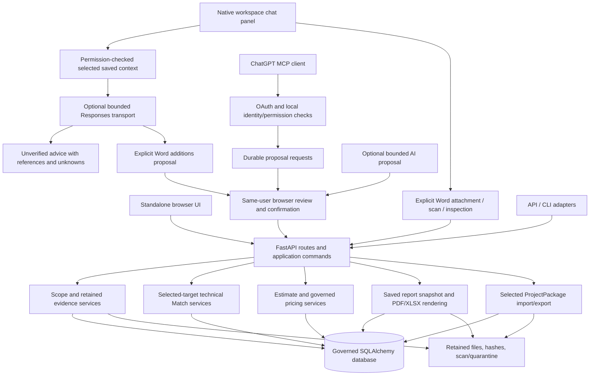

# CLASSIFIRE Architecture

Reconciled 2026-09-13 from merged source, approved ADRs and the owner's clarified
in-app chat upload and page-interaction intention. This document
separates implemented application structure from the target and remaining work.
Exact branch, CI, runtime and validation facts belong in
[PROJECT_STATE.md](./PROJECT_STATE.md), not in historical feature narratives.

## Accepted direction

[ADR 0001](./ARCHITECTURE_DECISION_0001_HYBRID_ORCHESTRATION.md) and
[ADR 0002](./ARCHITECTURE_DECISION_0002_INDEPENDENT_CAPABILITIES.md) accept a hybrid
modular application: deterministic workflows by default; optional AI for useful
interpretation; shared services for standalone UI, authenticated clients and APIs.
Four independently callable capabilities do not require four agents or microservices.
OpenClaw remains until its required protections have proven replacements.

The reasoning chain remains evidence -> physical scope -> technical applicability ->
quantity/labour -> commercial recovery -> validation/snapshot -> output -> human release.
Users may stop after any capability and resume from explicit saved artifacts. A valid
manual/imported artifact replaces session dependence, not the required evidence or authority.

The locally implemented [register source evidence view](./REGISTER_SOURCE_EVIDENCE.md)
reuses the existing intake and row services for read-only exact-revision context.
Its validation/publication status is tracked separately; no schema or authority changes.

## Implemented components

The diagram represents Draft application composition. Canonical admission, physical
locks and final release are separate guarded services; a Draft confirmation does not
activate them. Client upload/scan tools may retain and process explicitly requested
untrusted evidence without saving Scope or granting approval.

| Layer | Implemented components and responsibility |
| --- | --- |
| Interfaces | FastAPI/Jinja UI (`ui.py`, `draft_scope_ui.py`, format-specific review routes), API/CLI and optional `draft_client.py` MCP mounting |
| Embedded assistant | Shared docked/collapsible/resizable panel, typed selected-context preview and hash, explicit provider consent and bounded qualified conversation; context/message endpoints offer advice, explicit Word additions or selected Scope replacements for separate review; a separate thin session adapter adds explicit Word retain/scan/inspection controls over existing services, without Scope edits or provider disclosure |
| Authentication | Existing user/session/CSRF checks plus `draft_client_auth.py` and explicit client policy; verified external identity maps to an active local user. Exact resource/issuer/signature/time/scope checks; approved optional nbf/Auth0 compatibility does not remove permission checks |
| Application commands | `services/draft_client_requests.py` and `draft_client_capabilities.py` create typed durable requests; browser confirmation rechecks rights, owner, dependencies and expected state before executing the shared service |
| Scope | `draft_scope.py`, `draft_scope_evidence.py`, format review services and shared editor. Immutable revision envelopes with explicit evidence state and unknowns |
| Technical | Governed technical sources, variants/releases, source integrity, temporal eligibility and independent review; `draft_system_matches.py` snapshots selected-target candidates and later measured constraint decisions |
| Commercial | `draft_estimates.py` and contracts preserve lines, original rates/overrides, totals and dependencies; separate pricing intake/profile/observation/mapping/recipe/quantity services support bounded deterministic proposals |
| Reports/packages | Scope and estimate report services persist selected snapshots and exact paired outputs; project-package service composes saved artifacts without rerunning upstream capabilities |
| Persistence | SQLAlchemy models, Alembic forward migrations and retained storage; PostgreSQL for appropriate governed/integration workflows, SQLite in bounded tests/demo paths. A test configuration is not proof of production topology |
| Execution | Explicit services and bounded subprocess parsers; `execution_journal.py` provides scoped execution records. `worker.py` has no registered job handlers and cannot yet run general document-processing work |

`pyproject.toml` currently declares Python >=3.11, FastAPI, SQLAlchemy, Pydantic,
Jinja, Alembic, PDF/XLSX/image libraries and optional PostgreSQL/malware/ChatGPT extras.
There is no new service/database/framework introduced by the Word client increment.

## Native chat as a working interface

The owner clarified on 2026-09-13 that users must be able to upload supported defect
reports through the ChatGPT integration inside CLASSIFIRE and interact with the
data on the page through it. A separate external chat page is insufficient for
that working experience. Keep the native panel available across data-heavy screens,
with selection-aware context and collapsible/resizable layout.

**Current architecture:** the native panel resolves typed identifiers and exact saved
revisions through authenticated readers, previews the data, then sends it to the
existing bounded Responses transport after consent. Separately, the existing
external ChatGPT/MCP client can request intake/scan and prepare durable Draft changes
for same-user browser confirmation. Ordinary UI intake/review uses the same domain
services. The native panel now also
retains Word, PDF and XLSX reports, explicitly scans them and displays retained evidence
via `draft_workspace_word_ui.py`. The historical module and Word routes remain; the
same adapter selects the existing format-specific intake policy through a constrained
source kind. A shared panel driver handles these formats. PDF inspection shows one retained
page at a time, its rendered PNG and exact original download, with a link to that
page's existing review. XLSX now uses this same adapter/driver: five-row windows,
worksheet selection, typed cells, verified anchored picture previews, original download
and a link to existing mapping/review. Scope workbook purpose stays distinct from
pricing. These controls never call the advice transport; native workbook model
selection and typed proposals remain the next extension.
The existing plugin is retained. The advice context additionally accepts explicit
selection of at most 10 text blocks and 2 verified PNG pictures from one retained
DOCX. Source/scan/document/image hashes bind the preview and are rechecked before
and after provider use; original files and omitted content are excluded. Alternatively,
users select one PDF page's retained text and/or PNG (at most4MiB). Word and PDF
selectors are mutually exclusive. The same evidence preview, consent, integrity
and current-rights rechecks apply; no external image link or original PDF is sent.

**Implemented extension:** an explicit `propose_word_scope` action uses that same
transport and selected Word evidence. A small composer validates new Defect, Opening
and Service records against the existing Scope contract, remaps proposal IDs and
preserves existing rows. The panel shows additions, source claims and unknowns, then
posts to the existing Word preview route. Its session-bound confirmation remains the
only save step. `propose_pdf_scope` reuses this composer and transport with the
selected page anchor, exact text quotes and selected image identity. Its review card
posts to the existing signed PDF page preview/confirmation. Confirmed references
record the existing human page/entity review; raw AI claims and rationale remain
transient, without a new durable suggestion batch. The additional
`propose_scope_edits` action prepares at most25
complete replacements of explicitly selected saved Scope records, with before/after
fields and reasons. It preserves the rest of the graph, validates its relationships
and retains old source claims, marking changed claims for review. Its review form
uses the existing manual editor with `action=validate`; the user separately saves
through that editor. This is not the signed Word confirmation or a durable AI request.
Broader report and non-Scope edit coverage follow. Browser routes use the existing
user session and
CSRF checks; external clients retain their OAuth scope/policy checks. The browser
does not need to loop through external MCP or acquire a second identity.

**Reason:** selected-record advice and local Word attachment/inspection are
implemented, and bounded selected Word evidence now enters the model contract only
after preview and consent. Users can now prepare typed additions without granting
chat write authority. The selected-record extension lets users review requested
changes in context without copying data, while preserving the existing manual writer.
Separate review and package steps retain their existing guards.

**Consequences:** distinguish local attachment/intake, explicitly requested scan,
provider disclosure/consent, analysis proposal, human Draft confirmation and package
confirmation. A typed action dispatcher admits only supported application commands
with current authority and sufficient inputs; model text or a generic tool call
cannot invoke arbitrary services, save data or chain capabilities. A same-user
review card can live beside the conversation while retaining the existing
confirmation checks and explicit confirmation control. Typing "confirmed" alone
does not execute the pending request.

The first slice uses bounded DOCX intake, then the same interaction extends to
supported PDF and XLSX. Approved technical-source and commercial-library ingestion
retain their distinct purpose, rights and authority; attaching a defect report
does not import it as a trusted technical or pricing library.

**Migration impact:** native Word/PDF/XLSX attachments reuse the existing retained-source
policies, parser/scan workers and readers without changing tables, migration history
or dependencies. Explicitly selected PDF page evidence now enters the same native
chat transport; existing PDF suggestion/review services remain available. The
reason for extending the shared adapter is to expose already supported evidence in
the requested native working environment without another intake pipeline.
The selected-evidence extension adds optional typed selectors and an internal image
argument to the same advisory port; no new provider, identity or write path is added.
The proposal composer reuses immutable Draft revisions and the existing Word
preview/confirmation service; selected replacements reuse manual validation/save
and shared strict-schema construction. Neither adds a schema version or writer. New Word
observation claims are outside that existing contract; old observations remain intact. No new table, migration, vector store, agent
framework or transcript
store is required by this decision. If a demonstrated gap requires persistence
changes, document compatibility and use a forward migration before activation.
This refines the interface under ADRs 0001/0002; their domain/authority rules remain.

Detailed interaction, source-disclosure and acceptance requirements belong in
[Embedded workspace assistant](./EMBEDDED_WORKSPACE_CHAT.md#approved-target-experience);
delivery order belongs in the roadmap's
[C1-C3 sequence](./CLASSIFIRE_ROADMAP.md#embedded-chat-delivery-sequence).

## Reports from selected row reviews

The [multiple-review increments](./MULTI_REVIEW_REPORTS.md) extend the existing
Scope and Estimate report services/tables from one review to an explicit collection.
Scope-and-system uses Scope report v3/render11. The existing Complete profile uses
Estimate report v3/render12 over the exact unchanged Estimate and its embedded Scope.
An embedded Estimate review must be explicitly included at its exact revision;
additional reviews are report-only context and cannot alter arithmetic or recovery.

The UI and typed client commands share no-write preview and separately confirmed
creation boundaries. Import mapping v4 is reused for all review dependencies,
including retained ancestor reports. There is no model, migration, new profile or
downstream authority change. Older snapshots/downloads remain unchanged; readers
that predate Complete v3 cannot read its new reports/imports merely because they
already understand mapping v4. An activation or downgrade requires a separate
exact-version data/storage and rollback plan.

## Scope and evidence interpretation

The Draft graph distinguishes defects, openings, services and observations. Services
can reference multiple openings; blank openings remain distinct. Dimensions and
quantities may be null. The complete canonical physical model also has separate
relationship/plane/governance concepts; the simpler Draft schema does not yet expose
all required service-instance, substrate-plane, treatment and inspection concepts.

The implemented path is explicit upload -> retain original -> scan/parse -> inspect ->
propose complete graph with source targets -> preview -> human confirmation -> append
revision. It does not infer one defect = one opening = one service = quantity one.

- PDF: exact original, parsed pages, image previews and page/entity references.
- Excel: selected sheets/rows/cells and embedded pictures; explicit column mapping and
  target review. Formula cells are not evaluated. Image anchors are placement, not ownership.
- Word: bounded DOCX body paragraphs/simple tables and supported embedded pictures;
  structural locators, text/picture/document/source hashes, explicit associations and
  human decisions. Headers/footers and unsupported layouts are rejected, not silently
  reinterpreted. Original pictures do not reconstruct Word cropping/rotation or pagination.
- Optional PDF suggestions: proposals through the existing review boundary; model content
  never becomes canonical authority. No provider run is implied by installed source code.

The shared `DraftSourceIntake` and existing workers enforce format/size/containment,
malware state, current owner/rights and retained-byte identity. Runtime file retrieval
uses format-specific MIME/magic checks plus bounded HTTPS, host allowlisting, public-DNS
checks, TLS, redirects and deadlines. URLs/credentials are not durable evidence content.
Document text is untrusted evidence, never an instruction to bypass application rules.

Contracts: [PDF](./DRAFT_PDF_EVIDENCE_V1_CONTRACT.md),
[Excel](./DRAFT_SCOPE_XLSX_V1_CONTRACT.md),
[Word](./DRAFT_SCOPE_DOCX_V1_CONTRACT.md),
[optional suggestions](./DRAFT_PDF_SUGGESTIONS_V1_CONTRACT.md).

## Capability independence and limits

Scope analysis saves physical observations, not technical suitability. Match retrieval
uses an authorized technical release and retains reasons/constraints/source identity;
its current selected-target coverage is not a complete automatic applicability solver.
Technical source approval, Match review and commercial rate identity remain different acts.

Independent Draft Estimate lines consume sufficient saved/manual inputs. Existing
rate-selection and override history do not implement every planned inferred pricing
method. Source A (general products/activities) and source B (Firefly observed system
prices) retain separate dataset/version/price-meaning identities. A commercial match
never proves technical suitability.

Implemented A/B support includes exact profile decisions, A observations, B mappings,
frozen technical recipes/reviewed links, target-wide T9 coverage, target-blind T13 roster
and a governed Scope-service quantity basis. T10 bottom-up preview uses only supported
current confirmed observations, quantities and units; absent/incompatible inputs withhold
amounts/totals. It does not parse yield/productivity/recovery prose into numbers or grant
commercial activation. Representative semantics, broader recovery arithmetic, analogous
methods, calibration and independent evaluation remain required.

Reporting selects saved revisions and a profile: scope-only, scope-and-system,
estimate-only or complete. Paired PDF/XLSX outputs share a retained snapshot and keep
unavailable information explicit. Historical bytes/render versions remain stable.
Canonical output still requires its separate physical-lock/snapshot/release gates.

## Project-package schema, lifecycle and source of truth

The governed database and retained files are live application truth. The versioned
project package is the canonical interoperability boundary, not chat memory or a
substitute for database authority. Current exports are selected Draft artifacts.

1. Create/configure a Draft; append explicit revisions rather than overwriting history.
2. Retain and review evidence; bind source and target hashes to the saved revision.
3. Select exact Scope/Match/Estimate/report revisions and permitted original evidence.
4. Validate dependencies, current ownership/export permissions and file integrity.
5. Persist the package manifest/inventory and exact ZIP bytes; authenticated download
   serves the saved artifact, not a new inference or recalculation.
6. Import through bounded archive/schema/inventory/hash checks. Materialize new owned
   local identities; preserve imported origin bytes/history and foreign review claims.
7. Require current local scanning/containment for retained imported originals; imported
   claims do not become local approval. Re-export checks retained binary ancestors too.

Scope readers preserve v1-v7 evidence history; Word review uses v7. ProjectPackage v1-v6
readers coexist: v3 adds optional PDFs, v4 optional workbooks, v5 optional DOCX originals,
and v6 an explicit collection of exact row reviews. Collection imports use mapping v3
within the existing persistence model; no database migration is added. Older binaries
cannot read these new formats. See [compatibility and recovery limits](./MULTI_REVIEW_PROJECT_PACKAGES.md).
These are explicit format branches, not a claim that every export uses the newest version.
Full project history, all audit events, library source bodies and unselected artifacts
are not automatically present. The schema is not a full database backup.
Upstream edits retain prior references and expose dependent staleness instead of silently
refreshing technical, commercial, report or approval state.

See [ProjectPackage contract](./DRAFT_PROJECT_PACKAGE_V1_CONTRACT.md) and
[client contract](./DRAFT_CLIENT_V1_CONTRACT.md) for exact fields and limits.

## Security and authority boundaries

Current permissions/ownership apply at reads, previews, saves and downloads. Durable
client requests bind exact inputs and expiry; only a separate same-user browser session
may confirm. No `confirm`/`execute` client tool exists. Scan success means processing
readiness, not human approval. Schema validity is necessary but does not prove authority.

Canonical physical submission/admission, protected-state checks, signatures, replacement
locks and final Human Release remain separate. Imported claims, agent scope, a pricing
row or a Draft package cannot grant canonical writes. Foreign/stale/tampered/quarantined
inputs must fail closed. Evidence/technical/pricing confidentiality and source retention
remain relevant even though the source-code GitHub repository is public.

OpenClaw and Mission Control coordinate some existing proposal/controlled workflows;
their memory and task text never own estimate truth. Approved retirement requires
replacement parity for permissions, egress/privacy, containment, budgets/deadlines,
receipts, cancellation/recovery, observability, compatibility and rollback. Existing
execution journal/transport protections are foundations, not proof of full retirement.

## Migrations and deployment boundary

The verified source migration head is 0047 (retained Word source rows), following 0046
(governed pricing quantity bases). Word review uses existing JSON revisions and package
storage; the client adapter adds no migration. Preserve historical migration files and
old artifact readers; future changes require forward compatibility and restore evidence.

Merged source and live runtime are separate. The accepted operational workspace
runs the earlier 6c1e2a4; the native panel is merged through PR #268 and has a
separately approved conditional activation plan for tested 7dbc1cc. One bounded
real gpt-5-mini transport test passed with synthetic data. That is not a live-panel
or report-upload acceptance result. Consult [PROJECT_STATE.md](./PROJECT_STATE.md)
for observed CI/runtime status; publication of these documents does not repin the
approved deployment or permit OAuth/tunnel changes.

## Planned architecture and unresolved decisions

| Gap / decision | Planned direction and validation needed |
| --- | --- |
| Native chat upload and reviewed page actions | Reuse existing intake and typed proposal/confirmation services; prove the complete in-context C2/C3 journeys before claiming chat attachment or edit support |
| Broader physical/evidence representation | Extend current graph and provenance only for a proven user need; explicit instances/planes/treatments and additional report formats need representative acceptance and compatible schemas |
| General document jobs | Implement bounded resumable stages/attempts/leases/recovery over existing persistence when the interactive pilot establishes need; current worker has no handlers |
| Technical corpus scale | T2-T8 require retained source revisions, per-field lineage, duplicate/reprocess policy, pagination and measured capacity; no mandatory vector database or agent fleet |
| Pricing breadth | Validate representative quantity/recipe meaning; then justified yield/productivity/recovery inputs, explainable provisional methods and independent T13 evaluation before T11 combination |
| Whole-project portability | Define missing history/audit/source membership, retention/confidentiality and forward import policy; current selected ZIP is not the full target |
| AI/orchestration | Preserve optional proposals; test replacement protections before retiring OpenClaw. No autonomous approval or hidden orchestration state |
| Operational readiness | Tenant separation, backup/restore, clean-machine startup, representative performance/cost, monitoring and production release exits remain unproven |
| Merge governance | GitHub main protection endpoint reports unprotected; observed premature merge requires explicit check verification now and an owner-approved enforcement decision |

This interface refinement is documented above as current structure -> proposed
extension -> reason -> consequences -> migration impact. It neither completes a
production phase nor retires OpenClaw.

## Immediate direction

Follow [Recommended Next Actions](./PROJECT_STATE.md#recommended-next-actions):
C1 still needs successful applicable CI and a separately approved diagnostic test
and activation. C2 has synthetic native Word and PDF journeys, with real-provider/live
acceptance and broader coverage outstanding. C3 has a synthetically validated
selected Scope replacement action; broader reviewed actions and durable AI lineage remain. Existing connector transport
acceptance, independent technical/pricing work and production gates remain tracked
without forcing users through downstream capabilities.
