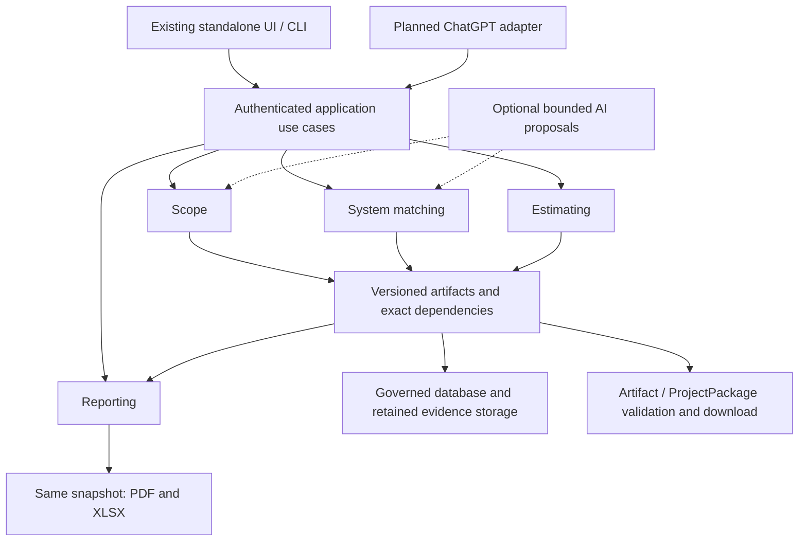

# CLASSIFIRE Architecture

**Document status:** Current pre-production architecture

**Architecture version:** 5.1 - accepted independent capabilities; implementation remains partial

**Verified shared-main baseline:** `3b437dad9e42ec7ba2adf512b8ee67816d243473` (PR #186, 2026-09-05)

**Latest executable-change baseline:** 73c428e (PR #185)

**Accepted target architecture:** Hybrid deterministic core with bounded,
optional AI adapters; see
[Architecture Decision 0001](./ARCHITECTURE_DECISION_0001_HYBRID_ORCHESTRATION.md),
refined by approved [Decision 0002](./ARCHITECTURE_DECISION_0002_INDEPENDENT_CAPABILITIES.md).

This document separates the architecture that is implemented now from the
adopted target architecture and known gaps. Read it with [PROJECT_STATE.md](./PROJECT_STATE.md)
and [CLASSIFIRE_ROADMAP.md](./CLASSIFIRE_ROADMAP.md). Source, tests, migrations,
Git state, and retained runtime receipts determine factual implementation state.

## Implemented execution boundary and planned package boundary

PR #185 is merged at `73c428e`; optional journal lifecycle hooks now span both
visual and report transports. Capture begins before inference dispatch;
completion is durably reloaded and validated before proposal acceptance.
Duplicate begin, abort and conflicting verifier configuration fail closed.
The journal is a bounded foundation, not a complete workflow scheduler or proof
of remote capture. Managed factories remain unwired pending producer assurance.
[Exact main CI](https://github.com/Slayde91/classifire/actions/runs/33941884582)
passed 974 tests. No OpenClaw retirement or operational migration occurred.

A local, untracked Draft ProjectPackage schema/archive candidate exists in
`.tmp/project-package-draft-20260905`; 22 synthetic tests passed on review.
It is not shared-main architecture. It accepts an explicit snapshot/inventory
and authorization callback, validates the declared graph and hashes, and writes
or validates deterministic archives. A supplied inventory cannot prove database
completeness, and a callback interface cannot establish an export policy.
Database projection, rights/redaction, immutable persistence, download and
quarantined import remain separate unimplemented boundaries.

Do not reuse `services/snapshot.py:build_estimate_snapshot` as a read-only package
extractor: it calls `recalculate_estimate`. Future projection must preserve a
consistent authorized revision and reuse exact clean-byte evidence reads without
recalculating, changing records or bypassing canonical output gates.

## Approved capability composition and first prototype

**Target, not implemented capability:** one modular CLASSIFIRE application exposes
Scope, System Matching, Estimating and Reporting through independent use cases.
Each accepts explicit validated saved/manual inputs, produces a versioned artifact
and stops unless the user requests another capability. Stable IDs, evidence,
validation, storage and permissions are shared across clients.



The arrows show available data paths, not automatic execution. Reporting reads
selected available artifacts; it does not call the other three capabilities.
Technical suitability and pricing remain separate, and source/library eligibility
still applies. Model output is proposed evidence, never authority.

| Component | Implemented starting point | Accepted prototype/target work |
| --- | --- | --- |
| Interfaces/API | FastAPI, Jinja templates, sessions, project/estimate forms and scoped proposal-review pages | Extend the existing UI first. Add independently callable shared Draft use cases; ChatGPT later uses the same commands. |
| Orchestration | Deterministic controllers and bounded inference journal; generic worker incomplete | Ordinary synchronous bounded manual commands for P0. Add durable jobs only when a selected long-running workflow needs them. |
| Domain services | Physical/evidence guards, technical governance, calculations, snapshot/renderers | Reuse rules behind independently validated capability contracts; do not duplicate business logic in UI or adapters. |
| Draft persistence | Existing project/database/storage and narrower proposal records | Persist Draft Scope revisions in an explicit non-authoritative boundary, with ownership, integrity and stale-save refusal. Determine the smallest compatible mapping in P0. |
| Canonical physical writes | Existing opening/service UI writes guarded canonical rows | Keep these routes and admission/lock protections intact. Draft Scope saving cannot promote data into them. |
| Packages | Narrow proposal-review/estimate exports; local unmerged generic archive candidate | Minimum Scope JSON contract in P0; whole-project archives and import follow demonstrated use cases. A Scope artifact is not a complete ProjectPackage. |
| Reporting | Canonical export requires lock/retained snapshot; snapshot builder recalculates | Separate Draft profiles over explicit immutable inputs, PDF/XLSX parity and visible missing/stale sections; preserve canonical guards. |
| Security | Session/CSRF, roles, evidence ownership, scoped review and safe reads | Define exact Draft object access/export policy, bounded input and safe filenames. Existing role names alone do not prove object authorization. |

**First milestone:** a real persisted Draft Scope UI, with manually entered
synthetic observations, distinct openings/services, explicit uncertainty,
validation, reopen after restart and exact saved JSON download. Build the minimum
schema, persistence and tests in that same slice. An API-only/schema-only result
or a mocked screen does not satisfy the milestone.

**Dependency freshness:** artifacts pin input/release revisions and hashes.
Upstream edits mark affected downstream relationships stale without changing the
old artifact's content or approval history. The user chooses to compare or rerun.
A report snapshot captures selected revisions and freshness so PDF and XLSX agree.

**Scope of independence:** saved/manual input can replace a prior session's
execution, but cannot replace required evidence or approval. Partial Draft
artifacts/reports may be valid with explicit missing information. Structural
validity, completeness, technical authority and Human Release are separate facts.

## 1. Governing reasoning chain

CLASSIFIRE preserves this order:

```text
Project Evidence
-> Defects
-> Services and Assets
-> Openings
-> Substrate Planes
-> Physical Model
-> Repair Components
-> Technical System Search
-> Compatibility Validation
-> Commercial Applicability
-> Quantity and Labour
-> Reconciliation
-> Estimate, Scope, and Close-out
-> Human Release
```

This chain governs defensibility and authority; it does not require every user
to run every capability in one session. Validated saved/manual inputs may enter
at a capability boundary, with unresolved facts and approvals explicit.

Physical reality comes before technical selection or pricing. A report label,
Defect, photograph, Opening, Service, Opening-Service link, repair component,
and commercial line are different records. One Defect does not imply one
Opening, one Service, or quantity one.

An assumption-led desk quote is a deliberately parallel proposal-only
commercial scenario. It may support early budgeting from bounded evidence and
assumptions, but it does not enter or bypass the canonical chain above.

## 2. Authority and sources of truth

The governed CLASSIFIRE database and content-addressed retained-file storage are
live canonical project state for an application instance. The planned versioned
`ProjectPackage` schema is the canonical interoperability contract; each valid
export is an immutable, hash-bound snapshot of one governed project version,
with independent Scope/System Match/Estimate artifacts and explicit partial
project exports supported in the target. Every import remains untrusted until quarantine, integrity, schema,
lineage, conflict, permission, and authority checks pass. The existing
`ProposalReviewPackage` is a narrower proposal-only review artifact, not that
complete portable project contract. OpenClaw sessions, Mission Control tasks,
prompts, model outputs, chat history, desk quotes, and temporary receipts remain
evidence or proposals, not live canonical truth.

Authority remains separate for:

1. evidence retention and review;
2. proposal-only inference;
3. human evidence adjudication;
4. canonical Physical Model submission;
5. Physical Model Lock creation;
6. technical-source and TechnicalVariant approval;
7. technical-release publication;
8. commercial approval;
9. deployment; and
10. Human Release.

Approval for one operation never grants a later authority.

### Repository tiers

| Tier | Meaning |
| --- | --- |
| **Shared main** | Reviewed source on the current GitHub `main` lineage. |
| **Isolated branch/worktree** | Candidate work based on current main; not shared implementation until reviewed and merged. |
| **Quarantined legacy root** | Historical and unfinished evidence in the conflicted `C:\CLASSIFIRE` checkout; never a bulk publication or deployment source. |
| **Local runtime evidence** | Receipts and disposable artifacts proving a particular bounded operation; never canonical state or source publication. |

## 3. Implemented application composition

| Layer | Current implementation | Main boundary |
| --- | --- | --- |
| Application | FastAPI, CLI, development HTML UI, worker shell, and audit services | Pre-production; not every merged service has an operator/UI flow |
| Persistence | SQLAlchemy with packaged Alembic migrations | Packaged history advances through 0026_single_active_technical_release |
| Evidence storage | Content-addressed `StoredFile`, Project/Estimate ownership, immutable metadata, verified reads, quarantine | Exact production use requires PostgreSQL transaction semantics |
| Physical model | Defect, EvidenceSource, Opening, Service, `ServiceOpeningLink`, locks, admissions, submission receipts, governed reopen/amendment execution, and atomic signed replacement-lock execution | Historical UAT records report no accepted replacement lock; live state was not rechecked; code capability does not authorise operation on real project data |
| Proposal-only inference | Blind inventory, Physical proposal, Validator, bounded correction, receipts | No canonical-write or lock capability |
| Report assessment | Shared components, expected-label admission, an approval-bound proposal-review controller, proposal-only single/family runners, retained single-report/family package lifecycle, and administrator-only immutable human-review annotations | The family runner validates every exact family member's approved source and V2 scope before it creates any injected no-tool port, then preserves separate member packages; no CLI, API, or UI invokes either runner and no real-provider run exists |
| Technical governance | Document review, clean source-byte checks, source-bound Draft materialisation/variants/revisions, hash-bound Draft source-document predecessor lineage, source locators, independent activation, pinned active releases, atomic governed publication, and read-only lineage | Extraction-assisted and manufacturer-neutral lineage plus production technical authority remain incomplete |
| Estimating/output | Basic estimate calculation, PDF/XLSX outputs, assumption-led desk quotes | Full technical-to-component recovery and release chain incomplete |
| Orchestration | OpenClaw boundary and Mission Control client/bootstrap | Transitional current implementation. The accepted target is a small CLASSIFIRE-owned deterministic job/run coordinator with bounded optional AI adapters; journal/lifecycle foundations are implemented, but full migration remains incomplete and OpenClaw stays until parity gates pass. Neither control plane owns canonical estimate state. |

Production startup validates configuration before storage work, never runs
`create_all()` or seeds a default administrator in production, and requires the
configured database to match the packaged migration head. Development retains
convenient schema creation/seeding. This is narrow hardening, not deployment
proof.

### Verified execution boundary and worker debt

Controllers determine stage order and correction bounds through injected
inference ports. Separate Physical/Validator contexts do not prove a deployed
autonomous fleet. OpenClaw transport lives under services; that placement does
not make it a provider-neutral domain layer.

BackgroundJob and worker.run_once() are existing extension points. The worker
claims a queued job with a row lock, marks it running, then fails it because no
handlers are registered. Its selector does not honour run_after. Durable stages,
lease expiry, cancellation and crash recovery remain gaps. Record them now;
PR #184's journal reuses this table in distinct non-queued states;
the generic worker still has no registered handlers.

The controlled-write plugin defaults to phase8-admission-only. Broader catalog
entries and Mission Control bootstrap code do not prove working API routes,
deployed tools or an operational fleet. Inventory callers/profiles/tests before
deciding what the replacement must preserve.

## 4. Domain model

The current physical graph is:

```text
Project
  -> Estimate
       -> Defect
            -> EvidenceSource
            -> one or more Openings
                 -> zero Services for an explicit blank opening/core hole
                 -> one or more Services through ServiceOpeningLink records
```

An Opening is the aperture or bounded penetration condition. A Service is a
physical item passing through it. Placeholder Services are prohibited.

### Pre-technical physical amendments

**Current architecture:** an active Physical Model Lock blocks evidence and
physical mutations. **Change:** the generic API now allows an `estimate:write`
human to reopen an active *unsigned* pre-technical lock with a nonblank reason.
**Reason:** a human-reviewed physical correction needs a governed way to proceed
without discarding retained evidence or topology. **Consequences:** reopening
invalidates the old lock, records the actor, reason, prior lock hashes, current
physical hash, and row counts in the existing audit record, then preserves every
Defect, EvidenceSource, Opening, Service, and link for amendment. It fails closed
when technical selection, estimate lines, rule evaluations, snapshots, approval,
or any signed lock is present. **Migration impact:** none; it uses the existing
lock invalidation and audit fields.

### Signed-lock amendment eligibility

**Current architecture:** a no-write P-256 verifier and transaction-ready
preflight bind an active signed lock, its current physical hash, a prospective
canonical payload, and an exact semantically approved visual-validation receipt.
**Change:** a separately additive immutable admission journal now records a
fresh verified manifest, canonical prospective payload, preflight receipt, and
attributed human-governance audit event. **Reason:** retain exact approval
lineage without letting a generic API, a receipt, or the journal itself become
lock-execution authority. **Consequences:** registration refuses unsigned,
stale, altered, expired, mismatched, visually withheld, conflicting-replay, or
corrupt retained candidates. Exact replays recheck every stored binding before
returning the existing admission. A separate no-write registered-admission preflight reloads the exact journal
record and reruns the locked signed preflight. The permission-gated execution
service consumes only that exact registered payload in the same caller-owned
transaction. It reconciles Openings, Services, and ServiceOpeningLinks, preserves
or records their logical row identities, invalidates only the signed target lock,
and retains exact canonical before/after payloads, hashes, an identity map, an
execution receipt, and an attributed audit event. Exact completed replays return
the intact retained outcome; corrupt outcomes fail closed. Any write or audit
failure rolls back the topology, invalidation, outcome, and audit together. A
disposable PostgreSQL two-session race test holds the first execution
uncommitted, proves the second session blocks, and then requires both callers to
resolve to the same single outcome and audit event.
Execution rejects a no-op and rechecks later technical, commercial, rule,
snapshot, or release dependencies. It creates no replacement lock and grants no
technical, commercial, snapshot, release, or other downstream authority. Lock
decimals remain semantically normalised before hashing so an unchanged model is
not made stale by database display scale. **Migration impact:** forward-only
migration `0022_signed_physical_model_lock_amendment_admissions` adds the journal;
`0023_signed_physical_model_lock_amendment_outcomes` adds the immutable execution
outcome. Neither alters the initial-submission admission table.

A separate signed replacement-lock contract now binds one short-lived P-256
approval to the exact immutable amendment outcome, invalidated signed-lock hash,
approved visual receipt, and unchanged amended physical-model hash. Its
transaction-ready preflight locks the Estimate and every current physical row,
rechecks scope-aware physical completeness, editable lifecycle state, and the absence of technical, commercial,
rule, snapshot, or release dependencies, then returns only a deterministic
no-write receipt. A separate human-attributed registration transaction reruns
that preflight and immutably journals the exact canonical signed envelope and
receipt. Exact replays are idempotent; conflicting or corrupted records fail
closed. A fresh separately signed approval can be registered if an earlier
short-lived approval expires unused; every record keeps a distinct exact identity.
Registration creates no Physical Model Lock and grants no downstream authority.
A separate active-human `estimate:write` transaction may consume one exact
registered admission only after rerunning its locked fresh preflight. It creates
the exact replacement Physical Model Lock over the unchanged approved snapshot,
retains the complete canonical signed envelope on that lock, and writes one
immutable outcome plus attributed audit event in the same transaction. Exact
completed replay returns the same intact outcome. Active-lock races, state drift,
corrupt replay, or a failed outcome/audit write fail closed or roll back together.
The writer performs no technical selection, pricing, deployment, or release and
grants no downstream authority. **Migration impact:** forward-only migration
`0024_signed_physical_model_lock_replacement_admissions` adds the journal;
`0025_signed_physical_model_lock_replacement_outcomes` adds the immutable
execution outcome.

The read-only lock-content snapshot API exposes the exact canonical JSON preimage
of the existing v1 lock hash. That payload includes the row identities and bound
fields for Defects, evidence, Openings, Services, and ServiceOpeningLinks. The
ordinary lock summary and persisted content hash are built through the same
snapshot path, preventing the inspection payload from silently diverging from
the lock identity. It performs no write and grants no amendment authority.

Barrier/substrate, plane, orientation, opening type and dimensions, FRL or
governed assumption, service identity/material/quantity, link provenance, and
limitations remain independently represented. Unknown or occluded facts must
not be invented to make a proposal complete.

Shared main also implements immutable admission registration and one-shot
initial physical submission. Registration is authority evidence, not a write.
Initial submission does not create a lock. A separate reviewed and signed lock
admission is required before a replacement active Physical Model Lock.

## 5. Evidence and storage architecture

### 5.1 Retained evidence

`StoredFile` retains immutable file metadata and content identity.
`ProjectEvidence` gives each binding exactly one direct owner: either a Project
or an Estimate, never both. Every Estimate is itself owned by a Project.
`EvidenceSource` binds a supported claim or observation to the estimate and
retained source.

For security-sensitive consumption, the PostgreSQL path locks every row sharing
the same SHA-256, requires every shared row to remain clean, opens the exact
retained path without following unsafe substitutions, verifies size and hash,
and holds the transaction through consumption. A malware verdict uses the same
row set and quarantines all matching-byte rows. Binding mismatches cannot roll
back confirmed shared-byte quarantine.

Metadata-only checks are not equivalent to this atomic clean-byte contract.

### 5.2 Report normalisation

The merged report adapter supports bounded PDF, XLSX, and DOCX normalisation:

- report/page metadata hashes;
- text blocks;
- strict explicitly numbered caption text blocks, with a fixed categorical caption
  kind and no raw caption text in the locator;
- tables;
- annotations;
- drawing locators/hashes;
- embedded-image locators/hashes;
- visible XLSX worksheet shape locators with no worksheet names;
- non-empty XLSX cell position/category/hash locators with no cell values;
- structural DOCX document locators, visible body paragraph locators, and simple body table locators, all with no document text or table values; and
- stable report/page/item identities and ordered Defect scopes.

Text, table, annotation, strict caption, selected XLSX cell, and selected DOCX paragraph/table items can provide
transient documentary content. Drawing, embedded-image, and XLSX worksheet items are
locator/hash evidence without raw documentary content. XLSX formula text is never
executed. The XLSX boundary rejects hidden sheets, macros, external links,
drawings/media/charts, comments, pivots, embedded objects, validation rules, and unsafe
archive or worksheet shapes. The DOCX boundary rejects encrypted or unsafe archives, macros, external relationships, embedded or hidden content, tracked changes, fields, hyperlinks, drawings, and unsupported body structures. Actual visual inference bytes come from a separately
governed retained visual packet. A caption is only an exact retained text block with an
explicit numbered category; it is not automatically associated with an image and cannot
establish a physical fact. General report formats remain planned. Explicit human-approved family admission, deterministic proposal-review aggregation, and service-only family execution are available. The family runner preflights every ordered member's exact retained source and V2 approved scope before it creates any no-tool port, then preserves separate inputs and packages; family records retain their approved member identities through the existing controlled-UAT reviewer lifecycle.

On shared main, cardinality is deterministic for the report scopes that already exist in the
database. An approved expected-label manifest record is source-bound to the
report bytes and estimate for runner completeness. New report scopes are admitted
only as one complete, exact label set matching that approval record, and every new
scope retains its approval-record ID. Bound packets emit V2 approval details.
Historical unbound scope packets remain verifiable as V1, but both the proposal
runner and the database-backed proposal-review controller reject them rather than
treating them as approved coverage or using them to assemble a new package.

### 5.3 Linked originals and visual evidence

Linked-original retrieval is limited by approved host/address/TLS/redirect,
path/query, MIME, byte, pixel, and runtime policies. A higher-resolution image
is retained only after binding to the report-provided parent. Lower-resolution
page context, annotations, crops, and alternate views remain relevant when they
contain different evidence.

Photograph count never becomes Opening, Service, or quantity count.

## 6. Proposal-only assessment architecture

The visual controller executes:

```text
Blind Validator inventory
-> Physical proposal
-> Conditioned Validator review
-> Optional bounded correction
-> Approved, Blocked, or Failed receipt
```

The blind inventory cannot see a Physical proposal or human answer. The Physical
role cannot see the blind inventory. Human-reference material is validation-only
and remains hidden from inference.

Schemas enforce separate Openings and Services, links, blank-opening semantics,
unique candidate IDs, uncertainty, evidence references, issue codes, and blind
reconciliation. Correction authority is field-specific. A quantity issue cannot
authorise an unrelated topology, substrate, material, or relationship change.

The report-specific services add:

```text
Owned clean report bytes
-> stable report locators and Defect scopes
-> transient documentary context + governed visual packet
-> v2 property assessment
-> proposal/Validator receipt
-> deterministic JSON + inert Markdown review
-> completion receipt over preceding artifacts
```

`execute_phase8_report_assessment_runner()` composes this sequence as a
proposal-only application service. It is not an operator surface: callers must
provide the transaction and no-tool port. The shared proposal-review lifecycle provides a scoped internal reviewer UI for registered package metadata, with explicit reader grants and administrator-only immutable review annotations. It does not wire that UI, an API, or a CLI to execute the runner. No real-provider run is implemented or authorised.

### Latest documented operational evidence

The following is retained historical evidence; the receipt and UAT database
were not reopened during the 2026-09-05 documentation reconciliation.

The authorised 2026-09-01 proposal-only attempt started inference and failed at
the first blind-inventory call. It safely returned
`VISUAL_PROPOSAL_FAILED`, did not compare a human reference, remained rollback-
only, exposed no write/lock capability, and performed no database write,
canonical submission, or lock creation.

`Phase8OpenResponsesTransportError` owns a stable code intended to exclude
secrets and response content. Historical receipts recorded only the exception
class under `INFERENCE_PORT_FAILED`, so they cannot identify the actual safe
transport reason. New proposal-only receipts retain only codes from the explicit
validated safe-code set; arbitrary exception text remains excluded.

## 7. Human review and canonicalisation

Human evidence review is a post-inference provenance record. It must bind exact
review/proposal lineage, account for every requested item, preserve unresolved
outcomes, and remain invisible to runtime inference. It is not a visual approval
receipt, canonical submission, lock, technical selection, price, or release.

The durable `VisualValidationReceipt` registry hash-binds the reviewed candidate,
controller receipt, evidence manifest, family/review records, policy versions,
and decision. Its verifier is a no-write eligibility check for a future lock
candidate. It neither writes a Physical Model nor creates lock authority.

Canonical submission, semantic acceptance, and Physical Model Lock remain
separate operations. The current estimate has no accepted replacement lock, so
downstream canonical technical and release phases remain blocked.

## 8. Technical authority

Technical selection must use authorised evidence and an immutable active
technical release; commercial pricing cannot prove compatibility.

Current shared-main safeguards include:

- independent technical-document submission and decision;
- clean, immutable, unchanged source-byte checks; an approved, unexpired source
  document with clean immutable `technical_evidence` metadata at bound-variant
  activation, search, snapshot, and pinned runtime use; and current
  technical-variant effective/expiry windows at
  activation, search, snapshot, and pinned runtime use;
- a retained source document on every Draft variant and preserved exact binding
  through a Draft revision;
- a nonblank source locator before technical review, clean hash-verified bytes
  before candidate extraction and Draft-only metadata refresh, and content-safe
  extraction failure diagnostics;
- independent TechnicalVariant activation from `in_review`;
- Draft-only new technical-library imports regardless of source-declared state;
- a new Draft technical document may record a hash-bound historical predecessor only when that predecessor is independently approved and its retained source bytes remain clean and unchanged; this does not approve the Draft, retire the predecessor, activate a variant, or create a release;
- runtime use only through an active immutable pinned technical release;
- technical publication only by an active `technical:approve` human; it locks
  the current active candidates, rejects any ineligible or duplicate logical
  variant instead of silently omitting it, rechecks exact bound source bytes,
  and atomically supersedes the prior active release while creating the new
  immutable manifest and audit event. Migration
  `0026_single_active_technical_release` adds a technical-only partial unique
  index so concurrent publication cannot leave two active technical releases;
- each newly published technical manifest fixes a safe source state: bound
  document/file identity, digest, and locator, or an explicit legacy-unbound
  state; pinned runtime rejects a later source-hash or source-binding mismatch; and
- rejection when any manifest TechnicalVariant is missing, inactive, or no
  longer current because its bound source is missing/ineligible or its own date
  window has expired; and
- the same eligibility check before refreshing an editable estimate's pins; and
- read-only current-authority displays on TechnicalVariant and TechnicalDocument
  detail screens, structured immutable source-lineage rows on TechnicalRelease
  detail screens, and each TechnicalVariant revision's existing retained document
  plus cited document/page/table/figure locator. An eligible bound record safely
  links to the existing current read-only TechnicalDocument record without
  changing its published binding. Those displays reuse metadata or existing
  persisted locator values only: they do not read source bytes or grant approval,
  activation, publication, or release authority.

Extraction-assisted and manufacturer-neutral source lineage, clean-machine
recovery, and production technical authority are not complete. Unsupported
compatibility remains unresolved.

## 9. Quantity, commercial recovery, snapshots, and outputs

The target canonical path is:

```text
Locked Physical Model
-> supported technical strategy
-> required repair components
-> deterministic quantities and labour
-> one commercial recovery per component
-> independent validation
-> reproducible immutable snapshot
-> rendered output
-> Human Release
```

Shared main has basic calculation, releases, estimate lines, PDF/XLSX rendering,
and snapshots. It does not yet implement the complete system-derived component,
productivity, and rate-inclusion/recovery ledger. Estimate snapshot V2 keeps
`generated_utc` for audit display but excludes it from `snapshot_hash`; a
separate `snapshot_document_hash` still binds every displayed field, including
that timestamp. The output boundary accepts legacy V1 full-payload hashes and
fails closed for invalid V1/V2 or unsupported packets. This establishes snapshot
integrity foundations only; it does not prove the independent Phase 12 inputs or
Human Release.

### Desk-quote exception boundary

PR #75 added strict assumption-led desk-quote payloads, active pricing-release
bindings, tamper-checked receipt rendering, client qualifications, PDF/XLSX
outputs, and audit events. A desk quote cannot claim an observed site condition,
technical system, canonical model, lock, approved estimate, or release.

The current implementation requires an explicit Project and Estimate reference,
accepts only ProjectEvidence-owned, immutable `project_evidence` with a `clean`
scan state, and reads every retained source through the atomic PostgreSQL
clean-byte reader. It rejects missing, changed, outside-root, link/reparse,
quarantined, wrong-purpose, and cross-estimate evidence. A caller locator must
match a persisted EvidenceSource page/region value or ReportEvidenceLocator.

Both new and cached exports are atomically read and hash-checked before their
bytes are returned. The audit binds the artifact hash and size. An evidence or
cache mismatch fails before an output or audit event; the proposal-only endpoint
still cannot create canonical state, a lock, a technical decision, or a release.
Synthetic SQLite and PostgreSQL race tests cover this boundary. PR #103 review
and CI passed; operational approval remains necessary before use.

Desk quotes also do not complete the canonical rate-inclusion/recovery ledger
and do not mark Phase 11 or Phase 13 complete.

## 10. Hybrid orchestration, OpenClaw, Mission Control, and human authority

[Architecture Decision 0001](./ARCHITECTURE_DECISION_0001_HYBRID_ORCHESTRATION.md)
accepts a hybrid target: deterministic CLASSIFIRE commands own durable workflow,
state, validation, packages, and authority-bearing transitions, while bounded
stateless AI calls are optional for evidence interpretation or independent
challenge where their benefit is measured. A persistent autonomous agent fleet
is not a required product foundation.

This is an accepted target with partial journal/lifecycle foundations, not a completed migration. OpenClaw remains the
current controlled execution adapter until CLASSIFIRE-owned replacements prove
equivalent no-tool isolation, context separation, input and version binding,
safe receipts, recovery, observability, and rollback. Removing or bypassing it
before those parity gates pass is not authorised by the decision.

OpenClaw provides controlled sessions, model routing, workspace/tool policy,
and audit evidence. Proposal roles must have empty effective tool inventories
and cannot submit canonical data, create a lock, approve technical/commercial
decisions, or release an estimate.

Mission Control is an operational task and visibility plane. It may mirror links
and summaries but must not become a second estimate database, technical library,
pricing authority, or release workflow.

The target ChatGPT integration and any standalone interface call the same
authenticated CLASSIFIRE application commands and queries. The governed
database and content-addressed storage remain live canonical state. A planned
`ProjectPackage` is a versioned interchange contract and immutable export; it
does not replace live canonical state or activate imported approvals, locks, or
release authority.

Competent humans own source approval, material evidence exceptions, technical
and commercial approvals where required, canonical/lock authorities, deployment,
and final Human Release. Decisions bind exact governed records, hashes, and
reasons.

## 11. Status vocabularies

Several bounded contracts intentionally use different vocabularies:

| Context | Terms |
| --- | --- |
| General governed evidence | Confirmed, Inferred, Provisional, Unresolved |
| Phase 8 v2 property assessment | Confirmed, Approximate, Inferred, Unknown |
| Desk-quote assumption | inferred, provisional, assumed, unresolved |

These terms are not interchangeable. No automatic translation may upgrade a
desk assumption or model estimate into a confirmed canonical fact.

## 12. Current architectural gaps and follow-up

### Accepted hybrid target (migration incomplete)

The hybrid decision merged in PR #175 at 9c0fc7d, with executable code
unchanged from the PR #174 baseline.
PR #177 completed the initial inventory and 13 synthetic contract cases.
PR #179 merged uncertain-creation refusal. Characterisation remains incomplete.
PR #180 merged deadline enforcement; PR #181 merged refusal of explicitly
incomplete/oversized audit pages. Stock pinned audit persistence is asynchronous
and can lose/disable new records without signaling this through audit.list.
A trusted completion/coverage evidence contract is therefore required before
claiming complete protection; legacy empty-list receipts remain observation-only.
This is a verified migration gap, not a new guarantee or permission to remove guards.
Complete remaining contract gates before production replacement wiring; extend the
existing journal/BackgroundJob boundary instead of inventing parallel run state.
Portable `ProjectPackage`, MCP,
standalone-client, and OpenClaw-retirement capabilities remain planned. No part
of this documentation decision grants canonical, technical, commercial, lock,
deployment, provider-run, or Human Release authority.

### Unresolved decisions, migrations and technical debt

**Implemented consumer (PR #183) and lifecycle integration (PR #185):** the completion-evidence boundary adds
a required application-injected verifier to both transports and binds validated
evidence into version-2 transport digests. Its context includes request/response
bytes, session, agent, audit and attestation receipts, and invocation times.
Missing evidence blocks inference dispatch; malformed, mismatched or incomplete
evidence blocks proposal acceptance. Independent no-tool checks remain.

**Reason and consequences:** shared-main audit pages cannot establish durable
completion. The consumer closes acceptance without pretending the missing
producer exists, but managed inference becomes unavailable until a trusted
producer/verifier is implemented and wired. Synthetic tests prove this availability
impact; no real provider was exercised. Typed callback data alone is not authentication.

**Migration and unresolved decisions:** verify historical version-1 receipts
separately from version-2 acceptance; never relabel old observations as complete
capture. The consumer adds no database migration or provider removal. Prove
producer identity, persistence ordering, capture health/loss detection, retention,
clock assumptions and crash/replay recovery before production wiring. The
[completion contract](./EXECUTION_COMPLETION_CONTRACT.md) records this boundary.

| Decision/gap | Constraint and next evidence |
| --- | --- |
| Durable execution | PR #184 journal is merged. PR #185 begin/complete/abort lifecycle integrates both transports without recursion; existing execute remains compatible. Generic coordination and real cancellation remain incomplete. No migration. |
| Inference replacement | Preserve ports, context isolation, evidence/version binding and receipts. Provider/endpoint, privacy, egress, retention/residency and secret policy need validation. |
| ProjectPackage v1 | Define project/estimate membership, rights/redaction, profiles, schema compatibility and signature trust. Database/storage remain live truth; imports never activate foreign authority. |
| Package integrity | Separate semantic and byte hashes; deterministic manifest entries, external final archive hash. Prove blank-instance import before existing-project conflict handling. |
| Interfaces/tenancy | MCP/standalone share application commands; prove identity mapping, tenant/project isolation and human review. Scoped reviewer grants are not full tenancy proof. |
| Offline use | Local backend/database and safe revision exchange need a separate decision. Do not assume SQLite reproduces PostgreSQL locking or permit automatic bidirectional merges. |
| Operations/cost | Clean-machine setup, backup/restore, safe traces, monitoring, rollback and accepted-result cost/latency remain unmeasured. Changing frameworks alone does not prove savings. |

**Migration impact:** first deliver the P0 UI and its minimum Draft contract.
Capability/package/client increments follow the roadmap independently of the
replacement track. That track adds required run/adapter behavior and retires
OpenClaw only after Decision 0001 parity gates. Preserve historical migrations and receipt readers,
signed admissions and human authority. Do not create a general agent platform
or duplicate business rules in MCP/UI.

**Historical verification:** PR #175 was documentation-only; its 70 focused
contract/security tests and main CI 33899855871 describe that older baseline.
The current verified baseline is `3b437da` with main CI 33943428434; neither
proves production, full recovery parity or a demonstrated new UI prototype.

### Completed report-governance integration

PR #104 merged the expected-label manifest, atomic scope admission, V2 runner
preflight, migration-head readiness, and `main` push validation into
`b6409a5`. Pull-request validation passed on `0f6c252`, and the first observed
`main` validation passed on the merge commit (`33516292114`), including tests
and the one-head Alembic check. These are implementation and CI facts only: the
services remain proposal-only and no operator/UI surface or downstream authority
was added.

GitHub protection configuration is still unavailable to inspect on the current
private-repository plan. The standard merge and hosted validation were accepted;
that does not prove a configured required-review or required-check rule.

PRs #105-#118 then merged documentation reconciliation, semantic snapshot
identity, retained-source safeguards, source-bound Draft materialisation, and
contained type-safety hardening through `14ed594`. PR #119 reconciled the
preceding factual records; PR #120 moved PDF timestamps to an aware UTC clock;
PRs #121-#122 applied current CLASSIFIRE display branding; PR #123 reconciled
factual records; PR #124 added full hosted Mypy validation; PR #125 established
full hosted Ruff validation; and PR #126 added full hosted Bandit validation
and explicit Phase 8 fail-closed invariant errors. Their pull-request checks
and corresponding `main` validation runs passed; the latest post-merge run is
`33667477950` on `b33246a`. The technical changes require
retained source identity and locator, preserve exact Draft/revision source
binding, and derive candidate metadata only from clean hash-verified bytes with
content-safe extraction diagnostics. PR #113 makes admission rejection helpers explicitly
non-returning without altering their fail-closed safe-code behaviour. PR #114
makes rule and UI response types explicit, rejects non-text rule operators
deterministically, and proves existing library-page rendering. PR #116 preserves
release-administration guards while making their type boundaries explicit; PR
#117 clarifies XLSX row handling; and PR #118 rejects non-object task responses
from Mission Control. These safeguards do not approve a system, publish a
release, price work, create a lock, deploy, or release an estimate.

PRs #127-#142 then added verified-byte extraction, Draft refresh and
current-authority safeguards, reviewer visibility, immutable published source
lineage, factual reconciliations, and read-only source-document/locator
visibility for every TechnicalVariant revision. PR #142 validated successfully
on `cdf4236` (run `33695410954`) and after merge into `main` as `abe8bde`
(run `33695636744`). Those validations prove source/test/static/migration checks,
not technical, commercial, canonical, lock, deployment, or release authority.

### Proposal-review lifecycle and scoped-reader access on shared main

The adopted lifecycle policy names CLASSIFIRE as records owner and sets a five-year retention period from registration; an active legal hold prevents deletion beyond that period. PR #144 merged the narrow metadata and separate immutable-redaction records. PR #145 merged auditable active/revoked reader grants for one Project or one exact retained package. They retain only hash-bound identifiers, safe locators, safe outcome states, uncertainty, and receipt/source/approval bindings - never report bytes, image bytes, prompts, provider output, filesystem paths, signed URLs, credentials, or tokens.

Administrators can register a record, create a redaction, place or remove a legal hold, delete an expired non-held record, and manage reader grants. A non-administrator needs both the existing human read permission and an active matching grant before listing or reading a package. Every read verifies hashes and relational bindings; a mismatch is refused and produces a content-safe tamper audit event.

PR #145 passed pull-request run 33741309950 and post-merge main run 33741595397. The lifecycle does not execute the report runner or add canonical, technical, commercial, lock, deployment, or release authority.

### Approval-bound proposal-review assembly on shared main (PR #149)

The database-backed `assemble_phase8_report_review_package()` controller now
requires the exact human-approved expected-label manifest. Before it creates an
in-memory package, every selected packet must be V2 and retain the same manifest
ID, deterministic hash, and approval reference. Legacy/unbound packets and
packets tied to a different approval are refused before package assembly.
Historical V1 packet verification is retained without rewriting old records.

PR #149 passed pull-request validation run 33749820103 and post-merge main run
33750096567. The controller still cannot retrieve report bytes, invoke a
provider, materialise files, write canonical state, create a lock, or release
anything.

### Strict source-bound report captions on shared main (PR #151)

The PDF normaliser accepts only an explicit, bounded numbered caption prefix and
stores its category, position, size, sequence, and content hash—not its raw
wording. Before selected caption wording is exposed in transient documentary
context, the system normalises the exact verified PDF again and requires the
same locator and hash. Ambiguous prose, unknown categories, and locator fields
that attempt to persist raw caption wording fail closed. This is no image link,
no visual interpretation, and no physical, technical, commercial, canonical,
lock, deployment, or release authority. PR #151 pull-request run 33753130859
and post-merge main run 33753516838 passed.

### Source-bound XLSX report locators on shared main (PR #154)

PR #154 extends the existing exact-byte report boundary to retained `.xlsx` files.
It adds forward-only migration `0017_xlsx_report_evidence_locators`, accepts only
visible worksheet shape and non-empty cell position/category/hash locators, and
re-extracts a selected cell transiently only after exact-source verification. It stores
neither worksheet names nor cell values and never executes formulas. It adds no provider,
canonical, technical, commercial, lock, deployment, or release authority. Pull-request
run 33760112145 and post-merge main run 33760450512 passed.

### Source-bound DOCX report locators on shared main (PR #156)

PR #156 extends the existing exact-byte report boundary to retained `.docx` files.
It adds forward-only migration `0018_docx_report_evidence_locators`, accepts only
structural document, visible body paragraph, and simple body table locators, and
re-extracts a selected paragraph or table transiently only after exact-source
verification. It stores positions, counts, and hashes--never document text or table
values--and fails closed on encrypted or unsafe archives, macros, external
relationships, embedded or hidden content, tracked changes, fields, hyperlinks,
drawings, and unsupported body structures. It adds no provider, canonical, technical,
commercial, lock, deployment, or release authority. Pull-request run 33765731885 and
post-merge main run 33766069162 passed.

### Explicit human-approved report evidence families

Migration `0019_report_evidence_family_manifests` retains an immutable,
human-approved, ordered family of at least two already-retained reports for one Project
and Estimate. The approver supplies only each exact stored-file ID and source SHA; the
service rejects filenames, folders, timestamps, titles, and other inferred membership.
It rechecks the immutable clean source binding, ownership, source hash, and family hash
whenever the family is loaded, and rejects tampering or source drift.

Explicit family admission is now accompanied by a deterministic proposal-review
aggregate. It accepts exactly one already-valid single-report review package for each
approved member, in the approved order. Each inner package must retain a V2
human-approved expected-label manifest that is independently re-resolved against the
member's exact stored source and hash. The aggregate retains the separate scopes,
artifacts, and identical protected-state receipt binding; it rejects absent, extra,
swapped, legacy/unbound, drifted, or tampered components.

The proposal-review register now retains either a single-report package or an approved
report-family package. A family record binds the exact approved family-manifest ID,
hash, and human approval reference, then independently rechecks every member's exact
stored source, expected-label approval record, review-package manifest, and outcome
membership. It preserves member order and separate source identities; it never merges
reports or scopes. The same CLASSIFIRE-owned five-year retention, separate redaction,
legal hold, integrity refusal, and scoped internal reader grants apply. The internal `/proposal-reviews` pages identify a family and show each outcome's family
member and evidence identifier without exposing storage paths or creating an execution
route. Only an administrator may append an immutable, hash-bound human-review annotation
for the exact original or redacted view and a visible scope using an explicit finding state
and safe reason code. Other eligible readers can see annotations only in their exact view.
An annotation records an observation only; it is not a technical, commercial, lock, or
release approval.
This remains evidence admission and proposal-review assembly only. It does not change
PDF/XLSX/DOCX normalisation, merge or re-scope evidence/proposals, invoke the
single-report runner, call a provider, or grant canonical, technical, commercial, lock,
deployment, or release authority.

### Near term: demonstrate P0 in the existing UI

Implement the persisted manual Draft Scope workspace described above and in the
[roadmap](./CLASSIFIRE_ROADMAP.md#prototype-delivery-track). Include only the
contract, storage, permissions, validation and tests needed to create/edit/save/
reopen/download it. Inspect the browser and exact download using synthetic data
and isolated storage. Preserve all canonical and evidence guards.

Package-schema reconciliation is supporting work within that slice, not a reason
to delay the screen until all archive or capability contracts are complete.
Use existing services/frameworks; no general agent/scheduler/platform rewrite.

### Separate production and adapter backlog

Remaining OpenClaw contract characterisation is required before replacement
wiring/retirement, not before the manual prototype. Provider execution needs
its established explicit authority, capture assurance and privacy controls.
Broader technical-source lineage, formats, pricing inference, full archive
migration/conflict handling, deployment recovery, scale and accuracy tuning
follow supported-path needs and user evidence. Never postpone a known security
or correctness defect on the path exposed by the prototype.

Phase 8-14 authoritative exits, canonical submission/locks and Human Release
remain separately governed. They do not block all independent Draft development.
The [roadmap](./CLASSIFIRE_ROADMAP.md) controls delivery order; the
[project snapshot](./PROJECT_STATE.md) controls factual implementation claims.

## 13. Deprecated or superseded paths

- Whole-file database hashes and count equality as semantic acceptance.
- Placeholder Services for blank openings.
- Generic writer authority or lock creation during initial submission.
- A persistent autonomous agent fleet as a mandatory domain or runtime path.
- Completing all schemas, orchestration or edge cases before a usable UI slice.
- Reusing guarded canonical physical writers as permissive Draft storage.
- Treating model output, desk quotes, chat, or Mission Control as canonical truth.
- Treating the conflicted legacy root or draft PR stack as a bulk merge path.
- Treating a successful transport, test suite, or CI run as technical approval,
  deployment proof, or Human Release.

Structural-steel protection and complete fire-rated duct runs remain deferred
domains requiring their own schemas, sources, calculations, and acceptance
evidence.
