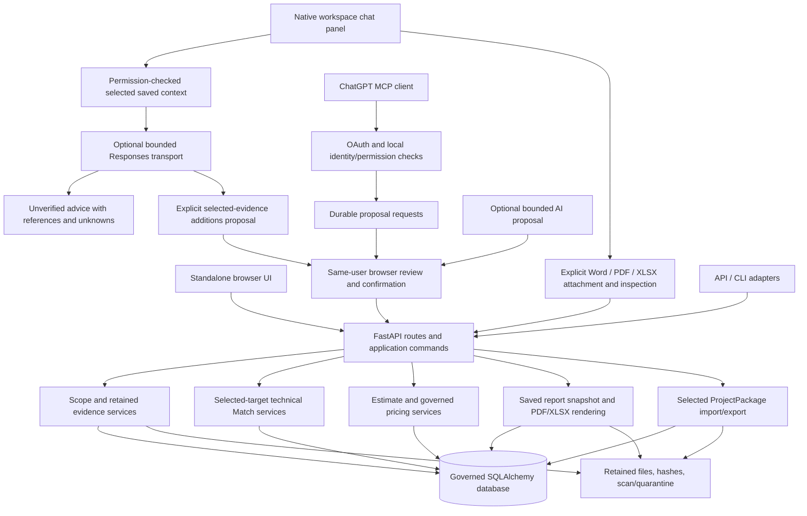

# CLASSIFIRE Architecture

Reconciled 2026-09-15 from merged and local source, approved ADRs and the owner's clarified
in-app chat upload and page-interaction intention. This document
separates implemented application structure from the target and remaining work.
Exact branch, CI, runtime and validation facts belong in
[PROJECT_STATE.md](./PROJECT_STATE.md), not in historical feature narratives.

## Accepted direction

[ADR 0001](./ARCHITECTURE_DECISION_0001_HYBRID_ORCHESTRATION.md) and
[ADR 0002](./ARCHITECTURE_DECISION_0002_INDEPENDENT_CAPABILITIES.md) accept a hybrid
modular application: deterministic workflows by default; optional AI for useful
interpretation; shared services for standalone UI, authenticated clients and APIs.
Four independently callable capabilities do not require four agents or microservices.
OpenClaw remains until its required protections have proven replacements.

The reasoning chain remains evidence -> physical scope -> technical applicability ->
quantity/labour -> commercial recovery -> validation/snapshot -> output -> human release.
Users may stop after any capability and resume from explicit saved artifacts. A valid
manual/imported artifact replaces session dependence, not the required evidence or authority.

The locally implemented [register source evidence view](./REGISTER_SOURCE_EVIDENCE.md)
reuses the existing intake and row services for read-only exact-revision context.
Its validation/publication status is tracked separately; no schema or authority changes.

## Implemented components

The diagram represents Draft application composition. Canonical admission, physical
locks and final release are separate guarded services; a Draft confirmation does not
activate them. Client upload/scan tools may retain and process explicitly requested
untrusted evidence without saving Scope or granting approval.

| Layer | Implemented components and responsibility |
| --- | --- |
| Interfaces | FastAPI/Jinja UI (`ui.py`, `draft_scope_ui.py`, format-specific review routes), API/CLI and optional `draft_client.py` MCP mounting |
| Embedded assistant | Shared docked/collapsible/resizable panel, typed selected-context preview and hash, explicit provider consent and bounded qualified conversation; context/message endpoints offer advice, explicit Word/PDF/XLSX additions or selected Scope replacements for separate review; a separate thin session adapter adds explicit Word/PDF/XLSX retain/scan/inspection controls over existing services, without Scope edits or provider disclosure |
| Authentication | Existing user/session/CSRF checks plus `draft_client_auth.py` and explicit client policy; verified external identity maps to an active local user. Exact resource/issuer/signature/time/scope checks; approved optional nbf/Auth0 compatibility does not remove permission checks |
| Application commands | `services/draft_client_requests.py` and `draft_client_capabilities.py` create typed durable requests; browser confirmation rechecks rights, owner, dependencies and expected state before executing the shared service |
| Scope | `draft_scope.py`, `draft_scope_evidence.py`, format review services and shared editor. Immutable revision envelopes with explicit evidence state and unknowns |
| Technical | Governed technical sources, variants/releases, source integrity, temporal eligibility and independent review; `draft_system_matches.py` snapshots selected-target candidates and later measured constraint decisions |
| Commercial | `draft_estimates.py` and contracts preserve lines, original rates/overrides, totals and dependencies; separate pricing intake/profile/observation/mapping/recipe/quantity services support bounded deterministic proposals |
| Reports/packages | Scope and estimate report services persist selected snapshots and exact paired outputs; project-package service composes saved artifacts without rerunning upstream capabilities |
| Persistence | SQLAlchemy models, Alembic forward migrations and retained storage; PostgreSQL for appropriate governed/integration workflows, SQLite in bounded tests/demo paths. A test configuration is not proof of production topology |
| Execution | Explicit services and bounded subprocess parsers; `execution_journal.py` provides scoped execution records. `worker.py` has no registered job handlers and cannot yet run general document-processing work |

`pyproject.toml` currently declares Python >=3.11, FastAPI, SQLAlchemy, Pydantic,
Jinja, Alembic, PDF/XLSX/image libraries and optional PostgreSQL/malware/ChatGPT extras.
There is no new service/database/framework introduced by the Word client increment.

## Native chat as a working interface

The owner clarified on 2026-09-13 that users must be able to upload supported defect
reports through the ChatGPT integration inside CLASSIFIRE and interact with the
data on the page through it. A separate external chat page is insufficient for
that working experience. Keep the native panel available across data-heavy screens,
with selection-aware context and collapsible/resizable layout.

### Explicit native proposal retention

Native generated review controls were transient. The local extension now adds one
Draft-only history table/service and explicit retention in the same panel, using
existing authentication, context readers and review routes. This lets users reopen
an exact proposal without fabricating an external client identity or repurposing the
PDF-specific suggestion model. Generation remains read-only; retention, Scope
confirmation and package creation are separate actions. History is owner-bound and
rechecks current rights/source integrity/scans; changed context is historical only.

Migration0048 adds `draft_workspace_proposals` after0047; no existing migration is
rewritten. It refuses destructive downgrade, so future activation requires matched
backup/restore, disposable rehearsal and an explicitly approved rollback plan. No
live upgrade is included. See the [history contract](./NATIVE_WORKSPACE_PROPOSALS_V1_CONTRACT.md)
for the full limits and consequences. The local decision extension adds forward0049
and a separate one-per-proposal human decision record. Existing source-review signatures
carry an optional saved-proposal identity; existing Scope-save transactions record the
exact resulting revision atomically. Explicit rejection records no Scope change. Original
generation remains immutable; matching content never implies acceptance. No new writer,
provider or downstream authority is introduced. A local ProjectPackage v7 extension now
exports explicitly selected generations and exact decisions, or explicitly no selected
decision, through existing package preview/save. Imported history remains read-only foreign
claims in the original archive; it creates no local proposals or approvals. No new database
migration is added. See [selected history](./NATIVE_PROPOSAL_PACKAGE_HISTORY.md) for bounds,
privacy, source/permission checks and compatibility. Browser validation of these controls,
raw provider/prompt-version records and full AI lineage remain incomplete.
The format-specific paths below save human-reviewed Scope references. Optional
proposal retention preserves generated fields separately; it never runs implicitly.

**Current architecture:** the native panel resolves typed identifiers and exact saved
revisions through authenticated readers, previews the data, then sends it to the
existing bounded Responses transport after consent. Separately, the existing
external ChatGPT/MCP client can request intake/scan and prepare durable Draft changes
for same-user browser confirmation. Ordinary UI intake/review uses the same domain
services. The native panel now also
retains Word, PDF and XLSX reports, explicitly scans them and displays retained evidence
via `draft_workspace_word_ui.py`. The historical module and Word routes remain; the
same adapter selects the existing format-specific intake policy through a constrained
source kind. A shared panel driver handles these formats. PDF inspection shows one retained
page at a time, its rendered PNG and exact original download, with a link to that
page's existing review. XLSX now uses this same adapter/driver: five-row windows,
worksheet selection, typed cells, verified anchored picture previews, original download
and a link to existing mapping/review. Scope workbook purpose stays distinct from
pricing. Attachment and inspection do not call the transport. Explicit workbook model
selection now chooses one header, up to 10 data rows and two verified PNG pictures
(4 MiB combined) from one worksheet. All selected cells and the header are disclosed;
originals, other worksheets and omitted rows/pictures are excluded. Strict nullable
column mappings and additions use the shared composer and existing signed workbook
review. Text claims must quote a selected mapped non-formula/non-error cell; picture
claims still require a selected row. Mapping and relationships remain unverified
until separate human review. Confirmation preserves existing row/entity provenance.
Saving the generation requires the separate retention action above. Attachment and
workbook review add no migration or new writer.
The existing plugin is retained. The advice context additionally accepts explicit
selection of at most 10 text blocks and 2 verified PNG pictures from one retained
DOCX. Source/scan/document/image hashes bind the preview and are rechecked before
and after provider use; original files and omitted content are excluded. Alternatively,
users select one PDF page's retained text and/or PNG (at most4MiB). Word, PDF and XLSX
selectors are mutually exclusive. The same evidence preview, consent, integrity
and current-rights rechecks apply; no external image link or original PDF is sent.

Both browser context endpoints offload synchronous context readers to the existing
thread pool. Browser validation demonstrated that a source-lock wait on the async
request loop could prevent another request's cleanup from releasing its lock.
Keeping blocking reads off that loop preserves concurrent request progress without
weakening source locks or introducing a new queue, service or migration.

**Implemented extension:** an explicit `propose_word_scope` action uses that same
transport and selected Word evidence. A small composer validates new Defect, Opening
and Service records against the existing Scope contract, remaps proposal IDs and
preserves existing rows. The panel shows additions, source claims and unknowns, then
posts to the existing Word preview route. Its session-bound confirmation remains the
only save step. `propose_pdf_scope` reuses this composer and transport with the
selected page anchor, exact text quotes and selected image identity. Its review card
posts to the existing signed PDF page preview/confirmation. Confirmed references
record the existing human page/entity review. Generated claims and rationale remain
transient unless the user explicitly saves the native proposal. The additional
`propose_scope_edits` action prepares at most25
complete replacements of explicitly selected saved Scope records, with before/after
fields and reasons. It preserves the rest of the graph, validates its relationships
and retains old source claims, marking changed claims for review. Its review form
uses the existing manual editor with `action=validate`; the user separately saves
through that editor. Optional saved-proposal identity links the reviewed result to
the immutable generation; the manual editor remains the Scope writer.
Broader report and non-Scope edit coverage follow. Browser routes use the existing
user session and
CSRF checks; external clients retain their OAuth scope/policy checks. The browser
does not need to loop through external MCP or acquire a second identity.

**Reason:** users can work with selected records and supported Word/PDF/XLSX reports
in the same panel. Bounded selected evidence enters the model contract only
after preview and consent. Users can now prepare typed additions without granting
chat write authority. The selected-record extension lets users review requested
changes in context without copying data, while preserving the existing manual writer.
Separate review and package steps retain their existing guards.

**Consequences:** distinguish local attachment/intake, explicitly requested scan,
provider disclosure/consent, analysis proposal, human Draft confirmation and package
confirmation. A typed action dispatcher admits only supported application commands
with current authority and sufficient inputs; model text or a generic tool call
cannot invoke arbitrary services, save data or chain capabilities. A same-user
review card can live beside the conversation while retaining the existing
confirmation checks and explicit confirmation control. Typing "confirmed" alone
does not execute the pending request.

The shared interaction supports bounded DOCX, PDF and XLSX intake. Approved technical-
source and commercial-library ingestion
retain their distinct purpose, rights and authority; attaching a defect report
does not import it as a trusted technical or pricing library.

**Migration impact:** native Word/PDF/XLSX attachments reuse the existing retained-source
policies, parser/scan workers and readers without changing tables, migration history
or dependencies. Explicitly selected PDF page evidence now enters the same native
chat transport; existing PDF suggestion/review services remain available. The
reason for extending the shared adapter is to expose already supported evidence in
the requested native working environment without another intake pipeline.
The selected-evidence extension adds optional typed selectors and an internal image
argument to the same advisory port; no new provider, identity or write path is added.
The proposal composer reuses immutable Draft revisions and the existing Word
preview/confirmation service; selected replacements reuse manual validation/save
and shared strict-schema construction. These proposal/review paths add no new writer.
New Word observation claims are outside that existing contract; old observations
remain intact. Optional native retention and decision linkage are separate persistence
extensions requiring 0048/0049 as described above; package v7 adds no further migration.
No vector store or agent framework is introduced.
This refines the interface under ADRs 0001/0002; their domain/authority rules remain.

The Estimate screen extends the same typed context with optional `line_ids` and
selected-line controls. An explicit list, including an empty one, restricts context
to those lines in the exact saved revision; omitted/null preserves the earlier
whole-Estimate API behavior. Duplicate/malformed IDs, missing lines and over-50 selections
fail closed. Partial context withholds the whole-Estimate summary and recalculates
no totals. Existing sensitive-value, ownership and stale-context checks still apply.
This is an advisory extension to the existing panel, not a new Estimate edit or
approval path. It adds no migration, dependency, service or writer.

Detailed interaction, source-disclosure and acceptance requirements belong in
[Embedded workspace assistant](./EMBEDDED_WORKSPACE_CHAT.md#approved-target-experience);
delivery order belongs in the roadmap's
[C1-C3 sequence](./CLASSIFIRE_ROADMAP.md#embedded-chat-delivery-sequence).

## Reports from selected row reviews

The [multiple-review increments](./MULTI_REVIEW_REPORTS.md) extend the existing
Scope and Estimate report services/tables from one review to an explicit collection.
Scope-and-system uses Scope report v3/render11. The existing Complete profile uses
Estimate report v3/render12 over the exact unchanged Estimate and its embedded Scope.
An embedded Estimate review must be explicitly included at its exact revision;
additional reviews are report-only context and cannot alter arithmetic or recovery.

The UI and typed client commands share no-write preview and separately confirmed
creation boundaries. Import mapping v4 is reused for all review dependencies,
including retained ancestor reports. There is no model, migration, new profile or
downstream authority change. Older snapshots/downloads remain unchanged; readers
that predate Complete v3 cannot read its new reports/imports merely because they
already understand mapping v4. An activation or downgrade requires a separate
exact-version data/storage and rollback plan.

## Scope and evidence interpretation

The Draft graph distinguishes defects, openings, services and observations. Services
can reference multiple openings; blank openings remain distinct. Dimensions and
quantities may be null. The complete canonical physical model also has separate
relationship/plane/governance concepts; the simpler Draft schema does not yet expose
all required service-instance, substrate-plane, treatment and inspection concepts.

The implemented path is explicit upload -> retain original -> scan/parse -> inspect ->
propose complete graph with source targets -> preview -> human confirmation -> append
revision. It does not infer one defect = one opening = one service = quantity one.

- PDF: exact original, parsed pages, image previews and page/entity references.
- Excel: selected sheets/rows/cells and embedded pictures; explicit column mapping and
  target review. Formula cells are not evaluated. Image anchors are placement, not ownership.
- Word: bounded DOCX body paragraphs/simple tables and supported embedded pictures;
  structural locators, text/picture/document/source hashes, explicit associations and
  human decisions. Headers/footers and unsupported layouts are rejected, not silently
  reinterpreted. Original pictures do not reconstruct Word cropping/rotation or pagination.
- Optional PDF suggestions: proposals through the existing review boundary; model content
  never becomes canonical authority. No provider run is implied by installed source code.

The shared `DraftSourceIntake` and existing workers enforce format/size/containment,
malware state, current owner/rights and retained-byte identity. Runtime file retrieval
uses format-specific MIME/magic checks plus bounded HTTPS, host allowlisting, public-DNS
checks, TLS, redirects and deadlines. URLs/credentials are not durable evidence content.
Document text is untrusted evidence, never an instruction to bypass application rules.

Contracts: [PDF](./DRAFT_PDF_EVIDENCE_V1_CONTRACT.md),
[Excel](./DRAFT_SCOPE_XLSX_V1_CONTRACT.md),
[Word](./DRAFT_SCOPE_DOCX_V1_CONTRACT.md),
[optional suggestions](./DRAFT_PDF_SUGGESTIONS_V1_CONTRACT.md).

## Capability independence and limits

Scope analysis saves physical observations, not technical suitability. Match retrieval
uses an authorized technical release and retains reasons/constraints/source identity;
its current selected-target coverage is not a complete automatic applicability solver.
Technical source approval, Match review and commercial rate identity remain different acts.

Independent Draft Estimate lines consume sufficient saved/manual inputs. Existing
rate-selection and override history do not implement every planned inferred pricing
method. Source A (general products/activities) and source B (Firefly observed system
prices) retain separate dataset/version/price-meaning identities. A commercial match
never proves technical suitability.

Implemented A/B support includes exact profile decisions, A observations, B mappings,
frozen technical recipes/reviewed links, target-wide T9 coverage, target-blind T13 roster
and a governed Scope-service quantity basis. T10 bottom-up preview uses only supported
current confirmed observations, quantities and units; absent/incompatible inputs withhold
amounts/totals. It does not parse yield/productivity/recovery prose into numbers or grant
commercial activation. Representative semantics, broader recovery arithmetic, analogous
methods, calibration and independent evaluation remain required.

Reporting selects saved revisions and a profile: scope-only, scope-and-system,
estimate-only or complete. Paired PDF/XLSX outputs share a retained snapshot and keep
unavailable information explicit. Historical bytes/render versions remain stable.
Canonical output still requires its separate physical-lock/snapshot/release gates.

## Project-package schema, lifecycle and source of truth

The governed database and retained files are live application truth. The versioned
project package is the canonical interoperability boundary, not chat memory or a
substitute for database authority. Current exports are selected Draft artifacts.

1. Create/configure a Draft; append explicit revisions rather than overwriting history.
2. Retain and review evidence; bind source and target hashes to the saved revision.
3. Select exact Scope/Match/Estimate/report revisions and permitted original evidence.
4. Validate dependencies, current ownership/export permissions and file integrity.
5. Persist the package manifest/inventory and exact ZIP bytes; authenticated download
   serves the saved artifact, not a new inference or recalculation.
6. Import through bounded archive/schema/inventory/hash checks. Materialize new owned
   local identities; preserve imported origin bytes/history and foreign review claims.
7. Require current local scanning/containment for retained imported originals; imported
   claims do not become local approval. Re-export checks retained binary ancestors too.

Scope readers preserve v1-v7 evidence history; Word review uses v7. ProjectPackage v1-v7
readers coexist: v3 adds optional PDFs, v4 optional workbooks, v5 optional DOCX originals,
v6 an explicit collection of exact row reviews, and local v7 explicitly selected native
proposal/decision history. Collection imports use mapping v3
within the existing persistence model; no database migration is added. Older binaries
cannot read these new formats. See [compatibility and recovery limits](./MULTI_REVIEW_PROJECT_PACKAGES.md).
These are explicit format branches, not a claim that every export uses the newest version.
Full project history, all audit events, library source bodies and unselected artifacts
are not automatically present. The schema is not a full database backup.
Upstream edits retain prior references and expose dependent staleness instead of silently
refreshing technical, commercial, report or approval state.

See [ProjectPackage contract](./DRAFT_PROJECT_PACKAGE_V1_CONTRACT.md) and
[client contract](./DRAFT_CLIENT_V1_CONTRACT.md) for exact fields and limits.

## Security and authority boundaries

Current permissions/ownership apply at reads, previews, saves and downloads. Durable
client requests bind exact inputs and expiry; only a separate same-user browser session
may confirm. No `confirm`/`execute` client tool exists. Scan success means processing
readiness, not human approval. Schema validity is necessary but does not prove authority.

Canonical physical submission/admission, protected-state checks, signatures, replacement
locks and final Human Release remain separate. Imported claims, agent scope, a pricing
row or a Draft package cannot grant canonical writes. Foreign/stale/tampered/quarantined
inputs must fail closed. Evidence/technical/pricing confidentiality and source retention
remain relevant even though the source-code GitHub repository is public.

OpenClaw and Mission Control coordinate some existing proposal/controlled workflows;
their memory and task text never own estimate truth. Approved retirement requires
replacement parity for permissions, egress/privacy, containment, budgets/deadlines,
receipts, cancellation/recovery, observability, compatibility and rollback. Existing
execution journal/transport protections are foundations, not proof of full retirement.

## Migrations and deployment boundary

The optional programmatic migration path accepts an already-active PostgreSQL
transaction through Alembic `config.attributes["connection"]`. The caller owns
commit, rollback and closing; migration does not open a second connection. This lets
an explicitly reviewed schema conversion, independently verified baseline attestation
and subsequent forward migrations roll back together. Invalid, closed, invalidated, inactive,
non-PostgreSQL and offline supplied connections are refused before migration work.
Ordinary CLI/standalone migration and SQLite foreign-key handling remain unchanged.

This extends the existing Alembic runner, adding no service, dependency, migration
revision or authority. It does not establish baseline equivalence or authorize
stamping, adoption or live execution. The operational caller must still prove those
conditions and bind the exact destination, backup, candidate and approval before use.

Production startup and database-writing CLI commands use the same readiness guard.
It requires the packaged Alembic head, then reuses the existing read-only deployment
lineage assessment to refuse missing required tables or retired tables still present.
It never stamps, migrates or repairs the database. These checks do not certify column,
constraint or index equivalence; activation still needs its independent schema rehearsal.

Local environments can opt into that same boundary with
`CLASSIFIRE_REQUIRE_MIGRATED_DATABASE=true`. Web startup skips metadata creation
and seeding; CLI seed commands refuse, while authorized non-seeding commands still
require readiness. SQLite readiness opens read-only, and application connections
preserve the existing journal mode. Production always enforces migrations regardless
of this option. This does not make test-mode authentication or deployment production-ready.
The existing demo launcher exposes `--require-current-migrations` for an already
marked, migrated demo with existing users and, for PostgreSQL, its matching guard.
It refuses preparation, generated client policy and fixture-seeding modes. It does
not migrate, stamp, adopt, repair or authorize activation of an existing database.

Published baseline `97c0778` uses migration 0047 for retained Word sources. This
merged native-history stack requires `0049_draft_proposal_decisions`, following
`0048_draft_workspace_proposals`. Both forward migrations refuse destructive
downgrade. Word/PDF/XLSX attachment/review and ProjectPackage v7 reuse existing
storage and writers; do not confuse their format changes with a database migration.

The last approved operational receipt is rollback `6c1e2a4` with chat disabled.
The earlier `7dbc1cc` activation passed one browser reply, failed its follow-up,
and was rolled back. Its old request allowance is consumed. New testing/activation
requires successful applicable CI and a new exact approved plan with matched
backup, disposable restore, migration/restart and rollback evidence. An older
binary cannot safely read every newer schema or package format; code-only rollback
is not assumed. No live upgrade, OAuth, tunnel or host-policy change follows from
these documents. Current runtime and CI observations belong in
[PROJECT_STATE.md](./PROJECT_STATE.md).

### Queue claim boundary

The generic worker claims one `queued` record whose `run_after` is unset or no
later than the current UTC time, ordered by creation time then ID. PostgreSQL
`FOR UPDATE SKIP LOCKED` locks only that selected record, allowing another worker
to claim another due job. Future and nonqueued records stay unchanged. No processing
handlers are registered: an eligible unsupported job still finishes `failed`.
This correction adds no report dispatch, retry, lease, recovery policy or schema
change. Execution-journal `preparing` and `running` records are not queue work.
Disposable PostgreSQL concurrency tests verify the claim boundary; general document
processing and crash recovery remain planned below.

## Planned architecture and unresolved decisions

| Gap / decision | Planned direction and validation needed |
| --- | --- |
| Native chat upload and reviewed page actions | Bounded attachment, evidence proposals and Scope edits are merged; bounded synthetic Word decision/package browser acceptance passed; real-provider/live acceptance and broader typed actions remain |
| Broader physical/evidence representation | Extend current graph and provenance only for a proven user need; explicit instances/planes/treatments and additional report formats need representative acceptance and compatible schemas |
| General document jobs | Implement bounded resumable stages/attempts/leases/recovery over existing persistence when the interactive pilot establishes need; current worker has no handlers |
| Technical corpus scale | T2-T8 require retained source revisions, per-field lineage, duplicate/reprocess policy, pagination and measured capacity; no mandatory vector database or agent fleet |
| Pricing breadth | Validate representative quantity/recipe meaning; then justified yield/productivity/recovery inputs, explainable provisional methods and independent T13 evaluation before T11 combination |
| Whole-project portability | Define missing history/audit/source membership, retention/confidentiality and forward import policy; current selected ZIP is not the full target |
| AI/orchestration | Preserve optional proposals; test replacement protections before retiring OpenClaw. No autonomous approval or hidden orchestration state |
| Operational readiness | Tenant separation, backup/restore, clean-machine startup, representative performance/cost, monitoring and production release exits remain unproven |
| Merge governance | GitHub main protection endpoint reports unprotected; observed premature merge requires explicit check verification now and an owner-approved enforcement decision |

This interface refinement is documented above as current structure -> proposed
extension -> reason -> consequences -> migration impact. It neither completes a
production phase nor retires OpenClaw.

## Immediate direction

Follow [Recommended Next Actions](./PROJECT_STATE.md#recommended-next-actions):
Applicable CI for the pinned code baseline has passed. C1 still needs the separately
approved diagnostic, activation and real-model application acceptance. C2 has synthetic
native Word/PDF/XLSX journeys, with real-provider/live acceptance and broader coverage
outstanding. C3 has a synthetically validated
selected Scope replacement action and bounded selected saved Estimate-line advice.
The latter has synthetic service/HTTP and rendered selection/preview evidence, not
real-provider acceptance or an Estimate edit contract. The frozen `8b4b79f` activation
candidate excludes this later feature; shared code and deployed code are distinct.
Explicit native proposal retention/reopening is
merged with explicit decision/revision links. Actual-app HTTP/server restart
passed for both the earlier decision candidate and local package-history commit23f5110.
Selected history has targeted regression and exact synthetic database/storage recovery evidence.
Source inspection retains transaction row locks for quarantine coordination; no-write behavior
does not imply compatibility with a PostgreSQL read-only transaction. Bounded headless
browser acceptance now covers Word decisions, rejection and selected v7 history across
restart with synthetic provider/scanner stubs. Broader reviewed actions, real-provider
and operational acceptance remain. Existing connector transport
acceptance, independent technical/pricing work and production gates remain tracked
without forcing users through downstream capabilities.

## Draft work-evidence capture (local candidate)

The approved first close-out slice extends the existing register/reporting capability,
using immutable Draft assertions and selected saved Scope/evidence dependencies. It is
not installation acceptance, inspection, compliance certification or Human Release.
The two Draft tables use forward migration0050 and the existing database, audit, permission,
source-retention and scan controls. Explicit preview/save/reopen/report actions do not run
matching, costing or AI. Source changes remain stale dependencies rather than silently
retargeting work history. See [the work-record contract](./DRAFT_WORK_RECORDS.md) for
architecture consequences, migration, output limits and the outstanding browser gate.
