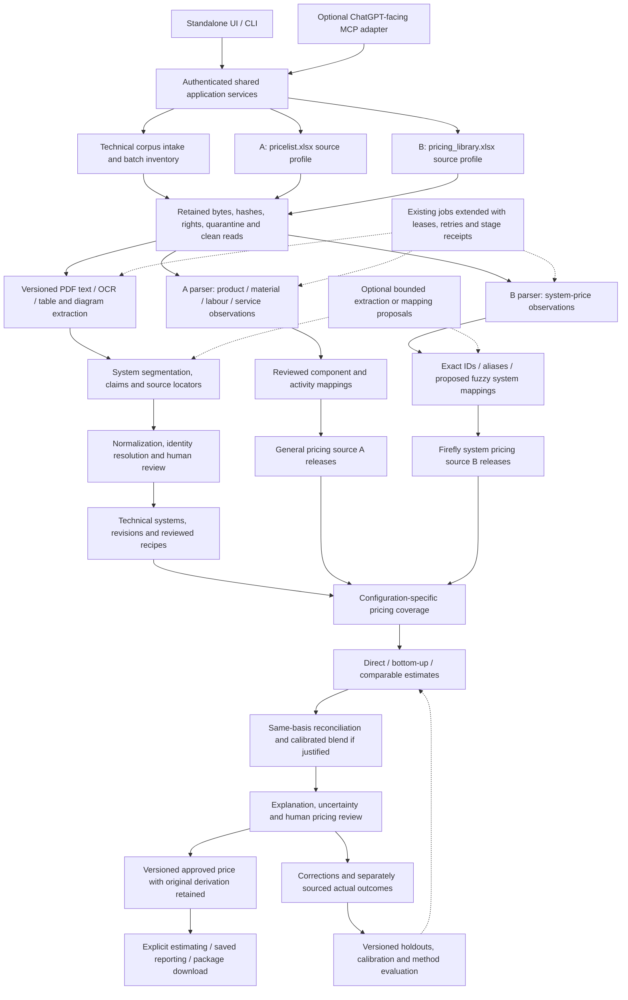

# Technical corpus and dual-pricing architecture amendment

**Status:** requested target design, 2026-09-06; documentation only. Read with
[Architecture 5.21](./CLASSIFIRE_ARCHITECTURE.md), the [roadmap](./CLASSIFIRE_ROADMAP.md),
[project state](./PROJECT_STATE.md) and accepted ADRs
[0001](./ARCHITECTURE_DECISION_0001_HYBRID_ORCHESTRATION.md) /
[0002](./ARCHITECTURE_DECISION_0002_INDEPENDENT_CAPABILITIES.md).

**Verified baseline:** shared main `a22a02769d3b842d5d0129dbd09273759ae583c1`, PR #207.
The PR's exact-head CI passed 1,522 tests; main CI 34020498735 also succeeded.
Those checks prove the existing bounded implementation, not the capabilities or
pricing accuracy proposed here. No workbook prices, customer documents or actual
costs were imported or evaluated for this amendment.

## 1. Architecture changes summary

Extend CLASSIFIRE's existing modular application with three separately governed
input pipelines and one shared pricing decision workflow:

- Technical corpus: retained test reports, assessments and certifications become
  source-bound proposed technical systems, configurations and individual claims.
- **Source A, `pricelist.xlsx`:** authoritative general product, material, labour
  and service observations, primarily supporting component and activity costing.
- **Source B, `pricing_library.xlsx`:** authoritative Firefly system-price
  observations, primarily supporting direct system prices, comparables and benchmarks.
- Reviewed technical revisions and independently released A/B observations feed
  coverage analysis, deterministic estimation, explanation, human review and
  versioned approved pricing. Original predictions and eventual actuals remain separate.

Authoritative input means that the supplied source is retained faithfully. It does
not mean every row is correct, current, technically applicable or commercially
approved. Neither workbook's filename proves whether its amounts are cost, list,
sell, quoted or actual prices. Their actual schemas, counts and price meanings are
unverified. The requested 1,000-plus Firefly prices and hundreds-to-thousands of
technical documents are capacity requirements, not measured inventory.

Preserve existing physical-model, technical-source, commercial, snapshot and human
release boundaries. Keep AI optional and limited to extraction/mapping proposals.
Do not replace this with a new fleet, a service per pipeline or a second canonical
store. This amendment changes the target model and delivery order, not runtime rules.

## 2. Updated end-to-end CLASSIFIRE architecture

The standalone FastAPI/Jinja UI, CLI and optional MCP adapter use the same application
services. Library administrators intake and review sources; estimators inspect
coverage, evidence and proposed prices; permitted reviewers publish reviewed revisions.
Scope, Matching, Estimating and Reporting remain independently callable. An explicit
saved/manual physical configuration can supply prerequisites; running one capability
does not automatically invoke the others.

The backend owns authentication, source permissions, immutable storage, validation,
calculation, revision control, jobs and exact downloads. ChatGPT can request scoped
previews or prepare a bounded proposal; current client mutations still require the
separate same-human browser confirmation. Bulk parsing, credentials, source libraries,
canonical writes and approval decisions stay outside chat. Real OAuth linking,
production tenancy and deployment remain separate unproven work.

Use the existing governed SQLAlchemy/PostgreSQL persistence and content-addressed
StoredFile boundary. Begin with indexed relational filters, exact identifiers and
reviewed aliases. Add document/claim text indexes with explicit permissions and
pagination; measure retrieval recall and latency before adding a vector database or
search cluster. Optional semantic retrieval must be a candidate-finding aid, never
an authority or hard-constraint bypass.

Within this retained corpus/pricing track, the first visible slice is a bounded source-profile preview: explicitly select A
or B, retain the source/version, inspect sheets/headers/counts and flag unknown units
or price meaning. It publishes nothing. Add useful mapping/technical-review slices
next. Batch orchestration and broader formats follow representative UI proof; a fully
normalized enterprise schema is not a prerequisite to the first interaction.

Packages remain portable representations of selected revisions, while the governed
database and retained files hold live state. Later package versions should pin source
release identifiers, approved mapping/recipe versions, proposal methods, limitations
and review history. Include source bytes only when licensed and authorized; otherwise
include an explicit external/restricted inventory. Imports never create local approvals,
trusted system mappings, release status or commercial authority from foreign claims.

## 3. Architecture/data-flow diagram

All new corpus, A/B and estimation boxes below are **planned extensions**. Existing
storage, Draft, source-review and publication controls are reused.



Arrows represent available data dependencies, not permission to activate records or
run another capability automatically. Extraction may create Draft proposals; technical
approval, mapping approval, commercial publication and human release remain distinct.

## 4. New or modified components

These are logical modules within CLASSIFIRE, not mandated microservices or filenames.

| Component / responsibility | Inputs -> outputs and storage | Integrations / dependencies | Validation and audit |
| --- | --- | --- | --- |
| Source registry and intake profile | Bytes plus explicit A/B/technical/legacy kind -> immutable DatasetVersion, SourceRecords and profile preview; StoredFile plus SQL metadata | Existing source intake, scanner, ownership and UI | Exact hash, rights, version collision, media/archive bounds, parser/profile versions; no filename-based authority |
| Corpus coordinator | Authorized file inventory -> per-file/stage outcomes and exception queue | Extend BackgroundJob after bounded UI proof; storage and parser adapters | Idempotency, quotas, retries, partial failures, cancellation and recorded attempt identity |
| Technical extraction | Clean pages/text/OCR/tables/figures -> proposed systems, claims and recipes where evidenced | TechnicalDocument, extraction adapters, optional AI port | Per-field locators, raw/normalized values, parser/model versions, unresolved contradictions; never inferred approval |
| Identity and mapping review | Source IDs, attributes and candidate aliases -> accepted/rejected resolution decisions | TechnicalVariant plus stable TechnicalSystem/SystemRevision; indexed search | Manufacturer/namespace/configuration separation, alternatives, reviewer reasons and reversible supersession |
| A normalizer | Profiled workbook rows -> typed product/material/labour/service PriceObservations | Product, LabourComponent and commercial release services | Cell lineage, unit/pack/crew semantics, missing versus zero, effective dates and basis review |
| B normalizer | Profiled Firefly rows -> system PriceObservations and mapping candidates | PricingLibraryRecord, system resolution, release services | Exact revision/configuration link, duplicate/conflict review, basis/inclusions and unmapped rows retained |
| Recipe and activity mapper | Approved technical constraints plus attributed costing assumptions -> versioned component/activity recipe and A mappings | Technical review and separate commercial/productivity review | Dimensional analysis, source-backed quantities/hours, applicability bounds and recovery ledger |
| Coverage service | Technical revision/configuration + A/B release pair + as-of basis -> CoverageRun | Reviewed mappings, recipe coverage and release selection | Paginated complete inventory, reason codes, unavailable/stale/contradictory inputs exposed |
| Pricing estimation service | Frozen eligible inputs -> immutable EstimateProposal | Existing Decimal calculations, new pure bottom-up/comparable methods | Determinism, method/config versions, no technical approval, partial totals and abstention |
| Reconciliation and pricing review | Independent estimates, discrepancies and evidence -> review decision / approved derived or direct price | Permissions, audit and commercial publication | Same-basis checks, no double recovery, exact proposal hash, current authority and stale-input check |
| Evaluation and feedback | Frozen known-price test manifest, proposals, corrections and separate actuals -> metrics and candidate method revisions | Offline deterministic evaluation; no automatic retraining/publication | Lineage-aware holdouts, untouched final test, calibration record and original predictions retained |
| UI/API/download projection | Owned source/revision/run IDs -> source profiles, progress, review, coverage filters and explanation export | Existing UI/API/client services, reports and packages | Server-side scope checks, cursor pagination, optimistic revisions, safe download and redaction |

**Existing gaps requiring deliberate modification:** `worker.py` has no registered
handlers and does not implement durable lease/retry scheduling; the inference journal
records outcomes but does not resume or redispatch old attempts. Technical retrieval
currently examines bounded prefixes and technical admin listing caps at 500; pricing
listing caps at 897. Batch and coverage workflows need complete indexed pagination,
not an unnoticed increase to an arbitrary display cap.

Proposed API use cases are source profile/preview, batch status, claim and mapping
review, coverage query, estimate preview/save, pricing review and explanation download.
Keep reads separate from commands; use expected revisions and idempotency keys for
commands. Define concrete routes/scopes in each implementation slice, retaining
current client confirmation and library permissions. Do not expose all administrative
operations through MCP merely because a UI endpoint exists.

## 5. Canonical technical-system and pricing data model changes

The following names are logical contracts. Extend existing models where appropriate;
do not assume each name requires a new table. Add forward migrations and versioned
artifact/manifest contracts, preserving historical bytes and interpretations.

| Contract | Required identity, content and relationships |
| --- | --- |
| SourceDataset | Stable ID, owner/access domain, semantic kind `technical_corpus`, `general_pricelist`, `firefly_system_prices` or `legacy_package14`, declared source authority and permitted uses; original name is descriptive only |
| DatasetVersion / SourceRecord | Dataset ID, original StoredFile hash, source/ingest/effective/available dates, parser/schema/profile versions, import run, original worksheet/row/cell or document locators; immutable raw and normalized representations and diagnostics |
| TechnicalSystem / SystemRevision | Stable opaque system ID with manufacturer-scoped aliases; immutable revision/configuration, relationship to existing variant IDs and contributing documents, validity and review status; similar names do not imply identical systems |
| Claim / ClaimEvidence / ResolutionDecision | Typed property and value/unit, explicit Confirmed/Inferred/Provisional/Unresolved state, extraction quality separate from authority, many-to-many document/page/section/table/cell/figure/bounding-box support, contradiction group, method/version and review decision |
| ComponentRecipe / ActivityRecipe | Exact system revision/configuration, components, dimensional formulas and valid ranges, units/yields/waste, activities/person-hours/crew meaning and recovery coverage; every assumption attributed and reviewed; immutable published version |
| PriceObservation | SourceRecord and dataset/version, original identifier/description, item kind, observed or derived origin, Decimal amount or explicit missing, complete price-basis tuple, validity, inclusions/exclusions, source hash and commercial review status |
| ComponentMapping / SystemPriceMapping | Versioned A-observation-to-component/activity or B-observation-to-system/configuration link; exact/alias/attribute/fuzzy/manual method, candidates, score, conflicts, reviewer and reason; commercial identity link is not technical compatibility |
| CoverageRun / EstimateProposal | Exact technical/recipe/mapping/source release pair and as-of basis, method/config version, coverage reasons, inputs/intermediate quantities/costs/comparables/adjustments, output/range, uncertainty, recovery ledger and content hash |
| ReviewDecision / ApprovedSystemPrice | Original proposal reference, accepted/corrected/rejected/needs-evidence decision, old/new values and reasons, reviewer authority/time, approved revision and expiry/supersession; derived stays derived after approval |
| ActualCostFeedback / EvaluationRun | Independently sourced quote/invoice/actual cost or sell outcome with configuration/date/basis, link to prior proposal without overwrite; frozen training/calibration/test manifests, leakage exclusions, metrics and approval of method version |

**Price basis is a required tuple**, not a single unit string: currency; tax treatment;
buy/material/labour cost versus list/sell/quote/actual; denominator object and unit;
quantity band/pack or crew basis; system configuration and included work; region,
vendor and conditions; effective and available dates. Preserve unsupported or missing
members explicitly. Unit conversion must be dimensionally valid and versioned. An
installed opening price cannot silently become a service rate or material unit cost.

Reuse `TechnicalDocument`, `TechnicalVariant`, `Product`, `LabourComponent`,
`PricingLibraryRecord`, `LibraryRelease`, `StoredFile` and current review/audit services.
Today `TechnicalVariant.system_id` is indexed text, not a foreign key to a stable
system entity; variants bind one document and record-level locators. Add compatible
identity/claim links without renaming historical IDs or losing source JSON. Duplicate
files, duplicate systems and alternative configurations are distinct problems.

**Immutable recipe gap:** current component requirements are JSON and labour
requirements are strings. Technical release v3's frozen public fields do not include
these complete requirements. Before reproducible costing, publish a versioned recipe
snapshot with component/activity values, units, evidence and rules alongside a new
compatible manifest contract. Old release hashes remain unchanged; their missing
recipe coverage remains unavailable, not reconstructed from mutable current rows.

**Legacy import gap:** Package 14 CSV intake is not either new XLSX pipeline. Its
missing/invalid-to-zero and active/default-unit behavior must not become the new
staging contract. Its raw-file release hash is not proof of a complete governed
manifest acceptable to pinned reads. New intake starts Draft, preserves unknowns and
uses reviewed publication. Do not relabel old rows A/B without verified provenance.
Existing release uniqueness/active-selection rules must be reviewed for independent
A/B version pairs; pin both explicitly instead of relying on a generic latest price.

## 6. Document-ingestion and technical-system extraction pipeline

1. **Inventory and intake:** accept a bounded batch manifest with source rights,
   declared document types and original names. Retain each original once by content
   hash; retain duplicate upload occurrences and lineage. Quarantine before parsing;
   reject unsupported/encrypted/oversized files with a per-file reason. A batch may
   partially succeed without hiding failed documents.
2. **Safe parsing:** extract the PDF text layer and layout first; identify pages with
   little/unusable text for optional OCR. Preserve page images, tables, captions and
   coordinates. Use separate supported-format adapters for spreadsheets/images and
   later DOCX; do not claim arbitrary-format coverage. Enforce compressed/expanded,
   page, pixel, time, memory and output bounds. Do not execute macros, external links
   or document instructions. Credential stripping alone is not a parser sandbox.
3. **System segmentation:** identify report/assessment IDs, system codes, assemblies
   and configuration tables. One document can describe many systems; one system can
   be supported or constrained by several documents. Retain continuation pages,
   table headers, footnotes and limitations with each candidate. Uncertain splits
   go to review instead of creating one system per document or table row by default.
4. **Claim extraction:** propose manufacturer/product/component, material, service
   family/size/insulation, substrate/plane/thickness/orientation, opening/annular gap,
   spacings/supports/fixings, installation faces/method, FRL/classification/standard,
   jurisdiction, valid ranges, exclusions and dependencies. Do not infer missing
   labour productivity or pricing from technical text. Attach exact evidence and
   extraction method/version to each field, including OCR/diagram observations.
5. **Normalization:** preserve source text and unit alongside canonical typed values,
   ranges, quantities and controlled vocabulary. Resolve units only with explicit
   conversions. Contradictory classifications and unclear diagrams remain separate
   claims. Structural validity, extraction quality and technical approval are separate.
6. **Resolution and review:** exact namespaced identifiers and approved aliases first;
   deterministic attributes then fuzzy candidates. Require configuration/issuer/date
   consistency; do not collapse superseded assessments into a single current claim.
   Show page/table context, differences and candidate alternatives in the UI. Record
   match/reject/split/merge/supersede decisions without deleting provenance.
7. **Publication:** human technical review and approval select eligible revisions
   through existing source/release boundaries. Recipe/productivity approval is explicit
   and separate where the technical source does not support costing assumptions.
8. **Reprocessing:** key stage outputs by source hash plus parser/schema/normalizer/
   prompt/model/rule versions. Create new proposals and a reviewable diff; never
   overwrite approved facts. Mark downstream dependencies stale when selected versions
   change. Retain prior outputs so the original interpretation remains reproducible.

Use at-least-once job delivery with idempotent stage writes. Add leases/heartbeat,
`run_after`, bounded backoff, maximum attempts, cancellation and dead-letter review to
the existing job subsystem when batching is implemented. Record bytes attempted,
attempt/stage versions, elapsed time and safe failure codes; isolate failures by file.
A new retry is an identified attempt, not a hidden redispatch of a journaled inference.
Persist stage completion transactionally; use an outbox only if a separate dispatcher
actually needs one. No new queue infrastructure is assumed.

Optional AI gets only authorized bounded content, an explicit output schema and no
write/approval tools. Treat documents as untrusted data, including prompt injection.
Validate every returned locator/value; retain model/prompt versions and raw proposal
under source permissions. Record external processing permission, data-retention and
cost budgets before real provider use. Upload protection is defense in depth, consistent
with the [OWASP upload guidance](https://cheatsheetseries.owasp.org/cheatsheets/File_Upload_Cheat_Sheet.html)
and [prompt-injection guidance](https://cheatsheetseries.owasp.org/cheatsheets/LLM_Prompt_Injection_Prevention_Cheat_Sheet.html).

The existing technical PDF helper extracts limited text metadata synchronously;
JSONL variant import expects already structured rows. Neither proves this pipeline.
The newer Draft PDF parser is bounded to 10 MiB/50 pages/30 seconds and strips
credentials in a subprocess; these are prototype limits, not corpus capacity or a
complete security sandbox. Measure OCR and review effort on representative samples
before claiming throughput or operating cost.

## 7. `pricelist.xlsx` ingestion, normalization and mapping pipeline

1. Retain source A as `general_pricelist`, independently versioned even when B arrives
   in the same batch. Profile sheets, header candidates, row counts, cell types,
   formulas, hidden content, merged regions and unit/currency/date coverage.
2. A human confirms an explicit reusable mapping profile against the actual layout.
   Required semantic fields may span several columns or workbook sections. Do not
   invent column names or assume one sheet/one header. Preserve rejected sections and
   explain unsupported content. Formula text is not a trusted calculated rate;
   external/cached values require an explicit future verified policy.
3. Stage raw records and normalize product/service identifiers, descriptions,
   manufacturer/supplier/category, product/material/labour/service kind, quantity,
   pack/MOQ, units, material price, labour rate and service price where present.
   Preserve valid zero separately from absent, invalid or negative values; unexpected
   negatives/credits need an explicit reviewed policy. Never insert a fabricated zero.
4. Validate price basis, dates, dimension/pack conversion, duplicates, conflicting
   observations and missing inclusion information. A person-hour rate differs from
   a crew-hour rate; a bundled service may already include materials or labour.
5. Propose A mappings from technical components and installation activities through
   exact approved identifiers/aliases and typed specifications. Fuzzy description
   similarity ranks suggestions only. Show alternatives, unmatched requirements,
   compatible unit conversion and included work for human review.
6. Publish reviewed source/mapping versions through commercial governance. Query by
   item/category/specification, unit, basis, effective date and source release; return
   reasoned alternatives instead of selecting the cheapest text match silently.
7. On replacement workbook intake, create a new version and show additions, changed
   values, expired and removed rows. Do not delete historical prices. New effective
   dates do not rewrite old estimates; explicit repricing creates a new proposal.

A supplies observed prices, not a complete installation recipe. Required quantities,
yields, waste, productivity and installation activities need independent attributed
sources or reviewed assumptions. A missing required product/activity yields a priced
subtotal and missing-work list, not a complete cost.

## 8. `pricing_library.xlsx` ingestion, normalization and system-matching pipeline

1. Retain source B as `firefly_system_prices` with its own DatasetVersion, source
   authority, effective dates and exact worksheet/cell provenance. Profile its actual
   structure independently of A; the requested 1,000-plus prices are not assumed to
   mean 1,000 unique systems or independent training examples.
2. Map system code/name, description, manufacturer, configuration attributes,
   denominator/unit, amount/basis/date and inclusions/exclusions where present. Preserve
   source codes and separate price bands/configurations instead of forcing one price
   per name. Missing technical identity remains an unmatched price observation.
3. Resolve namespaced exact IDs, then approved aliases and deterministic attribute
   constraints. Fuzzy/entity-resolution candidates expose method/version, contributing
   features, alternatives and score. Conflicts, one-to-many ambiguity or low support
   require review; a high string score never overrides substrate/service/FRL conflicts.
4. Bind accepted mappings to an exact SystemRevision and configuration/valid range.
   Different denominators or included work may require distinct observations. Identity
   matching does not approve technical suitability for a project or authorize a price.
5. Deduplicate exact replay using source version/row identity and normalized observation
   fingerprint. Retain duplicates as occurrences; flag conflicting amounts and valid
   vendor/date/configuration alternatives. Do not suppress genuine distinct offers or
   average them automatically. Missing technical systems return to technical intake.
6. Publish reviewed B observations and mappings; pin the selected release and mapping
   versions. Replacement workbooks create diffs/supersession and preserve old prices,
   source cells, decisions and estimates. Re-resolve explicitly when technical identity
   changes; never attach a historical price to a new configuration by name alone.

Current Draft XLSX parsing permits at most **1,000 rows including the header**, ten
visible sheets, 50 columns, 20,000 grid cells and 2 MiB normalized JSON. Its contract
also bounds retained row numbers. Do not simply remove those safety limits. Provide
bounded streaming/chunked source-version processing with row/page completeness counts,
resumable jobs and separate preview pagination. Acceptance must demonstrate a synthetic
single-sheet input with at least 1,001 data rows plus its header without silent loss,
while preserving current Draft artifact compatibility and formula protections.

## 9. Pricing coverage/gap-analysis workflow

Coverage is evaluated for **SystemRevision + reference configuration/quantity basis +
A/B release pair + mapping/recipe versions + as-of date**, not a blanket permanent
price for every installation of a system. Enumerate all in-scope technical revisions
with paginated counts; unresolved configurations receive explicit reasons.

| Primary pricing state | Evidence required / visible result |
| --- | --- |
| Directly priced from B | Reviewed exact configuration/basis mapping and valid B observation; display source cells, inclusions and approval separately |
| Derivable from A | Complete reviewed recipe/activity quantities and required A mappings on a valid common basis; show all components and any manual assumptions |
| Comparable estimate from B | No direct price, sufficient eligible independent comparable groups and evidenced adjustments; show support and excluded candidates |
| Combined estimate | Both methods eligible on the same basis; retain both results and calibration/reconciliation status |
| Insufficient evidence | Missing identity, recipe, quantities, basis, scope, eligible comparables or independent support; list the exact gaps and withhold unsupported totals |
| Requires human review | Cross-cutting review flag for ambiguity, conflict, stale source, disagreement, uncalibrated method or correction; can coexist with any method |

Store available-method flags separately from the selected method, approval state and
confidence. This avoids calling a system unpriced merely because review is pending,
or calling a partial component subtotal fully priced. Filter UI/API views by source,
family, missing components, mapping status, price basis, review need and source age.
No direct B match should trigger unrelated estimation automatically; the user selects
a method/review action. Recompute coverage as a new run after upstream change and
show stale prior results without silently overwriting them.

## 10. Detailed pricing-estimation methodology

### 10.1 Freeze the target and admissible evidence

An estimate request names a system revision, physical configuration, quantity basis,
location/date and intended commercial basis. Pin technical/recipe/mapping versions,
A/B releases, normalization/rule versions and source permissions. Validate technical
eligibility independently; unavailable evidence cannot become an assumed compatible
system. A direct B price is an observed benchmark only within its mapped conditions.

Use Decimal arithmetic for money and explicit rounding rules. Preserve source precision
internally, but display amounts/ranges no more precisely than the evidence supports.
A computed cent value is arithmetic precision, not a claim of predictive accuracy.
Do not sum or compare currencies, cost and sell amounts, incompatible units or scope
until a sourced versioned policy has converted them to the same declared basis.

### 10.2 Bottom-up method using A

For a validated configuration, evaluate an independently prepared component/activity
recipe. Each quantity or hour value has a formula or attributed manual value, unit,
valid dimensional range and source/reviewer. Missing required inputs remain unresolved.
A fire rating or installation drawing does not itself establish labour productivity.

```text
material_cost = sum(required_material_quantity_j * normalized_A_material_rate_j)
labour_cost   = sum(person_hours_k * normalized_A_labour_cost_rate_k)
service_cost  = sum(explicit_service_quantity_l * normalized_A_service_rate_l)
C_A           = material_cost + labour_cost + service_cost + distinct_fixed_charges
P_A           = approved_basis_conversion(C_A), when the requested basis differs
```

The recipe explicitly defines take-off, pack/yield conversion, purchased versus
consumed quantity, wastage and activity hours. Apply a factor only once and only
within its evidenced range. For crew rates, convert crew-hours and person-hours
explicitly; do not multiply by crew size twice. Quantity bands, minimum charges,
access/setup and shared-opening work require attributed rules rather than hidden
allowances. Rounding packs may be per project or installation; that policy must be
known before calculation, not inferred from a spreadsheet label.

Maintain a component/activity inclusion ledger: required work -> recipe quantity ->
selected A observation/service -> included scope -> amount recovered. Prevent bundled
services from duplicating separately priced materials or labour. Shared closure work
is recovered once across services where relevant. A defect count is never a take-off.
The current Draft service/blank-opening recovery guard is a foundation, not this full
ledger. Do not place a complete opening/system price on a service line without proving
that its scope and shared work are compatible.

Show priced materials, labour and services separately **where evidence permits**.
Unpriced work remains visible; a partial subtotal is not a complete-system estimate.
A total B price cannot be reverse-engineered into fabricated material/labour splits.
If A gives sell prices for some items, do not blend them into cost subtotals without
an approved conversion; unknown markup, margin or tax treatment requires review.
Existing system-rate calculations treat markup as included, unlike product/labour
cost paths. Preserve that distinction rather than applying markup twice.

### 10.3 Comparable-system method using B

First filter eligible observations, then rank similarity. A high similarity score
must never rescue a failed hard constraint. Mandatory eligibility includes a reviewed
system/configuration mapping, permitted/current source, common commercial basis and
inclusion scope, compatible denominator, technical family/installation method and
relevant service/substrate/orientation/rating constraints. Required missing attributes,
out-of-range dimensions or insufficient independent support produce abstention.
Commercial comparability does not prove the target's technical compatibility.

For eligible comparable i and target t, a proposed transparent ranking model is:

```text
d_i = sum(a_k * delta_k(target, comparable_i)) / sum(a_k)
w_i_raw = evidence_quality_i * exp(-d_i / temperature)
w_i = normalized, group-capped(w_i_raw)
P_B = sum(w_i * (observed_price_i + evidenced_adjustment_i))
effective_sample_size = (sum(w_i))^2 / sum(w_i^2)
```

- `delta_k` is a declared feature difference: exact/categorical mismatch or a
  dimensionless numerical difference scaled by training-cohort ranges and valid
  engineering limits. Features include component quantities/material, geometry,
  service grouping, installation faces/activities, access and evidenced labour
  requirements. Unit conversion precedes comparison. Missing optional values incur
  an explicit penalty and coverage report; required unknowns are never zero distance.
- `a_k`, temperature, maximum neighbor count, minimum support and group caps are
  versioned. Fit/tune them only inside training folds, or label a predeclared expert
  profile **uncalibrated heuristic**. Price amount is the target, never a similarity
  input. An LLM's self-reported confidence is not `evidence_quality`.
- Use multiple independent comparable groups where available; cap repeated workbook
  copies, aliases, configurations and family/source influence. Report distinct group
  count and effective sample size as well as raw rows. One matching family copied
  many times is not independent corroboration.
- Adjust prices only for supported differences with a source, direction, units and
  bounds: independently evidenced component quantity differences, documented activity
  hours or authorized dated/region factors. Do not scale complete system prices by
  area, FRL or a generic complexity multiplier without evidence that the relationship
  holds and that fixed costs/inclusions remain valid.
- Compare this weighted mean with robust weighted-median and simple eligible-cohort
  median baselines during evaluation. Outlier rules must be versioned and explainable;
  a high legitimate price is not an error merely because it harms a score.

Material or labour weighted averages are valid only within comparable items/grades,
units and cost basis. Keep a reasoned source/date selection policy and expose dispersion;
never average incompatible products or installed totals to fill a missing component.

### 10.4 Output and uncertainty

Persist the original target, method/version, eligible and excluded comparables with
reasons, weights, adjustments, A rows, quantities/hours, conversion policy, recovery
ledger, assumptions and missing facts. Retain material/labour/service subtotals where
available and a proposed amount/range or explicit abstention. Price ranges may first
be evidenced low/high scenarios; label them scenario ranges, not statistical confidence
intervals. Numerical prediction intervals require independent calibration evidence.

## 11. Combining bottom-up and comparable-system estimates

1. Reconcile target scope, units, price basis, date/region and inclusion ledger before
   comparison. A cost subtotal and an installed sell price are not two estimates of
   the same quantity. Conversions require explicit approved policy, not fitted hidden
   markup chosen to match B.
2. Show `P_A`, `P_B`, absolute difference and relative difference on a declared nonzero
   denominator. Trace discrepancies to missing activities, stale observations, mapping,
   configuration, fixed charges, commercial assumptions or unsupported adjustments.
3. Initially show both independently with a review recommendation. Do not impose an
   arbitrary 50:50 average. Where neither has adequate evidence, refuse a combined
   estimate. A complete B amount must not be added to a complete A total.
4. With adequate grouped out-of-fold evidence, fit a constrained blend
   `P = alpha * P_A + (1 - alpha) * P_B`, `0 <= alpha <= 1`, for a predeclared loss
   and sufficiently supported cohort. Include alpha 0/1 as baselines. Tune on training/
   calibration data only; freeze before final testing. Prefer the simpler method if
   the blend has no demonstrated practical benefit.
5. Account for correlated errors and shared lineage: A recipes, adjustments or costs
   may have been calibrated from B. Do not assume independence or shrink uncertainty
   merely because both methods agree. Unexplained disagreement, low support or an
   out-of-domain target lowers confidence and requires review or abstention.

Any material-difference threshold is a pending business/calibration decision, not an
invented universal percentage. The approved method/profile records the threshold,
cohort, validation evidence and review behavior. A human may select or correct an
amount with reasons, but cannot erase the original estimates or their limitations.

## 12. Confidence, explainability and human review

Keep five dimensions visible: extraction reliability, identity/mapping support,
technical eligibility, commercial-basis completeness and pricing prediction reliability.
Hard permission, source, compatibility and integrity failures cannot be averaged into
a passing numerical score. A score used to order review work is a quality index,
not a probability that a price is correct.

Begin with **sufficient evidence for reviewed proposal**, **limited evidence / review
required**, and **insufficient evidence / withheld**, accompanied by specific reasons.
Calibrated numeric bands may follow only with independent validation for the relevant
cohort. Sparse/new families and missing basis remain mandatory review. All new derived
system prices require human commercial approval in the initial capability; automation
may rank work and prepare proposals but does not activate prices or release estimates.

The review screen shows source pages/cells, target configuration, observed versus
derived badges, recipe quantities, missing components, A/B contributions, comparable
alternatives and exclusions, assumptions, adjustments, source age, range meaning and
why review is required. Actions are accept, correct with reason, reject, request
information or remap. Review binds the exact proposal/dependency hashes, current
permissions and expected revision; stale or changed evidence requires a fresh decision.
Technical reviewers approve technical facts; commercial reviewers approve pricing and
inclusions. Existing independent source review/approval remains where required.

Preserve proposal, manual correction, approval and actual outcome as separate immutable
records. Approved derived prices can become explicitly labeled governed derived records;
they never silently become observed B prices or independent benchmark truth. Actual
costs, quotes and actual sell prices also differ: retain their date, scope and source
and compare only after like-for-like normalization. Curated feedback creates a new
training/evaluation dataset version and a reviewed candidate method; it does not
silently retrain or change previously released prices.

## 13. Validation/back-testing strategy

### Freeze a defensible benchmark before tuning

Use known B system prices as held-out observed targets, after verifying their meaning,
configuration and quality. This measures reproduction of those benchmarks, not actual
installation cost accuracy, technical compliance or future profitability. Record a
separate actual-outcome evaluation when independently sourced actuals become available.

Create training, calibration/validation and untouched final test manifests before
choosing weights, mappings influenced by prices, adjustments or thresholds. The main
split unit is connected price-observation/system lineage: aliases, near-duplicate
configurations, source-row derivatives and copies across workbook versions must stay
in one group. Hold out these groups within supported technical families so eligible
independent comparables can remain. Do not treat an entire workbook or every broad
technical family as one mandatory split group. Separately run unseen-family stress
tests, reporting expected out-of-domain abstention, and forward-date evaluation using
**availability** as well as effective dates. An old price published later was not
available to an earlier estimate.

For each held-out B target, temporarily remove its direct price and all aliases,
near-duplicates, cached/formula derivatives, prior corrections and dependent records
from training, retrieval, prompts, outputs and caches. Freeze technical features and
independently prepared recipes before revealing the target. Exclude A component or
bundled-service values derived from that B target; legacy Package 14 Product derivation
makes this a concrete leakage risk. Independently sourced A prices remain eligible
only if available at the evaluation cutoff. Never reverse-engineer a target recipe,
labour factor or commercial conversion from its held-out price.

Then run on identical targets:

1. **A-only:** authorized technical installation recipe plus independent A prices.
2. **B-only:** eligible comparables from the remaining B training records.
3. **Combined:** frozen same-basis reconciliation/blend from the two methods.
4. **Baseline:** eligible cohort median or another predeclared simple deterministic
   rule, with identical eligibility and leakage exclusions.

Fit preprocessing, similarity scaling and coefficients only within training folds.
Grouped validation prevents related records crossing folds; time splits test later
conditions. Firefly-only observations cannot establish cross-vendor generalization.
These practices follow primary [leakage guidance](https://scikit-learn.org/stable/common_pitfalls.html),
[grouped validation](https://scikit-learn.org/stable/modules/generated/sklearn.model_selection.GroupKFold.html)
and [time-order validation guidance](https://scikit-learn.org/stable/modules/generated/sklearn.model_selection.TimeSeriesSplit.html).
They do not require adding those libraries to CLASSIFIRE now.

### Metrics, calibration and acceptance decisions

| Measure | Interpretation and safeguards |
| --- | --- |
| MAE, median absolute error and error quantiles | Currency error per comparable price-basis cohort; do not mix currencies or denominators |
| Median absolute percentage error / WAPE | Relative error on explicitly positive comparable targets; report zero/invalid exclusions and avoid unstable tiny denominators |
| Signed bias and severe underpricing | Detect systematic shortfall and business loss hidden by average absolute error; report upper-tail underestimation |
| Returned-estimate coverage and abstention reasons | Denominator is all test targets, including failures/unmatched systems; also report error among eligible returned estimates |
| Error versus coverage | Show trade-off as review/abstention threshold changes; broad coverage with unsafe underpricing is not a win |
| Interval coverage and width | Compare stated range coverage with observed held-out outcomes, overall and by supported cohort; wider intervals alone are not useful accuracy |
| Cohort and grouped uncertainty | Stratify by family, unit/basis, size/configuration, source date and vendor where possible; use group-level resampling/intervals, not row-count independence |
| Reproducibility / leakage audit | Exact frozen manifests and versions reproduce outputs; denied held-out descendants cannot reach any estimator input |

Commercial owners must first define tolerable absolute/relative error, asymmetric
underpricing consequences, minimum independent support, useful interval width and
maximum review burden for the intended use. Select thresholds on training/calibration
results; lock them and evaluate the untouched test once. Record confidence intervals
and cohort sample sizes. Small or unrepresentative cohorts remain review-only; no
universal ten-percent target, fixed neighbor count or claimed 95-percent reliability
is established by this design.

Optional later conformal prediction can produce empirically calibrated marginal
intervals under its assumptions; it does not guarantee each family or individual
system, especially under distribution shift. See
[Angelopoulos and Bates](https://arxiv.org/abs/2107.07511). Begin with explicit evidence
ranges and measured residuals; add statistical machinery only when data supports it.

Validation also includes synthetic multi-system documents, contradictory sources,
OCR/table/footnote locators, same-name/different-configuration mappings, malformed
workbooks, missing/zero/formula prices, 1,001-plus rows, replay/version collisions,
source quarantine/permission changes, stale proposal confirmation and rollback of
partial batch failures. Test dimensional arithmetic and shared-work recovery, not
merely that a function returns a number.

## 14. Updated phased roadmap

The [main roadmap](./CLASSIFIRE_ROADMAP.md) contains the authoritative T1-T14 stage
cards, each with objective/scope, technical work, dependencies, deliverables,
acceptance and risks/data quality. They extend existing production phases and the
prototype track; they do not renumber or waive Phase 8-14 gates.

| Stage | Capability | Dependency / delivery order |
| --- | --- | --- |
| T1 | Minimal source identities, system/revision and price-basis contracts | Start with A/B source/version subset needed for visible profile; extend alongside later slices |
| T2 | Bulk technical document intake | T1 source subset and existing quarantine; durable batching after a bounded review interaction |
| T3 | Technical extraction and normalization | T2 supported inputs, T1 technical contracts; begin one representative family |
| T4 | Entity resolution and field provenance | T3 claims; exact/manual review before fuzzy automation and corpus scaling |
| T5 | A workbook ingestion and normalization | T1 source/basis subset; thin UI profile is first within the corpus/pricing track |
| T6 | A component/activity mapping | T4 reviewed technical identity/recipe and T5 observations; immutable recipe publication before costing |
| T7 | B workbook ingestion and normalization | T1 source/basis subset; thin UI profile starts with T5 |
| T8 | B system matching | T4 technical identities and T7 observations; exact/manual mappings before fuzzy suggestions |
| T9 | Coverage and gaps | T6/T8 mappings and pinned source pair; explicit unresolved states for incomplete paths |
| T10 | Independent bottom-up and comparable engine | T9, reviewed recipes, basis and recovery rules; T12 review contract and T13 frozen benchmark established first |
| T11 | Reconciliation and combined method | T10 outputs on same basis; automatic blend conditional on T13 evidence, otherwise show both |
| T12 | Confidence, explanation and review | Review scaffolding starts with intake/mapping; full pricing review accompanies T10 before approval |
| T13 | Holdout validation and calibration | Split/provenance policy starts before modeling; compare T10/T11 on untouched known B targets |
| T14 | Operations, monitoring and feedback | Useful UI and accepted relevant tests first; scale/monitor jobs, drift, source versions and correction outcomes |

**First task within this track:** implement a user-visible A/B source intake/profile preview
using minimal source/version semantics and existing retained-source controls. This
unblocks actual schema/basis discovery for both libraries without pretending that
pricing inference or technical extraction already works. Synthetic fixtures are
sufficient to build it; real workbook acceptance waits for authorized inputs.

Then demonstrate one reviewed technical/system mapping and coverage interaction,
add evidenced recipes/independent pricing methods, validate them, and scale proven
stages. The current product priority is the retained-PDF structured Draft workflow,
then bounded Excel defect-report mapping and optional interpretation; see PROJECT_STATE.md.
A/B remains the first slice within this separate corpus/pricing track. Neither a complete corpus platform nor pricing-model tuning should block
users from trying bounded useful UI slices. Review and benchmark safeguards are
cross-cutting prerequisites, not tasks postponed until after autonomous pricing.

## 15. Risks, assumptions and unresolved decisions

| Issue | Current evidence / decision required |
| --- | --- |
| Input availability and rights | Neither named workbook was located in tracked files, root-level XLSX or inspected data/docs filenames. They may exist elsewhere. Obtain authorized paths and representative corpus before real profiling; never commit source prices or confidential reports. |
| Price meaning and time | Column layouts, tax/currency, cost versus sell, inclusions, quantities and effective/available dates are unknown. Source owners must confirm them; unknown values block comparison. |
| Identity and recipe coverage | Multiple documents/configurations per system, contradictory revisions and missing labour/productivity demand review. Stable IDs and immutable recipes require compatible forward migrations. |
| Legacy migration | Old Package 14 identities/defaults, derived products and raw-file release manifests cannot silently become trustworthy new A/B records. Audit/map explicitly, retain legacy reads and old bytes. |
| Safety versus capacity | Existing parser/list/search bounds are inadequate for the requested corpus. Measure file/row sizes and memory, implement pagination and jobs, and demonstrate complete counts without weakening containment. |
| Confidentiality and permissions | Current shared project metadata is not full tenant isolation. Source-level rights must govern search, extraction, prompts, preview and export; AI egress/retention requires explicit policy. |
| Estimation validity | No fitted model, validated weights, error thresholds or representative holdout exists. Calibration may show that some families cannot support reliable estimates. Review/abstention is a valid outcome. |
| Scope and recovery | System prices may include shared-opening work or commercial allowances absent from a component recipe. Distinct coverage and basis must be resolved before applying prices to Draft lines. |
| Feedback contamination | Human approval is not actual cost truth; predicted prices and their descendants cannot become independent benchmark observations. Preserve lineage and original predictions. |
| Operational effort and cost | OCR, LLM calls, storage and expert review cost are unmeasured. Capture pages/time/tokens/review minutes per accepted system; budget and benchmark before scaling or selecting a provider. |
| Product sequencing | PDF graph review and Excel defect mapping now precede this track; A/B source profile is first within this track; broad extraction, calibration and production hardening follow proven dependencies. OpenClaw retirement remains separately gated. |

Open decisions: accepted source schemas and quantity/cost/sell conventions; canonical
system granularity and allowed alias resolution; recipe/productivity authority;
commercial conversion/recovery policy; price-source precedence and expiry; review roles;
acceptable prediction risk and support per family; actuals availability; permitted OCR/
LLM providers; batch capacity/SLO and retention. Each implementation should resolve only
the decision required for its visible slice, with named evidence and no invented data.

## 16. Acceptance criteria for the overall capability

The capability is complete only when all applicable evidence is recorded:

- A, B and technical sources remain independently identifiable, versioned and traceable
  to exact authorized bytes/cells/pages. Input profiles reflect actual supplied schemas;
  invalid/missing prices never silently become zero, approved or technically applicable.
- Representative multi-system documents yield reviewable normalized systems/claims,
  duplicates and contradictions with retained source context. Changed extractors produce
  new proposals/diffs; previous approved revisions and released recipes remain immutable.
- A maps reviewed components/activities; B maps exact system/configuration prices.
  Ambiguous/unmatched rows remain visible, duplicates cannot inflate support, and old
  source versions continue to reproduce historical outcomes.
- Coverage enumerates all in-scope systems/configurations with direct, A-derived,
  comparable, combined, insufficient and review states plus explicit missing work.
- Estimates explain quantities, rates, labour where evidenced, inclusions, comparables,
  weights, adjustments, source versions, assumptions and uncertainty. Cost/sell/unit
  mismatches fail closed and shared work is recovered once. Derived stays derived.
- Blind A-only/B-only/combined back-tests pass predeclared, owner-approved cohort
  acceptance thresholds or restrict unsupported cohorts to review/abstention. Leakage
  checks, sample sizes, coverage and underpricing risk are published with the metrics.
- Users can intake, inspect, correct, map, review, save/reopen and download selected
  revision explanations through a working UI. Shared APIs reuse the same domain logic;
  any client integration retains its explicit permission and confirmation boundaries.
- Proposal/approval/correction/actual records remain distinct and auditable after
  restart and reprocessing. Source changes mark dependencies stale; imports and output
  generation do not grant approval or recalculate historical results.
- Measured corpus/row capacity, idempotent retries, quarantine/permissions, parser
  containment, retention, migration compatibility and recovery meet the approved
  operating profile. No silent truncation or accidental canonical writes are allowed.
- Existing production Phase 8-14 gates, technical-source eligibility and Human Release
  still apply. Passing this pricing capability does not itself prove whole-platform
  production readiness, real ChatGPT linking or safe OpenClaw retirement.
